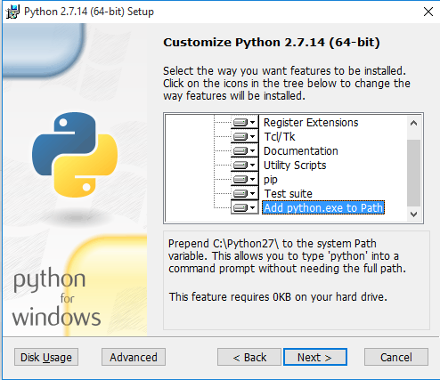

# Documentation

This the git repo of the mkdocs used to build the documentation for the public InertialSense documentation.

## Editing in github
You can just edit the page in github and create a commit when you are done.  This does not push the change to the server.  You'll need to clone and build the site, then push it to the server to see the changes publicly.

# Installing the Editors

## Install Python (Windows only)

Install the latest version of [python 3](https://www.python.org/ftp/python/3.7.2/python-3.7.2.exe)

Be sure to select the "add python.exe to path" option in the installers



## Install mkdocs and latex support (Mac, Linux and Windows)

To install mkdocs and latex, open a command prompt and use pip
``` powershell
python3 -m pip install mkdocs pygments pymarkdown pymdown-extensions mkdocs-material mdx_truly_sane_lists
python3 -m pip install https://github.com/mitya57/python-markdown-math/archive/master.zip
```

## Install mkdocs-pdf-export-plugin
``` powershell
python3 -m pip install --upgrade pip setuptools
python3 -m pip install mkdocs-with-pdf
```

Install GTK+ v3 (For 64bit Python): [GTK+](https://github.com/tschoonj/GTK-for-Windows-Runtime-Environment-Installer/releases)

*Make sure "Set up PATH environment variable to include GTK+" is checked.

If you get an error similar to OSError: dlopen() failed to load a library: cairo / cairo-2 follow instructions [here](https://weasyprint.readthedocs.io/en/latest/install.html#step-5-run-weasyprint). 

```powershell
pip install pymdown-extensions python-markdown-math mkdocs-material mkdocs-pdf-export-plugin
```

To export PDF set temporary environment variable:

```powersheel
set ENABLE_PDF_EXPORT=1
```

## Run the mkdocs server

Navigate to the docs directory.  The docs folder exists in the Inertial Sense IS-src repository. Run the server.

``` bash
mkdocs serve
```

in the root directory of the firmware repository.  It should report to you something like

``` bash
[I 170728 07:49:47 server:271] Serving on http://127.0.0.1:8000
[I 170728 07:49:47 handlers:58] Start watching changes
[I 180127 14:01:22 handlers:62] Start detecting changes
```

This means that mkdocs is hosting a webpage for you on http://127.0.0.1:8000.  Navigate to that page in your web browser.

Now, as you make changes to the documentation, you should be able to see it on your browser.  Just hit reload from time to time to see your changes.


## Editing the Documentation

I like to use [atom](https://atom.io/) (cross-platform) to edit markdown.  But you can use any text-editor to do it.  Atom has some nice markdown functionality.

### Adding new pages.

The organization of the pages is in the [`mkdocs.yml`](mkdocs.yml) file.  If you want to add a new page, just add a new line, and create a new `*.md` file wherever it goes.

For editing markdown, here is a really handy syntax guide https://github.com/adam-p/markdown-here/wiki/Markdown-Cheatsheet.  Our website has quite a bit of extra functionality built-in.  You might want to look at some of the existing pages for the syntax on creating notes, warnings, tables, etc...

For creating tables, Atom has a built-in table generator, but you can also use [https://www.tablesgenerator.com/markdown_tables]

### Proof Read and Broken Links Check

Double check your grammar and use a broken link checker tool:
 - https://validator.w3.org/checklink
 - https://www.deadlinkchecker.com
 - https://www.drlinkcheck.com

## Building and pushing to server

### Windows

Build the website

```
mkdocs build
```

## Adding pages
To add a new page to the documentation, just check out the mkdocs.yaml file in the root of the repo, you should be able to figure it out from there.

## Adding latex
The syntax for adding latex math inline is `\( x \)` which renders as \(x \).  For adding a block, it's

``` latex
$$ E = mc^2 $$
```
which renders as
$$ E = mc^2 $$

## Auto-Generating the Markdown DID description

In the [IS-src](https://github.com/inertialsense/IS-src) repository, there is a python script under [IS-src/scripts/data_sets_docs_generator.py](https://github.com/inertialsense/IS-src/scripts/data_sets_docs_generator.py) that auto-generates a markdown table from `data_sets.h`.  This file just generates a formatted table for all datasets from the comments in the source code.  You can choose to ignore DIDs by adding to the `ignore_DIDs` list near the top of the scripts.  If you run this file

`python data_sets_docs_generator.py`

from the scripts folder, it should dump out a new file called `DID-descriptions.md` that is preformatted markdown you can paste into the relevant parts of the documentation
