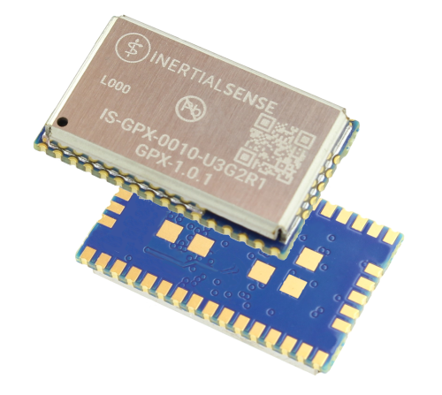

# GPX-1 Quick Start Guide

## Basic Configuration

!!!Note 
    When the GPX-1 is paired with an IMX-5, the IMX-5 will configure the GPX-1 automatically based on the configuration of the IMX-5. No further action is required.

The GPX-1 should be connected to a host via a communications port: USB, UART, or SPI.

The configuration settings found in DID_GPX_FLASH_CONFIG are used to configure the various features of the device. These can be modified directly to the appropriate values using either the [EvalTool](../user-manual/software/evaltool.md), the [CLTool](../user-manual/software/cltool.md), or the [SDK](../user-manual/software/SDK.md).

Configure the antenna offsets.
 When a GPX is not paired with an IMX the antenna offsets must be defined. In this scenario simply measure the the distance between Antenna 1 and Antenna 2 and enter it as the value of gps1AntOffset[0]. All other offset values should then be set to zero. This can be done easily in the EvalTool by going to the Data Sets Tab and selecting DID_GPX_FLASH_CONFIG. The values of each field can then be entered.

1. gps1AntOffset[X-Z] - Position offset of sensor frame with respect to GPS1 antenna.

2. gps2AntOffset[X-Z] - Position offset of sensor frame with respect to GPS2 antenna.

GNSS data sets can then be requested by one of several methods:

1. Requesting NMEA data using the [ASCE](../../user-manual/com-protocol/nmea/#asce) command. There is a convenient tool in the lower left corner of the Data Logs tab of the EvalTool.

2. Request data using the SDK commands: [SDK Function](../..//user-manual/com-protocol/isb/#getting-data)

3. Use the EvalTool to modify the value of DID_GPX_RMC.bits as outlined in the [SDK](https://github.com/inertialsense/inertial-sense-sdk/blob/68e5f20b994a0df43ef57720815aa7a16035d51f/src/data_sets.h#L2055).