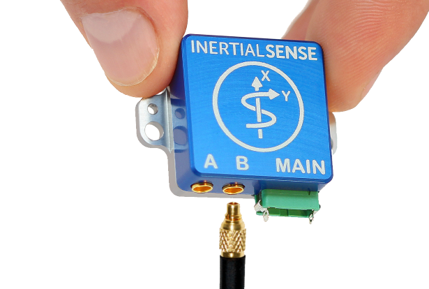

# Getting Started

The Inertial Sense Development platform was designed to provide a method of rapid evalution and integration. The following steps will provide a simple method to begin basic integration.

## 1. Install Software

Inertial Sense software provides a way to view, manipulate, stream, and record the data generated by an IMX-5, GPX-1, and the accompanying products.

- ### [EvalTool](../user-manual/software/evaltool.md) (Windows and Linux)
The EvalTool is a graphical Windows-based desktop program that allows users to explore, configure, and test functionality of the Inertial Sense products in real-time.
Download the EvalTool installer from the Inertial Sense [releases](https://github.com/inertialsense/InertialSenseSDK/releases) page. Run the .exe file and follow the instructions to complete the installation.

- ### [CLTool](../user-manual/software/cltool.md) (Windows, Linux, and OS X)
The CLTool is a command line utility that can be used to read and display data, update firmware, and log data from Inertial Sense products.
CLTool must be compiled from our source code. Follow the instructions on the [CLTool](../user-manual/software/cltool.md) page.

- ### [SDK](../user-manual/software/SDK/overview.md) (Windows, Linux)
Software development kit to interface with Inertial Sense products.
Download the file named "Source code" from our [releases](https://github.com/inertialsense/InertialSenseSDK/releases) page. The extracted folder contains code libraries as well as example projects.

## 2. Connect Hardware
Select the evaluation product from the list below to view instructions on basic connection to a computer.

- [IMX-5 PCB Module](../user-manual/hardware/module_imx5.md#application)
- [GPX-1 PCB Module](../user-manual/hardware/module_gpx1.md#typical-application-gpx-1-imx-5)
- [Rugged-3 Units](../user-manual/hardware/rugged3.md#connecting-your-unit)
<!-- - [Rugged-2 Units](../user-manual/hardware/rugged2.md) -->
- [IG-1 Units](../user-manual/hardware/IG1.md#connecting-your-unit)
- [IG-2 Units](../user-manual/hardware/IG2.md#connecting-your-unit)
- [IK-1 Units](../user-manual/hardware/IK1.md#connecting-your-unit)

## 3. Configuring Settings

The following sections contain instructions for basic configuration of IMX-5 based products and GPX-1 based products respectively:

- [IMX-5 Basic Configuration](IMX-5.md)

- [GPX-1 Basic Configuration](GPX-1.md)

## 4. Evaluation and Testing

Once a connection to the unit has been established, please follow one of the following guides to get started with the software tool of choice:

- [EvalTool](../user-manual/software/evaltool.md)
- [CLTool](../user-manual/software/cltool.md)
- [SDK Example Projects](../user-manual/software/SDK/overview.md)
