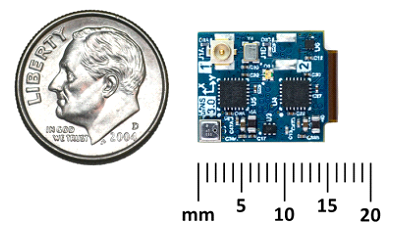

**Software Release 1.9.0 - 1 Sept 2022**

# Overview

## IMX-5 (IMU, AHRS, and GPS-INS)

The **IMX-5**™ is a 10-DOF sensor module consisting of a tactical grade Inertial Measurement Unit (IMU), magnetometer, and barometer. Output includes angular rate, linear acceleration, magnetic vector, and barometric pressure and altitude. IMU calibration consists of bias, scale factor, cross-axis alignment, and temperature compensation.  The IMX-5 includes Attitude Heading Reference System (**AHRS**) sensor fusion to estimate roll, pitch, and heading. Adding GNSS input to the IMX-5 enables onboard Inertial Navigation System (**INS**) sensor fusion for roll, pitch, heading, velocity, and position.

The **RUG-IMX-5**™ series adds a rugged aluminum enclosure and RS232, RS485, and CAN bus to the IMX-5.  

The **RUG-IMX-5-RTK**™ includes a multi-frequency GNSS receiver with RTK precision position enabling INS sensor fusion for roll, pitch, heading, velocity, and position. 

The **RUG-IMX-5-Dual**™ includes two multi-frequency GNSS receivers with RTK precision position and dual GNSS heading/compass.

The [**Inertial Sense SDK**](https://github.com/inertialsense/inertial-sense-sdk) is an open-source software development kit for quick integration to configure and communicate with Inertial Sense products. The SDK includes data logger, math libraries, and interface for Linux, Windows, and embedded platforms.

## Features
* **Tactical Grade IMU**
  - **Gyro: 2.0 °/hr Bias Instability, 0.2 °/√hr ARW**
  - **Accel: 20 µg Bias Instability, 0.04 m/s/√hr VRW**
* **High Accuracy INS (w/ IMX-5): 0.03° Roll/Pitch, 0.1° Dynamic Heading**
* **Surface Mount Reflowable (PCB Module)**
* Up to 1KHz IMU and INS Output Data Rate
* Small Form Factor: 15.6 x 12.5 x 2.9 mm
* Light Weight: 0.8 g
* Low power consumption: <110mW
* External GNSS Support (Multi-Band)
* Attitude (Roll, Pitch, Yaw, Quaternions), Velocity, and Position UTC Time Synchronized
* Triple Redundant IMUs Calibrated for Bias, Scale Factor, Cross-axis Alignment, and G-sensitivity
* -40°C to 85°C Sensor Temperature Calibration
* Binary and NMEA ASCII Protocol
* Barometric Pressure and Humidity
* Strobe In/Out Data Sync (Camera Shutter Event)
* Fast Integration with SDK and Example Software

## Interfaces

|                                     | IMX Module | EVB-2         | Rugged        |
| ----------------------------------- | ---------- | ------------- | ------------- |
| USB                                 | Yes        | Yes           | Yes           |
| TTL/UART                            | Yes        | Yes           | Yes           |
| RS232/RS422/RS485                   | No         | Yes           | Yes           |
| CAN                                 | Yes        | Yes           | Yes           |
| SPI                                 | Yes        | Yes           | Yes           |
| Integrated XBee Radio (RTK)         | No         | Yes (Option)  | No            |
| WiFi/BTLE                           | No         | Yes           | No            |
| GPS Antenna Ports (Dual=Compassing) | No         | Dual (Option) | Dual (Option) |

## Applications

* Drone Navigation
* Unmanned Vehicle Payloads
* Stabilized Platforms
* Antenna and Camera Pointing
* First Responder and Personnel Tracking
* Pedestrian and Auto Outdoor / Indoor Navigation
* Health, Fitness, and Sport Monitors
* Hand-held Devices
* Robotics and Ground Vehicles
* Maritime

 
 
 
 
 

<a href="https://inertialsense.com/">Inertial Sense, Inc.</a>
 3000 S Sierra Vista Way Suite 2, Provo, UT 84606 USA 
Phone 801-610-6771 
Email support@inertialsense.com 
Website: InertialSense.com 

© 2014-2022 Inertial Sense

Inertial Sense®, Inertial Sense logo and combinations thereof are registered trademarks or trademarks of Inertial Sense, Inc. Other terms and product names may be trademarks of others.

DISCLAIMER: The information in this document is provided in connection with Inertial Sense products. No license, express or implied, by estoppel or otherwise, to any intellectual property right is granted by this document or in connection with the sale of Inertial Sense products. EXCEPT AS SET FORTH IN THE INERTIAL SENSE TERMS AND CONDITIONS OF SALES LOCATED ON THE INERTIAL SENSE WEBSITE, INERTIAL SENSE ASSUMES NO LIABILITY WHATSOEVER AND DISCLAIMS ANY EXPRESS, IMPLIED OR STATUTORY WARRANTY RELATING TO ITS PRODUCTS INCLUDING, BUT NOT LIMITED TO, THE IMPLIED WARRANTY OF MERCHANTABILITY, FITNESS FOR A PARTICULAR PURPOSE, OR NON-INFRINGEMENT. IN NO EVENT SHALL INERTIAL SENSE BE LIABLE FOR ANY DIRECT, INDIRECT, CONSEQUENTIAL, PUNITIVE, SPECIAL OR INCIDENTAL DAMAGES (INCLUDING, WITHOUT LIMITATION, DAMAGES FOR LOSS AND PROFITS, BUSINESS INTERRUPTION, OR LOSS OF INFORMATION) ARISING OUT OF THE USE OR INABILITY TO USE THIS DOCUMENT, EVEN IF INERTIAL SENSE HAS BEEN ADVISED OF THE POSSIBILITY OF SUCH DAMAGES. Inertial Sense makes no representations or warranties with respect to the accuracy or completeness of the contents of this document and reserves the right to make changes to specifications and products descriptions at any time without notice. Inertial Sense does not make any commitment to update the information contained herein. Unless specifically provided otherwise, Inertial Sense products are not suitable for, and shall not be used in, automotive applications. Inertial Sense products are not intended, authorized, or warranted for use as components in applications intended to support or sustain life. SAFETY-CRITICAL, MILITARY, AND AUTOMOTIVE APPLICATIONS DISCLAIMER: Inertial Sense products are not designed for and will not be used in connection with any applications where the failure of such products would reasonably be expected to result in significant personal injury or death (“Safety-Critical Applications”) without an Inertial Sense officer's specific written consent. Safety-Critical Applications include, without limitation, life support devices and systems, equipment or systems for the operation of nuclear facilities and weapons systems. Inertial Sense products are not designed nor intended for use in military or aerospace applications or environments unless specifically designated by Inertial Sense as military-grade.
