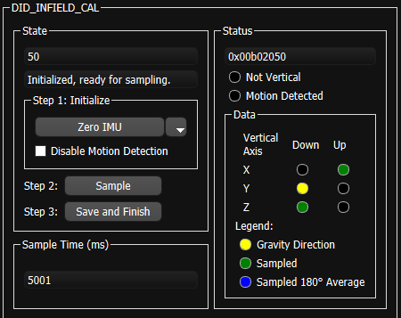

# Infield Calibration

The *Infield Calibration* provides a method to 1.) zero IMU biases and 2.) zero INS attitude to align the INS output frame with the vehicle frame.  These steps can be run together or independently.

## Zeroing IMU Bias

Zeroing IMU bias is a way to remove permanent offsets in the sensor output that may have occurred as a result of manufacturing or high shock.  The system must be completely stationary for accurate bias measurement.  The current value for IMU biases stored in flash memory is viewable in `DID_INFIELD_CAL.imu` when infield calibration is inactive and `DID_INFIELD_CAL.sampleCount` is zero. 

### Accelerometer Bias

In order to correct accelerometer bias on a given axis, that axis must be sampled while measuring full gravity.  Thus, only the accelerometer axes that are sampled while in the vertical direction can be corrected.  In order to correct all accelerometer axes, all three axes must be sampled while oriented vertically.  The sample can be done while the axis is pointed up, down, or both up and down for averaging.   

### Gyro Bias

All three axes of the gyros are sampled simultaneously, and the bias is stored in flash memory.   The system must be completely stationary for accurate bias measurement.  The system does not need to be level to zero the gyro biases.

## Zeroing INS Attitude

The Infield Calibration process can be used to align or level the INS output frame with the vehicle frame.  This is done by observing the X,Y,Z axes rotations necessary to level the orientation(s) sampled.  Zeroing the INS attitude as part of the Infield Calibration routine provides a optimal and highly accurate method for measuring the attitude while stationary by averaging raw bias corrected accelerations.  

Rotations cannot be computed for axes that are pointed vertically.  For example, a single orientation sample with X and Y in the horizontal plane and Z pointed down will only be able to produce an X,Y rotation, and the Z rotation will remain zero.  To compute all three rotations for the X,Y,Z axes, the system must be sampled at least twice, once while level and once while on its side. 

The infield calibration process is generally useful for only small angle INS rotations and is not intended for those larger than 15° per axis.  The user must set the INS rotation manually for larger rotations.  The INS rotation is stored and accessed in `DID_FLASH_CONFIG.insRotation` in flash memory. 

Because the sampled orientations are averaged together, it is recommended to only sample orientations that are at true 90° multiples of the vehicle frame.  

The zero INS attitude feature assumes there are flat rigid surface(s) attached to the uINS about which the system can be leveled.  If the working surface is not level or additional precision is desired, each orientation sampled can have an additional sample taken with ~180° yaw offset to cancel out tilt of the working surface.   

If Infield Calibration is not adequate, the INS may be [leveled or aligned manually](../ins_configuration/#manually-aligning-the-ins-after-mounting).     

## Infield Calibration Process 

The following process can be used to used to improve the IMU calibration accuracy and also align or level the INS to the vehicle frame. 

1. **Prepare Leveling Surface** - Ensure the system is stable and stationary on a near-level surface with one of three axes in the vertical direction.  

2. **Initialize the Mode** - Clear any prior samples and set the calibration mode by setting `DID_INFIELD_CAL.state` to one of the following:   

   ```c++
   INFIELD_CAL_STATE_CMD_INIT_ZERO_IMU            = 1, // Zero accel and gyro biases.
   INFIELD_CAL_STATE_CMD_INIT_ZERO_GYRO           = 2, // Zero only gyro  biases.
   INFIELD_CAL_STATE_CMD_INIT_ZERO_ACCEL          = 3, // Zero only accel biases.
   INFIELD_CAL_STATE_CMD_INIT_ZERO_ATTITUDE       = 4, // Zero (level) INS attitude by adjusting INS rotation.
   INFIELD_CAL_STATE_CMD_INIT_ZERO_ATTITUDE_IMU   = 5, // Zero gyro and accel biases.  Zero (level) INS attitude by adjusting INS rotation. 
   INFIELD_CAL_STATE_CMD_INIT_ZERO_ATTITUDE_GYRO  = 6, // Zero only gyro  biases.  Zero (level) INS attitude by adjusting INS rotation. 
   INFIELD_CAL_STATE_CMD_INIT_ZERO_ATTITUDE_ACCEL = 7, // Zero only accel biases.  Zero (level) INS attitude by adjusting INS rotation.
   
   INFIELD_CAL_STATE_CMD_INIT_OPTION_DISABLE_MOTION_DETECT    = 0x00010000, // Bitwise AND this with the above init commands to disable motion detection during sampling (allow for more tolerant sampling).
    INFIELD_CAL_STATE_CMD_INIT_OPTION_DISABLE_REQUIRE_VERTIAL = 0x00020000, // Bitwise AND this with the above init commands to disable vertical alignment requirement for accelerometer bias calibration (allow for more tolerant sampling).
   ```

   Zeroing accelerometer biases requires that any of the X,Y,Z axes be vertically aligned with gravity during sampling.  This is indicated by bit `INFIELD_CAL_STATUS_AXIS_NOT_VERTICAL = 0x01000000` in `DID_INFIELD_CAL.status`.   

   By default, the system must also be stationary without any movement during sampling.  This is indicated by bit `INFIELD_CAL_STATUS_MOTION_DETECTED = 0x02000000` is set in `DID_INFIELD_CAL.status`.  Motion detection can be disabled to make the system more tolerant during sampling.  To do this, bitwise and `INFIELD_CAL_STATE_CMD_INIT_OPTION_DISABLE_MOTION_DETECT = 0x00010000` with the initialization command.  As an example, the command to initialize *INS alignment with zero IMU bias* with motion detection disabled is as follows:

   ```c++
   (INFIELD_CAL_STATE_CMD_INIT_ZERO_ATTITUDE_IMU | INFIELD_CAL_STATE_CMD_INIT_OPTION_DISABLE_MOTION_DETECT);
   
   0x00010101 = (0x00000101 | 0x00010000); 
   ```

3. **Sample Orientation(s)** - Initiate sampling of one or more orientations by setting `DID_INFIELD_CAL.state` to `INFIELD_CAL_STATE_CMD_START_SAMPLE = 8`.  Sampling per orientation will take 5 seconds and completion is indicated when `DID_INFIELD_CAL.state` switches to `INFIELD_CAL_STATE_SAMPLING_WAITING_FOR_USER_INPUT = 50`.  

   - **Sample Same Orientation w/ +180° Yaw** - If the working surface is not level, two samples per orientation can be taken to cancel out the tilt of the working surface.  Rotate the system approximately 180° in yaw (heading) and initiate the sampling a second time for a given orientation. 
   - **Sample Up to Six Orientations** - The sampling process can be done for up to six orientations (X,Y,Z pointed up and down).  Each sample will be automatically associated with the corresponding vertical axis and direction.  All orientations will be averaged together for both the zero IMU bias and zero INS attitude.

4. **Store IMU Bias and/or Align INS** - Following sampling of the orientations, set `DID_INFIELD_CAL.state` to `INFIELD_CAL_STATE_CMD_SAVE_AND_FINISH = 9` to process and save the infield calibration to flash memory.  The built-in test (BIT) will run once following this to verify the newly adjusted calibration and `DID_INFIELD_CAL.state` will be set to `INFIELD_CAL_STATE_FINISHED`.  

### EvalTool or CLTool for Infield Cal

The EvalTool IMU Settings tab provides a user interface to read and write the DID_INFIELD_CAL message.  



#### CLTool Infield Cal

The following options can be used with the CLTool to edit the infield calibration (DID_INFIELD_CAL).  

```bash
cltool -c /dev/ttyS2 -edit DID_INFIELD_CAL
```

Below is an example of the CLTool edit view of the DID_INFIELD_CAL message.

```bash
$ Inertial Sense.  Connected.  Press CTRL-C to terminate.  Rx 13657

(94) DID_INFIELD_CAL:      W up, S down
                     0   calData[2].down.dev[1].acc[1]
                     0   calData[2].down.dev[1].acc[2]
                     0   calData[2].down.yaw
                     0   calData[2].up.dev[0].acc[0]
                     0   calData[2].up.dev[0].acc[1]
                     0   calData[2].up.dev[0].acc[2]
                     0   calData[2].up.dev[1].acc[0]
                     0   calData[2].up.dev[1].acc[1]
                     0   calData[2].up.dev[1].acc[2]
                     0   calData[2].up.yaw
          0.0398919582   imu[0].acc[0]
        0.000717461109   imu[0].acc[1]
            9.67872334   imu[0].acc[2]
         0.00583727891   imu[0].pqr[0]
          0.0135380113   imu[0].pqr[1]
        -0.00342554389   imu[0].pqr[2]
          0.0874974579   imu[1].acc[0]
          -0.167159081   imu[1].acc[1]
            9.67817783   imu[1].acc[2]
        -0.00111889921   imu[1].pqr[0]
        -0.00523020467   imu[1].pqr[1]
         0.00455262465   imu[1].pqr[2]
                     0   sampleTimeMs
                    50   state
            0x00B01000 * status
```

