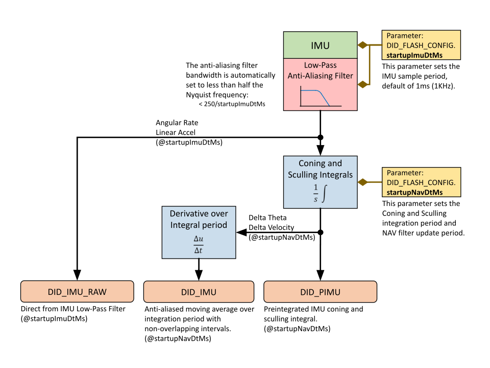

# INS & GNSS Configuration

## Translation

The uINS can be mounted and operated in any arbitrary orientation.  It is often desirable and conventional to translate the uINS output so that it is rotated into the vehicle frame and located at certain location for control and navigation of the vehicle.  This is done using the ***IMU Rotation***, ***INS Rotation***, and ***INS Offset*** parameters.  

In most common applications, output is translated to the vehicle frame (X to the front, Y to the right, and Z down): 

- *IMU Rotation* provides gross rotation of the IMU output in multiples of 90°.
- *INS Rotation* provides small angle alignment of the INS output.   
- *INS Offset* shifts the location from the INS output.

### IMU Rotation (Hardware Native Frame to Sensor Frame)

The *IMU rotation* is used to rotate the IMU and magnetometer output from the hardware native frame to the [sensor frame](../../reference/coordinate_frames/#sensor-frame) by **multiples of 90°**.  This is done using the `SENSOR_CFG_SENSOR_ROTATION_MASK` bits of the `DID_FLASH_CONFIG.sensorConfig` as defined in `enum eSensorConfig`.  The IMU rotation is defined in X,Y,Z rotations about the corresponding axes and applied in the order of Z,Y,X.  This rotation is recommended for gross rotations.   

### INS Rotation

The *INS rotation* is used to convert the INS output from the [sensor frame](../../reference/coordinate_frames/#sensor-frame) to the vehicle frame.  This is useful if the sensor frame and vehicle frame are not aligned.  The actual INS rotation parameters are `DID_FLASH_CONFIG.insRotation[3]` (X, Y, Z) in radians.  The *INS rotation* values describes the rotation from the INS sensor frame to the intermediate frame in order of Z, Y, X.     

### INS Offset

The *INS offset* is used to shift the location of the INS output and is applied following the INS Rotation.  This offset can be used to move the uINS location from the origin of the sensor frame to any arbitrary location, often a control navigation point on the vehicle. 

### Manually Aligning the INS After Mounting  

**NOTE for use:** 

- The [Infield Calibration](#infield-calibration) process can be used instead of this process to automatically measure and align the INS with the vehicle frame for INS rotations less than 15°.
- If using software release 1.8.4 or newer, we recommend using the `DID_FLASH_CONFIG.sensorConfig` to rotate the sensor frame by 90° to near level before following the steps below.

The following process uses the uINS to measure and correct for the uINS mounting angle. 

1. Set `DID_FLASH_CONFIG.insRotation` to zero. 

2. Set the sensor on the ground at various known orientations and record the INS quaternion output (DID_INS_2).  Using the Euler output (DID_INS_1) can be used if the pitch is less than 15°.  It is recommended to use the EKF [Zero Motion Command](../zero_motion_command/#zero-motion-command) to ensure the EKF bias estimation and attitude have stabilized quickly before measuring the INS attitude.

3. Find the difference between the known orientations and the measured INS orientations and average these differences together.

4. Negate this average difference and enter that into the `DID_FLASH_CONFIG.insRotation`. This value is in Euler, however it is OK for this step as this rotation should have just been converted from quaternion to Euler and will be converted back to quaternion on-board for the runtime rotation.

## Infield Calibration

The *Infield Calibration* provides a method to 1.) zero IMU biases and 2.) zero INS attitude to align the INS output frame with the vehicle frame.  These steps can be run together or independently.

### Zeroing IMU Bias

Zeroing IMU bias is a way to remove permanent offsets in the sensor output that may have occurred as a result of manufacturing or high shock.  The system must be completely stationary for accurate bias measurement.  The current value for IMU biases stored in flash memory is viewable in `DID_INFIELD_CAL.imu` when infield calibration is inactive and `DID_INFIELD_CAL.sampleCount` is zero. 

#### Accelerometer Bias

In order to correct accelerometer bias on a given axis, that axis must be sampled while measuring full gravity.  Thus, only the accelerometer axes that are sampled while in the vertical direction can be corrected.  In order to correct all accelerometer axes, all three axes must be sampled while oriented vertically.  The sample can be done while the axis is pointed up, down, or both up and down for averaging.   

#### Gyro Bias

All three axes of the gyros are sampled simultaneously, and the bias is stored in flash memory.   The system must be completely stationary for accurate bias measurement.  The system does not need to be level to zero the gyro biases.

### Zeroing INS Attitude

The Infield Calibration process can be used to align or level the INS output frame with the vehicle frame.  This is done by observing the X,Y,Z axes rotations necessary to level the orientation(s) sampled.  Zeroing the INS attitude as part of the Infield Calibration routine provides a optimal and highly accurate method for measuring the attitude while stationary by averaging raw bias corrected accelerations.  

Rotations cannot be computed for axes that are pointed vertically.  For example, a single orientation sample with X and Y in the horizontal plane and Z pointed down will only be able to produce an X,Y rotation, and the Z rotation will remain zero.  To compute all three rotations for the X,Y,Z axes, the system must be sampled at least twice, once while level and once while on its side. 

The infield calibration process is generally useful for only small angle INS rotations and is not intended for those larger than 15° per axis.  The user must set the INS rotation manually for larger rotations.  The INS rotation is stored and accessed in `DID_FLASH_CONFIG.insRotation` in flash memory. 

Because the sampled orientations are averaged together, it is recommended to only sample orientations that are at true 90° multiples of the vehicle frame.  

The zero INS attitude feature assumes there are flat rigid surface(s) attached to the uINS about which the system can be leveled.  If the working surface is not level or additional precision is desired, each orientation sampled can have an additional sample taken with ~180° yaw offset to cancel out tilt of the working surface.   

If Infield Calibration is not adequate, the INS may be [leveled or aligned manually](#manually-aligning-the-ins-after-mounting).     

### Infield Calibration Process 

The following process can be used to used to improve the IMU calibration accuracy and also align or level the INS to the vehicle frame. 

1. **Prepare Leveling Surface** - Ensure the system is stable and stationary on a near-level surface with one of three axes in the vertical direction.  

2. **Initialize the Mode** - Clear any prior samples and set the calibration mode by setting `DID_INFIELD_CAL.state` to one of the following:   

   ```c++
   INFIELD_CAL_STATE_CMD_INIT_ZERO_IMU            = 1, // Zero accel and gyro biases.
   INFIELD_CAL_STATE_CMD_INIT_ZERO_GYRO           = 2, // Zero only gyro  biases.
   INFIELD_CAL_STATE_CMD_INIT_ZERO_ACCEL          = 3, // Zero only accel biases.
   INFIELD_CAL_STATE_CMD_INIT_ZERO_ATTITUDE       = 4, // Zero (level) INS attitude by adjusting INS rotation.
   INFIELD_CAL_STATE_CMD_INIT_ZERO_ATTITUDE_IMU   = 5, // Zero gyro and accel biases.  Zero (level) INS attitude by adjusting INS rotation. 
   INFIELD_CAL_STATE_CMD_INIT_ZERO_ATTITUDE_GYRO  = 6, // Zero only gyro  biases.  Zero (level) INS attitude by adjusting INS rotation. 
   INFIELD_CAL_STATE_CMD_INIT_ZERO_ATTITUDE_ACCEL = 7, // Zero only accel biases.  Zero (level) INS attitude by adjusting INS rotation.
   
   INFIELD_CAL_STATE_CMD_INIT_OPTION_DISABLE_MOTION_DETECT = 0x00010000,	// Bitwise AND this with the above init commands to disable motion detection during sampling (allow for more tolerant sampling).
   ```

   Zeroing accelerometer biases requires that any of the X,Y,Z axes be vertically aligned with gravity during sampling.  This is indicated by bit `INFIELD_CAL_STATUS_AXIS_NOT_VERTICAL = 0x01000000` in `DID_INFIELD_CAL.status`.   

   By default, the system must also be stationary without any movement during sampling.  This is indicated by bit `INFIELD_CAL_STATUS_MOTION_DETECTED = 0x02000000` is set in `DID_INFIELD_CAL.status`.  Motion detection can be disabled to make the system more tolerant during sampling.  To do this, bitwise and `INFIELD_CAL_STATE_CMD_INIT_OPTION_DISABLE_MOTION_DETECT = 0x00010000` with the initialization command .  As an example, the command to initialize *INS alignment with zero IMU bias* with motion detection disabled is as follows:

   ```c++
   (INFIELD_CAL_STATE_CMD_INIT_ZERO_ATTITUDE_IMU | INFIELD_CAL_STATE_CMD_INIT_OPTION_DISABLE_MOTION_DETECT);
   
   0x00010101 = (0x00000101 | 0x00010000); 
   ```

3. **Sample Orientation(s)** - Initiate sampling of one or more orientations by setting `DID_INFIELD_CAL.state` to `INFIELD_CAL_STATE_CMD_START_SAMPLE = 8`.  Sampling per orientation will take 5 seconds and completion is indicated when `DID_INFIELD_CAL.state` switches to `INFIELD_CAL_STATE_SAMPLING_WAITING_FOR_USER_INPUT = 50`.  

   - **Sample Same Orientation w/ +180° Yaw** - If the working surface is not level, two samples per orientation can be taken to cancel out the tilt of the working surface.  Rotate the system approximately 180° in yaw (heading) and initiate the sampling a second time for a given orientation. 
   - **Sample Up to Six Orientations** - The sampling process can be done for up to six orientations (X,Y,Z pointed up and down).  Each sample will be automatically associated with the corresponding vertical axis and direction.  All orientations will be averaged together for both the zero IMU bias and zero INS attitude.

4. **Store IMU Bias and/or Align INS** - Following sampling of the orientations, set `DID_INFIELD_CAL.state` to `INFIELD_CAL_STATE_CMD_SAVE_AND_FINISH = 9` to process and save the infield calibration to flash memory.  The built-in test (BIT) will run once following this to verify the newly adjusted calibration and `DID_INFIELD_CAL.state` will be set to `INFIELD_CAL_STATE_FINISHED`.  

#### EvalTool or CLTool for Infield Cal

The EvalTool IMU Settings tab provides a user interface to read and write the DID_INFIELD_CAL message.  


#### CLTool Infield Cal

The following options can be used with the CLTool to edit the infield calibration (DID_INFIELD_CAL).  

```bash
cltool -c /dev/ttyS2 -edit DID_INFIELD_CAL
```

Below is an example of the CLTool edit view of the DID_INFIELD_CAL message.

```bash
$ Inertial Sense.  Connected.  Press CTRL-C to terminate.  Rx 13657

(94) DID_INFIELD_CAL:      W up, S down
                     0   calData[2].down.dev[1].acc[1]
                     0   calData[2].down.dev[1].acc[2]
                     0   calData[2].down.yaw
                     0   calData[2].up.dev[0].acc[0]
                     0   calData[2].up.dev[0].acc[1]
                     0   calData[2].up.dev[0].acc[2]
                     0   calData[2].up.dev[1].acc[0]
                     0   calData[2].up.dev[1].acc[1]
                     0   calData[2].up.dev[1].acc[2]
                     0   calData[2].up.yaw
          0.0398919582   imu[0].acc[0]
        0.000717461109   imu[0].acc[1]
            9.67872334   imu[0].acc[2]
         0.00583727891   imu[0].pqr[0]
          0.0135380113   imu[0].pqr[1]
        -0.00342554389   imu[0].pqr[2]
          0.0874974579   imu[1].acc[0]
          -0.167159081   imu[1].acc[1]
            9.67817783   imu[1].acc[2]
        -0.00111889921   imu[1].pqr[0]
        -0.00523020467   imu[1].pqr[1]
         0.00455262465   imu[1].pqr[2]
                     0   sampleTimeMs
                    50   state
            0x00B01000 * status
```

## GNSS Antenna Offset

If the setup includes a significant distance (40cm or more) between the GPS antenna and the uINS central unit, enter a non-zero value for the GPS lever arm, `DID_FLASH_CONFIG.gps1AntOffset` (or  `DID_FLASH_CONFIG.gpsAnt2Offset`) X,Y,Z offset in meters from Sensor Frame origin to GPS antenna.  The sensor frame is labeled on the uINS EVB case.

## IMU Sample and Navigation Periods

The IMU sample period is configured by setting `DID_FLASH_CONFIG.startupImuDtMs`  in milliseconds.  This parameter determines how frequently the IMU is measured and data integrated into the `DID_PREINTEGRATED_IMU` data.  `DID_FLASH_CONFIG.startupImuDtMs` also automatically sets the bandwidth of the IMU anti-aliasing filter to less than one half the Nyquist frequency (i.e. < 250 / startupImuDtMs).  The IMU anti-aliasing filter bandwidth can also be overridden to another frequency by setting bits `SENSOR_CFG_GYR_DLPF` and `SENSOR_CFG_ACC_DLPF` in `DID_FLASH_CONFIG.sensorConfig`. 

The INS and AHRS kalman filter update period is configured using `DID_FLASH_CONFIG.startupNavDtMs`.  This parameter also sets the integration period for the Preintegrated IMU or conning and sculling (delta theta, delta velocity) integrals.  The `DID_DUAL_IMU`  is the derivative of the `DID_PREINTEGRATED_IMU` value over a single integration period and serves as an anti-aliased moving average of the IMU value.

## INS-GNSS Dynamic Model
The `DID_FLASH_CONFIG.insDynModel` setting allows the user to adjust how the EKF behaves in different dynamic environments. All values except for 2 (STATIONARY) and 8 (AIR <4g) are experimental. The user is encouraged to attempt to use different settings to improve performance, however in most applications
the default setting, 8: airborne <4g, will yield best performance.

The STATIONARY configuration (insDynModel = 2) can be used to configure the EKF for static applications. It is a permanent implementation of the [Zero Motion Command](../application-config/zero_motion_command.md) which will reduce EKF drift under stationary conditions.

## Disable Magnetometer and Barometer Updates

Magnetometer and barometer updates (fusion) into the INS and AHRS filter (Kalman filter) can be disabled by setting the following bits in `DID_FLASH_CONFIG.sysCfgBits`.

| Bit Name                                 | Bit Value  | Description                          |
| ---------------------------------------- | ---------- | ------------------------------------ |
| SYS_CFG_BITS_DISABLE_MAGNETOMETER_FUSION | 0x00001000 | Disable magnetometer fusion into EKF |
| SYS_CFG_BITS_DISABLE_BAROMETER_FUSION    | 0x00002000 | Disable barometer fusion into EKF    |

These settings can be disabled using the General Settings tab of the EvalTool.

<center>


</center>

## Disable Zero Velocity Updates

Zero velocity updates (ZUPT) rely on GPS and/or wheel encoder data. In some cases there can be a slight lag/deviation when starting motion while simultaneously rotating. This is because GPS data is updated at 5 Hz and it takes a few samples to detect motion after a period of no motion. When ZUPT is enabled, it acts as a virtual velocity sensor telling the system that its velocity is zero. It may conflict briefly with GPS velocity observation when starting motion. If a slight lag at the beginning of motion is an issue, ZUPT may be disabled. Generally it should be enabled (Default). It can be disabled using `DID_FLASH_CONFIG.sysCfgBits` or using the General Settings tab of the EvalTool.

## Disable Zero Angular Rate Updates

Zero angular rate updates (ZARU) rely on analysis of either IMU (gyro) data or wheel encoders when available. When angular motion is very slow and no wheel encoders are available a zero angular rate may be mistakenly detected, which will lead to gyro bias estimation errors. In these cases it can be beneficial  to disable ZARU if the applications has slow rotation rates (approximately below 3 deg/s). It is not encouraged to disable ZARU if there is no rotation or faster rotation. It can be disabled using `DID_FLASH_CONFIG.sysCfgBits` or using the General Settings tab of the EvalTool.

