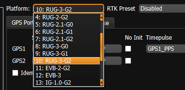
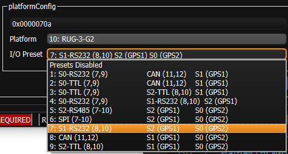

# Platform Configuration

The `DID_FLASH_CONFIG.platformConfig` allows for specification of the IMX carrier board type and configuration settings.   This is important and helpful for configuring I/O specific to the platform (carrier board).  Values for the Platform Config are specified in the **enum ePlatformConfig** in the SDK [data_sets.h](https://github.com/inertialsense/inertial-sense-sdk/blob/main/src/data_sets.h).

## Platform Type

The platform config type can be set through the EvalTool General Settings and GPS Settings tabs.  Setting the Platform Config type through the EvalTool acts as a convenience preset that automatically sets the GPS source, type, and timepulse pin selection for the selected platform.

## I/O Presets

The pin assignments on the RUG-3 are software configurable using the `PLATFORM_CFG_PRESET_MASK` bits of the `DID_FLASH_CONFIG.platformConfig`.   The `PLATFORM_CFG_TYPE` must be set to one of the RUG-3 types to enable the I/O Presets configuration on the RUG-3.  The RUG-3 main connector pin numbers are listed in parenthesis in the I/O Preset. 

