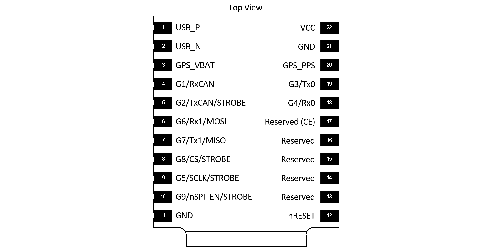
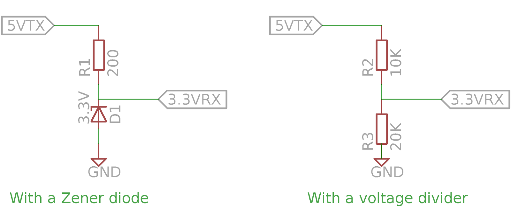

# Time Synchronization

## INS & GPS Timestamps

The uINS output messages are timestamped using GPS time-base because this time is known immediately following GPS signal reception.  Conversion from GPS time to UTC time requires knowledge of the number of leap seconds (GPS-UTC) offset.  This value is received periodically (every 12.5 minutes) and is available in the `DID_GPS1_POS` and `DID_GPS1_RTK_POS` (gps_pos_t) messages.  GPS leap seconds is 18 seconds as of December 31, 2016 and [will change in the future](https://en.wikipedia.org/wiki/Leap_second).  

The original designers of GPS chose to express time and date as an integer week number (starting with the first full week in January 1980) and a time of week (often abbreviated to TOW) expressed in seconds. Working with time/date in this form is easier for digital systems than the more "conventional" year/month/day, hour/minute/second representation. Most GNSS receivers use this representation internally and converting to a more "conventional form" externally. 

### GPS to UTC Time Conversion

UTC time is found by subtracting GPS leap seconds from the GPS time. 

## GPS Time Synchronization

Systems connected to the uINS can be time synchronized using the GPS PPS timepulse signal and any message containing GPS time.   The actual time of the GPS PPS timepulse signal is the same as any message with GPS time rounded down to the second.  The following pseudo code illustrates how this is done.

``` C++
// GPS Time Synchronization - Find the difference between local time and GPS time:

// 1. Sample your local time on the rising edge of the GPS PPS timepulse signal.
double ppsLocalTime = localTime();

// 2. Read the GPS time from any message WITHIN ONE SECOND FOLLOWING the GPS PPS timepulse signal.
double gpsTime = readGpsMessageTime();             // within one second after GPS PPS

// 3. Find the difference between the GPS PPS local time and the GPS time rounded down to the
//    nearest second (443178.800 s down to 443178 s, or 443178800 ms down to 443178 s).
double localToGpsTimeTemp = ppsLocalTime - floor(gpsTime);

// 4. Error check to ensure you have a consistent solution
static double localToGpsTimeLast;
double localToGpsTime;

if (fabs(localToGpsTimeLast - localToGpsTimeTemp) < 0.002)        // within 2ms
{
        localToGpsTime = localToGpsTimeTemp;
}
localToGpsTimeLast = localToGpsTimeTemp; // Update history

// Local time can now be converted at anytime to GPS time using 'localToGpsTime' difference.
double currentGpsTime = localTime() + localToGpsTime;
```

## Using the Strobe Input Pins

The uINS has several strobe input pins which can be configured to cause the uINS to report both its internal time and full navigation solution at the moment when triggered.

### Strobe I/O Events

Strobe input and output (I/O) events are used for time and data synchronization.



<center>**_STROBE pins on the μIMU, μAHRS, and μINS Module - Top View_**</center>
### Strobe Input (Time Sync Input)

Strobe inputs are used to timestamp digital events observed on any of the pins labeled STROBE, e.g. camera shutter signals.  A STROBE input event occurs when the logic level of any STROBE pin is toggled.  The transition direction can be set so that the STROBE event triggers on a rising edge, or a falling edge.  An internal 100K pull-up or pull-down resistor is enabled, depending on the assertion direction.  External pull-up or pull-down resistors are not necessary.  

The STROBE input will trigger on the edge type specified. However, the minimum period between STROBE input pulses is 1 ms.  The measurement and timestamp resolution are both 1 ms.  

The following pins can be used for STROBE input.  

| Signal | Module Pin | EVB-1 Pin              | Rugged Pin  |EVB-2|
| :----: | :--------- | :----------------------|:------------|:-----|
|   G2   | 5          | H2-4                   |12           | H7-6 |
|   G5   | 9          | H6-3                   |             | H7-9 |
|   G8   | 8          | H6-6                   |             | H7-12|
|   G9   | 10         | Button "B"             |             | H7-13|

To use a pin as a Strobe Input pin, the I/O must be configured as a strobe input. Additionally, the triggering edge must be set using the following bits in `DID_FLASH_CONFIG.ioConfig`.

| Bit Name                             | Bit Value  | Description                    |
| ------------------------------------ | ---------- | ------------------------------ |
| IO_CONFIG_STROBE_TRIGGER_LOW         | 0x00000000 | Trigger strobe on falling edge |
| IO_CONFIG_STROBE_TRIGGER_HIGH        | 0x00000001 | Trigger strobe on rising edge  |

Pushbutton “B” on the EVB asserts a logic low to G9 (pin 10) of the uINS and can be used to test the STROBE input functionality.

**Note: Holding pin 9 low at startup enables SPI which uses pins 5 and 8 making them unavailable to be used as Strobe Inputs. If pin 9 is not held low, the internal pullup resistor holds it high at startup. This sets pins 5 and 8 as inputs which can be used as Strobe Inputs.

A STROBE input event causes a timestamp message and INS2 message to be transmitted.  The ASCII messages `$PSTRB` and `$PINS2` messages are sent by default but can be disabled and replaced by the binary messages `DID_STROBE_IN_TIME` and `DID_INS_2` if the RMC bit `RMC_BITS_STROBE_IN_TIME` is set for the given serial port.  

Example: 

```
rmc_t rmc;
rmc.bits = RMC_BITS_STROBE_IN_TIME;

int messageSize = is_comm_set_data(comm, DID_RMC, offsetof(rmc_t, bits), sizeof(uint64_t), &rmc);
if (messageSize != serialPortWrite(serialPort, comm->buffer, messageSize))
{
    printf("Failed to write save persistent message\r\n");
}

```

__Table 2 - DID_STROBE_IN_TIME message transmitted following a SYNC input event.__

| Field        | Type     | Description                                               |
| ------------ | -------- | --------------------------------------------------------- |
| week         | uint32_t | Weeks since January 6th, 1980                             |
| timeOfWeekMs | uint32_t | Time of week (since Sunday morning) in milliseconds, GMT. |
| pin          | uint32_t | STROBE input pin                                          |
| count        | uint32_t | STROBE serial index number                                |

The STROBE input event also causes the HDW_STATUS_STROBE_IN_EVENT (0x00000020) bit of the hdwStatus field in INS output (DID_INS_1, DID_INS_2, DID_INS_3, and DID_INS_4) to be set, allowing users to identify strobe input events using the INS output.

#### Troubleshooting Input Strobe

If the STOBE input does not appear to be functioning properly, an oscilloscope or fast multi-meter can be used to probe the actual STROBE line to ensure the proper 0V to 3.3V voltage swing is present.  The following two tests can be used to evaluate the proper function of the strobe source and the uINS strobe input. 

**TEST 1:** Identify if the uINS strobe input is configured properly and has a low input impedance:  

1. Disconnect your strobe source from the uINS.  Use a 1K ohm resistor as a pull-up resistor between 3.3V and the uINS strobe input and measure the strong input line.  
2. Repeat using the resistor as a pull-down resistor between ground and the strobe input and measure the strobe input line.  

This will tell if the uINS strobe input is somehow being driven internally or not configured correctly.  If it is functioning correctly, the line will toggle from 0V to +3.3V following the resistor pull-down and pull-up.    

**TEST 2:** Identify if your strobe source is driving correctly:

1. With the uINS strobe input disconnected from your strobe driving circuit, probe the output of the strobe driving circuit and observe what levels it toggles between. 
2. Attach a 1M ohm pull-down resistor from ground to the strobe output and observe the strobe voltage swing.  

If the circuit is working correctly, it should drive the strobe output from 0V to +3.3V despite the 1M ohm pull-down resistor.

#### Input Voltage Level Shifter

The maximum input voltage for strobe lines (any pin on the uINS) is 3.6V.  A level shifter may be used to convert any strobe signal that is larger than 3.3V.  The following figure shows two passive level shifter circuits, a zener diode voltage clamp and a resistor voltage divider.   



These circuits are beneficial because of their simplicity.  An active, powered level shifter may also be used and necessary.

### Strobe Output (Preintegrated IMU Period)

The STROBE output feature is used to indicate start and end of the preintegrated IMU period (and navigation filter IMU updates) by toggling .   STROBE output is enabled on pin 9 by setting bit SYS_CFG_BITS_ENABLE_NAV_STROBE_OUT_GPIO_9 (0x00100000) of DID_FLASH_CONFIG.sysCfgBits.

### Configuring Message Output

By default, triggering a strobe input event will cause the uINS to produce an ASCII [PINS2](../../com-protocol/ascii/#pins2) message as well as a [PSTRB](../../com-protocol/ascii/#pstrb) message which contains the time stamp of the strobe event.

To instead send a binary [DID_INS_2](../../com-protocol/DID-descriptions/#did_ins_2) and [DID_STROBE_IN_TIME](../../com-protocol/DID-descriptions/#did_strobe_in_time) message, set the `RMC_BITS_STROBE_IN_TIME`flag of `DID_RMC/bits`field.

 