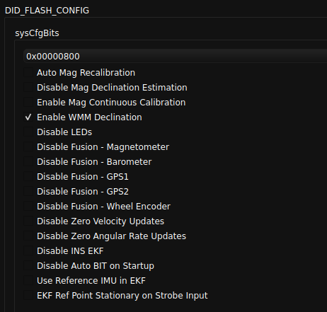

# World Magnetic Model (WMM)

The World Magnetic Model (WMM) is a mathematical model that represents the Earth's magnetic field. It is developed by the National Centers for Environmental Information (NCEI) and the British Geological Survey (BGS) and is updated every five years to account for changes in the Earth's magnetic field.

The IMX-5 uses an on-board WMM to estimate the magnetic declination, which is the angle between magnetic north and true north. 

## Enabling WMM Declination

The WMM declination is enabled by setting bit `SYS_CFG_BITS_MAG_ENABLE_WMM_DECLINATION` in `DID_FLASH_CONFIG.sysCfgBits` on the IMX-5.  This can be done in the EvalTool > Settings > General tab by checking the `Enable WMM Declination` option.

## Using WMM Declination

When enabled, the WMM declination (magnetic declination) is computed based on the current position of the IMX-5.   The current WMM declination can be viewed from the `DID_INL2_STATES.magDec` variable. 

### AHRS Mode

When running in AHRS mode and no GPS position has previously been available, the reference latitude, longitude position (`DID_FLASH_CONFIG.refLla`) is used to initialize the IMX position and WMM declination.   The user must set this `refLla` location for the WMM to generate the correct declination. 

### Nav Mode

When GPS is available and the IMX is in GNSS aided navigation mode (Nav mode), the WMM declination will continuously update as the current position changes.  

