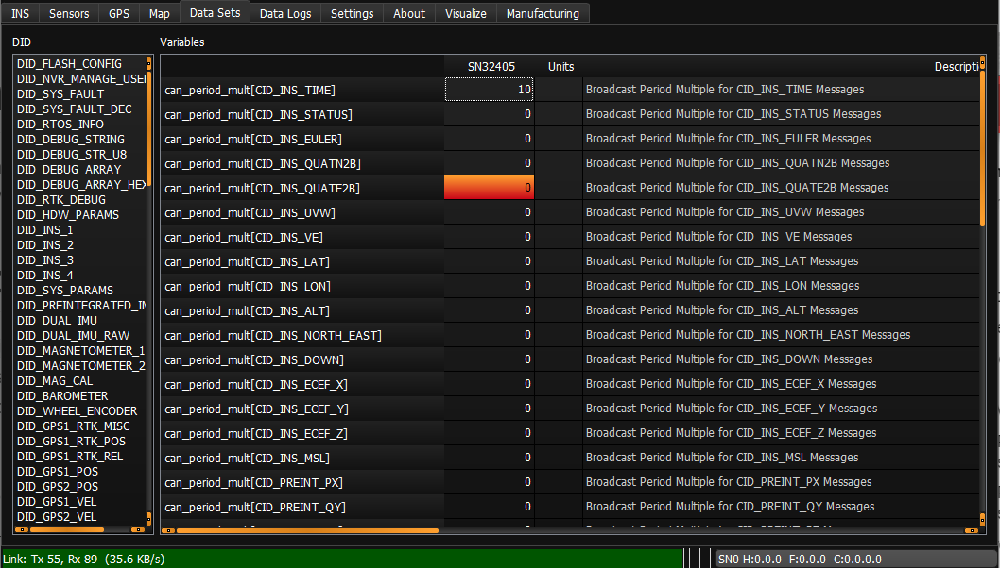

# CAN Protocol

The CAN interface allows the output of the the µINS, µAHRS, and µIMU to be published on a CAN bus. The Inertial Sense CAN implementation is based on CAN2.0b specification and follows a specific structure and format which is outlined below. All of the CAN configuration is done using the data set DID_CAN_CONFIG.

## Enable CAN

To enable the CAN bus interface on the IMX, set bit `IO_CONFIG_G1G2_CAN_BUS` in `DID_FLASH_CONFIG.ioConfig`.   This bit can be set using the EvalTool >> Settings >> General >> DID_FLASH_CONFIG >> ioConfig >> `Enable CAN Bus on G1,G2` option.

A CAN message is enabled by entering a non-zero value in the DID_CAN_CONFIG.*can_period_mult* field of the desired message. The *can_period_mult* field is an integer which is multiplied by the  [*Data Source Update Rate*](../binary/#data-source-update-rates) to determine the message broadcast period. Set *can_period_mult* to zero disable message broadcasting.

In the image below the CID_INS_TIME message is set to broadcast data at 10 times the data source rate.

The baud rate is configurable by setting the field DID_CAN_CONFIG.can_baudrate_kbps. The following standard baud rates are supported:

- 20 kbps
- 33 kbps
- 50 kbps
- 83 kbps
- 100 kbps
- 125 kbps
- 200 kbps
- 250 kbps
- 500 kbps
- 1000 kbps

The message ID for each message can be entered into the can_transmit_address field corresponding to the desired message. 

*Note: Any message ID greater than 0x7FF will be transmitted in the extended ID format.

The values set in any field of DID_CAN_CONFIG are saved to flash when a 'Save Persistent' command is received by the module. For example, this can be done in the EvalTool by clicking the Save Persistent button in the Data Logs tab. When the module is turned on, all the fields will be repopulated with the saved values.

All messages are disabled when a Stop Streaming message is received by the module. However, the values in each field will be repopulated to the values present when a 'Save Persistent' command was last received.

## Hardware

Inertial Sense module exposes the RxCAN and TxCAN pins. The selection and implementation of a CAN transceiver is left to the user. 

| Line | Function |
| ---- | -------- |
| G1   | RxCAN    |
| G2   | TxCAN    |

The Inertial Sense evaluation boards and Rugged unit have a built in transceiver.

## CAN Data Sets (CIDs)

The CAN Data Sets, in the form of C structures, define the format of the output data. The data sets are defined in SDK\hw-libs\communications\CAN_comm.h of the InertialSense SDK. The CID data is selected data from the standard Inertial Sense DIDs. The data types generally have been changed and scaled to fit the CAN2.0 8 byte payload restrictions.

#### CID_INS_TIME

INS time output

`is_can_time`

GMT information

| Field      | Type     | Description                                        |
| ---------- | -------- | -------------------------------------------------- |
| week       | uint32_t | GPS number of weeks since January 6th, 1980        |
| timeOfWeek | float    | GPS time of week (since Sunday morning) in seconds |

#### CID_INS_STATUS

`is_can_ins_status`

INS status flags

| Field     | Type     | Description                                 |
| --------- | -------- | ------------------------------------------- |
| insStatus | uint32_t | INS status flags (see eInsStatusFlags)      |
| hdwStatus | uint32_t | Hardware status flags (see eHdwStatusFlags) |

#### CID_INS_EULER

`is_can_ins_euler`

Euler angles: roll, pitch, yaw in radians with respect to NED (scaled by 10000)

| Field  | Type    | Description                        |
| ------ | ------- | ---------------------------------- |
| theta1 | int16_t | Roll (4 decimal places precision)  |
| theta2 | int16_t | Pitch (4 decimal places precision) |
| theta3 | int16_t | Yaw (4 decimal places precision)   |

#### CID_INS_QUATN2B

`is_can_ins_quatn2b`

Quaternion body rotation with respect to NED: W, X, Y, Z (scaled by 10000)

| Field | Type    | Description                    |
| ----- | ------- | ------------------------------ |
| qn2b1 | int16_t | W (4 decimal places precision) |
| qn2b2 | int16_t | X (4 decimal places precision) |
| qn2b3 | int16_t | Y (4 decimal places precision) |
| qn2b4 | int16_t | Z (4 decimal places precision) |

#### CID_INS_QUATE2B

`is_can_ins_quate2b`

 Quaternion body rotation with respect to ECEF: W, X, Y, Z (scaled by 10000)

| Field | Type    | Description                    |
| ----- | ------- | ------------------------------ |
| qe2b1 | int16_t | W (4 decimal places precision) |
| qe2b2 | int16_t | X (4 decimal places precision) |
| qe2b3 | int16_t | Y (4 decimal places precision) |
| qe2b4 | int16_t | Z (4 decimal places precision) |

#### CID_INS_UVW

`is_can_uvw`

Velocity U, V, W in body frame in meters per second (scaled by 100). 

| Field | Type    | Description                    |
| ----- | ------- | ------------------------------ |
| uvw1  | int16_t | U (2 decimal places precision) |
| uvw2  | int16_t | V (2 decimal places precision) |
| uvw3  | int16_t | W (2 decimal places precision) |

#### CID_INS_VE

`is_can_ve`

Velocity in ECEF (earth-centered earth-fixed) frame in meters per second  (scaled by 100).

| Field | Type    | Description                      |
| ----- | ------- | -------------------------------- |
| ve1   | int16_t | ve1 (2 decimal places precision) |
| ve2   | int16_t | ve2 (2 decimal places precision) |
| ve3   | int16_t | ve3 (2 decimal places precision) |

#### CID_INS_LAT

`is_can_ins_lat`

WGS84 latitude.

| Field | Type   | Description                                               |
| ----- | ------ | --------------------------------------------------------- |
| lat   | double | Latitude (degrees) (more than 8 decimal places precision) |

#### CID_INS_LON

`is_can_ins_lon`

WGS84 longitude.

| Field | Type   | Description                                                |
| ----- | ------ | ---------------------------------------------------------- |
| lon   | double | Longitude (degrees) (more than 8 decimal places precision) |

#### CID_INS_ALT

`is_can_ins_alt`

WGS84 height above ellipsoid and GPS status flags

| Field  | Type     | Description                                                  |
| ------ | -------- | ------------------------------------------------------------ |
| alt    | float    | Altitude (meters) (more than 8 decimal places precision)     |
| status | uint32_t | (see eGpsStatus) GPS status: [0x000000xx] number of satellites used, [0x0000xx00] fix type, [0x00xx0000] status flags |

#### CID_INS_NORTH_EAST

`is_can_north_east`

Offset from reference latitude, longitude, and altitude to current latitude, longitude, and altitude.

| Type  | Field | Description    |
| ----- | ----- | -------------- |
| float | ned1  | North (meters) |
| float | ned2  | East (meters)  |

#### CID_INS_DOWN

`is_can_down`

Down offset from reference LLA  and INS status flags

| Type  | Field     | Description      |
| ----- | --------- | ---------------- |
| float | ned3      | Down (meters)    |
| float | insStatus | INS status flags |

#### CID_INS_ECEF_X

`is_can_ecef_x`

X Position in ECEF (earth-centered earth-fixed) frame.

| Type  | Field  | Description |
| ----- | ------ | ----------- |
| ecef1 | double | X (meters)  |

#### CID_INS_ECEF_Y

`is_can_ecef_y`

Y Position in ECEF (earth-centered earth-fixed) frame.

| Type  | Field  | Description |
| ----- | ------ | ----------- |
| ecef2 | double | Y (meters)  |

#### CID_INS_ECEF_Z

`is_can_ecef_z`

Z Position in ECEF (earth-centered earth-fixed) frame.

| Type  | Field  | Description |
| ----- | ------ | ----------- |
| ecef2 | double | Z (meters)  |

#### CID_INS_MSL

`ins_can_msl`

Height above Mean Sea Level 

| Type | Field | Description  |
| ---- | ----- | ------------ |
| msl  | float | MSL (meters) |

#### CID_PREINT_PX

`is_can_preint_imu_px`

Preintegrated IMU values delta theta and delta velocity (X axis), and Integral period in body/IMU frame of accelerometer 0.

| Type   | Field     | Description                                                  |
| ------ | --------- | ------------------------------------------------------------ |
| theta0 | int16_t   | Delta theta (rad, scaled by 1000, 3 decimal places precision) |
| vel0   | int16_t   | Delta velocity (m/s, scaled by 100, 2 decimal places precision) |
| dt     | uints16_t | Integral Period (meters, scaled by 1000)                     |

#### CID_PREINT_QY

`is_can_preint_imu_qy`

Preintegrated IMU values delta theta and delta velocity (Y axis), and Integral period in body/IMU frame of accelerometer 0.

| Type   | Field     | Description                                                  |
| ------ | --------- | ------------------------------------------------------------ |
| theta1 | int16_t   | Delta theta (rad, scaled by 1000, 3 decimal places precision) |
| vel1   | int16_t   | Delta velocity (m/s, scaled by 100, 2 decimal places precision) |
| dt     | uints16_t | Integral Period (meters, scaled by 1000)                     |

#### CID_PREINT_RZ

`is_can_preint_imu_rz`

Preintegrated IMU values delta theta and delta velocity (Z axis), and Integral period in body/IMU frame of accelerometer 0.

| Type   | Field     | Description                                                  |
| ------ | --------- | ------------------------------------------------------------ |
| theta2 | int16_t   | Delta theta (rad, scaled by 1000, 3 decimal places precision) |
| vel2   | int16_t   | Delta velocity (m/s, scaled by 100, 2 decimal places precision) |
| dt     | uints16_t | Integral Period (meters, scaled by 1000)                     |

#### CID_DUAL_PX

`is_can_dual_imu_px`

Dual IMU gyro and accelerometer values from accelerometer 0

| Type   | Field     | Description                                                  |
| ------ | --------- | ------------------------------------------------------------ |
| theta0 | int16_t   | Theta (rad/s, scaled by 1000, 3 decimal places precision)    |
| vel0   | int16_t   | Acceleration (m/s2, scaled by 100, 2 decimal places precision) |
| status | uints32_t | IMU status (see eImuStatus)                                  |

#### CID_DUAL_QY

`is_can_dual_imu_qy`

Dual IMU gyro and accelerometer values from accelerometer 0

| Type   | Field     | Description                                                  |
| ------ | --------- | ------------------------------------------------------------ |
| theta1 | int16_t   | Theta (rad/s, scaled by 1000, 3 decimal places precision)    |
| vel1   | int16_t   | Acceleration (m/s2, scaled by 100, 2 decimal places precision) |
| status | uints32_t | IMU status (see eImuStatus)                                  |

#### CID_DUAL_RZ

`is_can_dual_imu_rz`

Dual IMU gyro and accelerometer values from accelerometer 0 

| Type   | Field     | Description                                                  |
| ------ | --------- | ------------------------------------------------------------ |
| theta2 | int16_t   | Theta (rad/s, scaled by 1000, 3 decimal places precision)    |
| vel2   | int16_t   | Acceleration (m/s2, scaled by 100, 2 decimal places precision) |
| status | uints32_t | IMU status (see eImuStatus)                                  |

#### CID_GPS1_POS

`is_can_gps1_pos_status`

GPS CNO Mean and GPS status flags

| Type    | Field    | Description                                                  |
| ------- | -------- | ------------------------------------------------------------ |
| status  | uint32_t | (see eGpsStatus) GPS status: [0x000000xx] number of satellites used, [0x0000xx00] fix type, [0x00xx0000] status flags |
| cnoMean | uint32_t | (dBHz) Average of all satellite carrier to noise ratios (signal strengths) that are non-zero |

#### CID_GPS1_RTK_REL

`is_can_gps1_rtk_rel`

RTK-GPS performance metrics

| Type            | Field   | Description                                                  |
| --------------- | ------- | ------------------------------------------------------------ |
| arRatio         | uint8_t | Ambiguity resolution ratio factor for validation             |
| differentialAge | uint8_t | Age of differential (seconds)                                |
| distanceToBase  | float   | Distance to Base (m)                                         |
| headingToBase   | int16_t | Angle from north to vectorToBase in local tangent plane. (rad, scaled by 1000) |

#### CID_ROLL_ROLLRATE

`is_can_roll_rollRate`

Combination or INS roll estimation and preintegrated IMU of both accelerometers

| Type    | Field   | Description                                                  |
| ------- | ------- | ------------------------------------------------------------ |
| insRoll | int16_t | INS Roll (scaled by 10000, 4 decimal places precision)       |
| pImu1   | int16_t | Delta theta (rad, scaled by 1000, 3 decimal places precision) |
| pImu2   | int16_t | Delta theta (rad, scaled by 1000, 3 decimal places precision) |