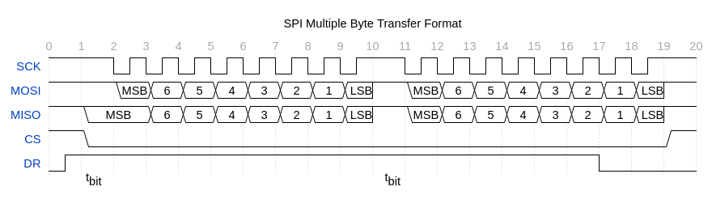
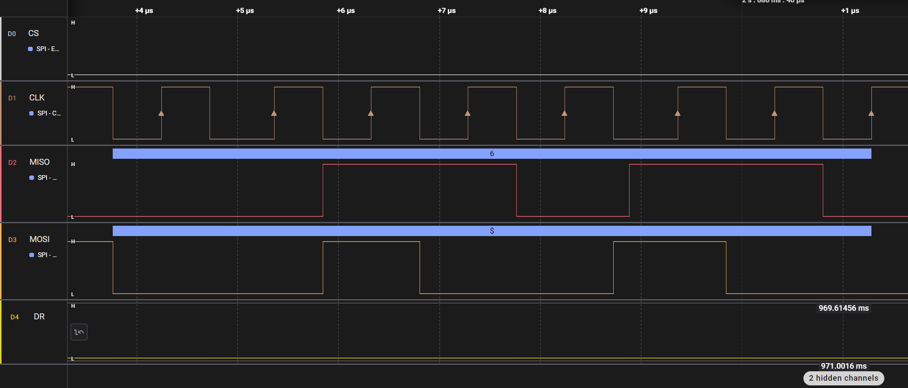
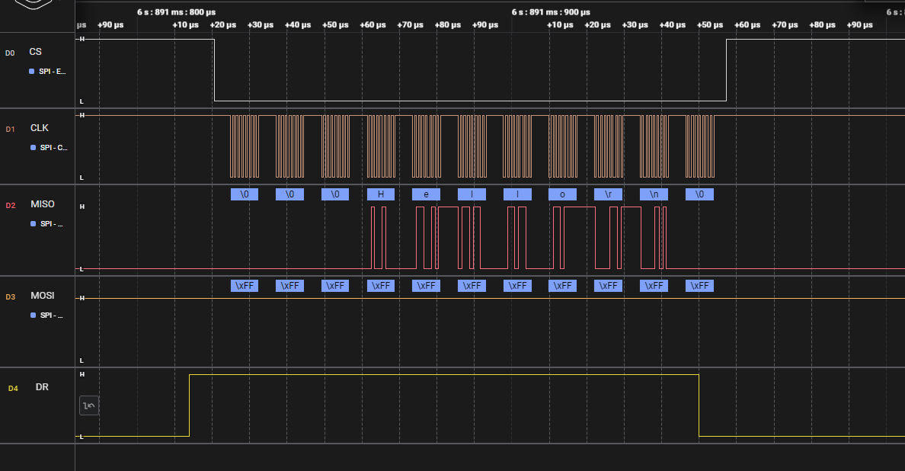
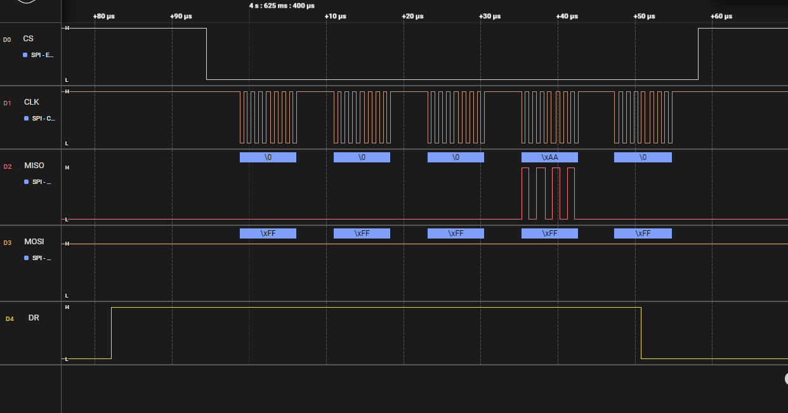
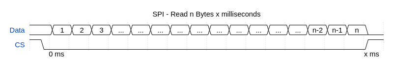
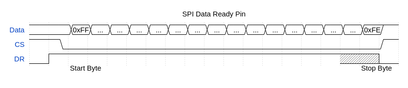
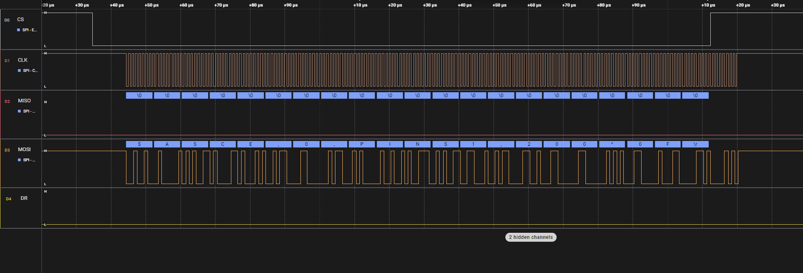

# SPI Protocol

The SPI interface provides an alternative method of communications with the IMX-5. The SPI protocol uses much of the same structure and format as the serial communication binary protocol which is outlined in the [Binary Protocol](../com-protocol/SPI.md) section of the users manual.

## Enable SPI

To Enable SPI, hold pin G9 (nSPI_EN) low at startup.

Note: When external GPS PPS timepulse signal is enabled on G9, the module will ignore the nSPI_EN signal and SPI mode will be disabled regardless of G9 pin state.

## Hardware

Inertial Sense SPI interface uses 5 lines to interface with other devices.

| Line | Function                      |
| ---- | ----------------------------- |
| CS   | SPI Chip Select               |
| SCLK | SPI Clock Synchronization Pin |
| MISO | SPI Master In Slave Out       |
| MOSI | SPI Master Out Slave In       |
| DR   | SPI Data Ready Pin (optional) |

### Hardware Configuration

The IMX and GPX modules operate as a SPI slave device using **SPI Mode 3**:

| SPI Settings        |                         |
| ------------------- | ----------------------- |
| SPI Mode            | 3                       |
| CPOL (Clock Polarity) | 1                |
| CPHA (Clock Phase)  | 1               |
| Clock Polarity in Idle State | Logic high    |
| Clock Phase Used to Sample and/or Shift Data | Data sampled on the rising edge and shifted out on the falling edge. |
| Chip Select         | Active low             |
| Data Ready          | Active high            |

###  Data Transfer

To ensure correct behavior of the receiver in SPI Slave mode, the master device sending the frame must ensure a minimum delay of one tbit (tbit being the nominal time required to transmit a bit) between each character transmission. Inertial Sense devices do not require a falling edge of the [Chip Select (CS)] to initiate a character reception but only a low level. However, this low level must be present on the [Chip Select (CS)] at least one tbit before the first serial clock cycle corresponding to the MSB bit. (1)

<!-- Wavedrom figure compatible with v1.8.0 https://github.com/wavedrom/wavedrom.github.io/releases/tag/v1.8.0
{signal: [
  {name: 'SCK', wave: '1...lhlhlhlhlhlhlhlh..lhlhlhlhlhlhlhlh..', period: .5 },
  {name: 'MOSI', wave: 'h.22222222h22222222h',phase: 0, data: "MSB 6 5 4 3 2 1 LSB MSB 6 5 4 3 2 1 LSB"},
  {name: 'MISO', wave: 'h..2.......2...2...2...2...2...2...2...h...2..2..2..2..2..2..2..2..h..', data: "MSB 6 5 4 3 2 1 LSB MSB 6 5 4 3 2 1 LSB", period: 0.25},
  {name: 'CS', wave: 'h0.................1'},
  {name: 'DR', wave: 'lh................................................................................................................................................................l.............................', period: .1}
 ],
  	foot: {text:
           ['tspan',{dx:'-160'},{dy:'-18'}, 't',['tspan', {dy:'5'}, 'bit'], ['tspan', {dx:'350'},{dy:'-5'}, 't'],['tspan', {dy:'5'}, 'bit']]},
	head:{text:'SPI Multiple Byte Transfer Format',
   tick:0,}
} -->

When reading the IMX and there is no data ready it will send zeros for the data.

Keeping CS low should not cause any issues. However, if the clocking between the master and slave processors gets out of sync there is nothing to get them back into sync. Ground bounce or noise during a transition could cause the IMX to see two clock edges when there should have only been one (due to an ESD or a fast transient event). Raising and lowering the CS line resets the shift register will resynchronize the clocks.

### Data Ready Pin Option

There is a data ready pin option. This signal will be raised when data becomes ready.Also this line will go inactive a byte or two before the end of the packet gets sent. There is not a "not in a data packet" character to send. It is strictly done by data ready pin and parsing.

 Depending on when this happens there can be 1-4 bytes of zeros that will come out before the packet starts. 

If the chip select line is lowered during a data packet, the byte being transmitted (or that would be transmitted) can be lost. It is recommended to only lower the chip select when outside of a data packet and the data ready pin is inactive.

The internal SPI buffer is 4096 bytes. If there is a buffer overflow, the buffer gets dropped. This is indicated by a data ready pin that is high without data being there. When an overflow happens, it clears the buffer, so the system could be in the middle of a packet and the IMX would just send zeros. If a request is sent to the IMX or the IMX sends a packet periodically it will resolve the situation.

The SPI interface supports up to 3 Mbs data rate. (5 Mbs works if the data ready pin is used to receive the data - see B below.)

### Reading Data
There are two strategies that can be used to read the data:

A. Read a fixed data size out every set time interval. More data will be read than the uINx will produce on a regular interval, for instance, reading 512 bytes every 4 ms.

<!-- Wavedrom figure compatible with v1.8.0 https://github.com/wavedrom/wavedrom.github.io/releases/tag/v1.8.0
{signal: [
  {name: 'Data', wave: '222222222222222220',phase: 0, data: " 1 2 3 ... ... ... ... ... ... ... ... ... ... n-2 n-1 n"},
  {name: 'CS', wave: 'h0.................................................................1..', period:.25},
  ],
  	foot: {text:
           ['tspan',{dx:'15'},{dy:'-16'}, '0 ms', ['tspan', {dx:'610'},{dy:'0'}, 'x ms'],]},
	head:{text:'SPI - Read n Bytes x milliseconds',
   }
} -->
Packet will be 0x00 padded if bytes read exceeds packet size.

B. Read while the data ready pin is active **or** we are inside a data packet. One anomaly is the data ready pin will drop a byte or two before the end gets clocked out, hence needing to watch for the end of the packet.

<!-- Wavedrom figure compatible with v1.8.0 https://github.com/wavedrom/wavedrom.github.io/releases/tag/v1.8.0
{signal: [
  {name: 'Data', wave: '2.22222222222222221',phase: 0, data: " 0xFF ... ... ... ... ... ... ... ... ... ... ... ... ... ... 0xFE"},
  {name: 'CS', wave: 'h....0................................................................1..', period: .25},
  {name: 'DR', wave: 'l........h....................................................................................................................................................c...................l.....', period: .1}
 ],
  	foot: {text:
           ['tspan',{dx:'35'},{dy:'-16'}, 'Start Byte', ['tspan', {dx:'535'},{dy:'0'}, 'Stop Byte'],]},
	head:{text:'SPI Data Ready Pin',
   }
} -->
### Pseudo Code for reading data:

1. Check data ready pin. If pin is low, delay and check pin again.
1. Lower CS line and read a block of data. Read sizes are arbitrary, but it tends to work better if the read count is long enough to contain most data packets.
1. After read completes, check data ready pin. If it is high, read more data. DO NOT raise the CS line while the data ready pin is high, it will cause data loss. If data ready is low, raise CS line. On a busy system (and depending on baud rate) this would need to happen along with the data read as the data ready pin might not go low in between packets.
1. Parse data looking for start of packet (0xFF) discarding data until found. Once found start saving the data.
1. Save and parse data looking for end of packet (0xFE). Once found send packet off for use. If a start of packet character is seen while looking for the end, discard previous data and start the packet saving over.

## EVB-2 SPI Dev Kit

The EVB-2 demonstrates SPI interface with the IMX.  The EVB-2 ATSAM-E70 (E70) processor provides the example SPI interface with the IMX.  The EVB-2 must be put into CBPreset mode 6 (CONFIG led color cyan) followed by a system reset to enable SPI mode.  The EVB-2 (E70) project source code is available in the SDK for reference. 

## Troubleshooting
If every other character from a packet is lost it might be that the CS line is being toggled after every byte.

The uINS-3.1 uses a USART SPI peripherial which requires a minimum delay of one tbit (tbit being the nominal time required to transmit a bit) spacing between characters sent. Reading bytes one by one may cause signifacnt time delays when streaming data. Depending on the ammount of data streaming, the uINS mable to keep up and the buffer could be overflow. Single message requests should work properly, but streaming probably will not work well. If the master hardware can't handle the delay, the uINS 3.2 hardware should be used.

## Resources

(1) *SAM E70/S70/V70/V71 Family*. Microchip Technology Inc., https://ww1.microchip.com/downloads/en/DeviceDoc/SAM-E70-S70-V70-V71-Family-Data-Sheet-DS60001527E.pdf
