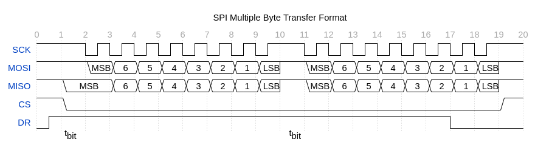
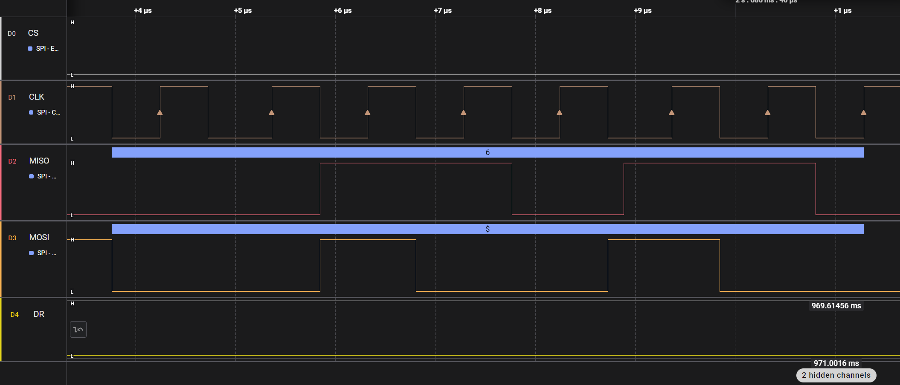
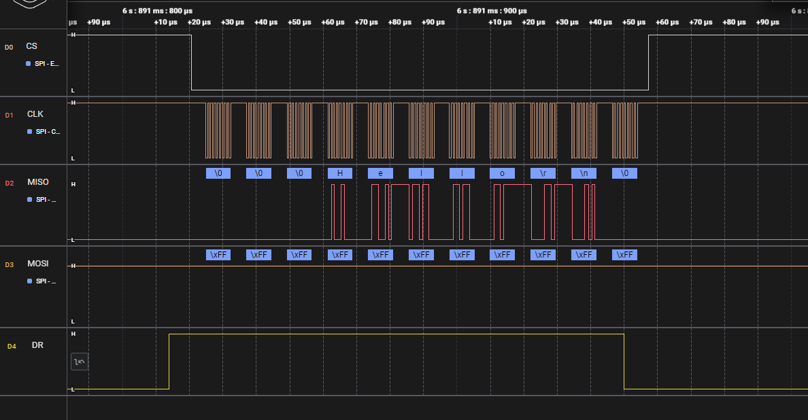
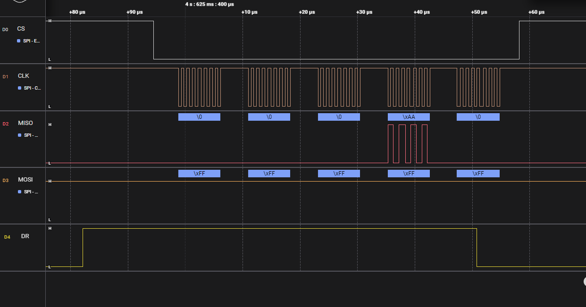
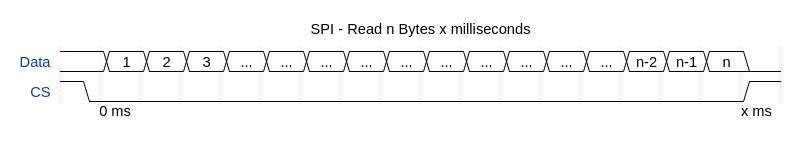
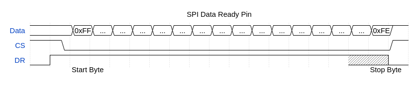
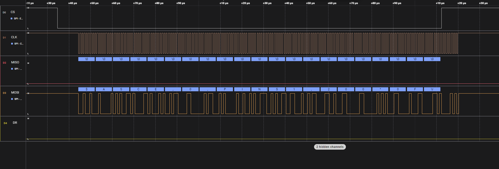

# SPI Protocol

The SPI interface provides an alternate communication path for IMX and GPX modules, supporting the same protocols as the UART and USB interfaces. It operates in a master/slave configuration with the module as the slave; the master clocks data in and out. When the output buffer is empty, the module transmits zeros and the Data Ready (DR) pin goes low. Two read strategies are available: **fixed-size polling**, which reads a fixed block at a regular interval regardless of DR state, and **Data Ready gated**, which drives reads from the DR pin and packet framing. Fixed-size polling is simpler to implement; the DR-gated approach is more efficient and supports higher data rates.

## Enable SPI

To enable SPI, hold pin G9 (nSPI_EN) low at startup.

> **Note:** When an external GPS PPS timepulse signal is enabled on G9, the module will ignore the nSPI_EN signal and SPI mode will be disabled regardless of the G9 pin state.

## Hardware

The Inertial Sense SPI interface uses 5 lines:

| Line | Function                      |
| ---- | ----------------------------- |
| CS   | Chip Select                   |
| SCLK | Clock Synchronization         |
| MISO | Master In Slave Out           |
| MOSI | Master Out Slave In           |
| DR   | Data Ready (optional)         |

### Hardware Configuration

The IMX and GPX modules operate as an SPI slave device using **SPI Mode 3**:

| Setting                       | Value                                                            |
| ----------------------------- | ---------------------------------------------------------------- |
| SPI Mode                      | 3                                                                |
| CPOL (Clock Polarity)         | 1 (idle high)                                                    |
| CPHA (Clock Phase)            | 1 (sample on rising edge, shift on falling edge)                 |
| Chip Select                   | Active low                                                       |
| Data Ready                    | Active high                                                      |

### Data Transfer

To ensure correct behavior in SPI slave mode, the master must provide a minimum delay of one tbit between each byte transmission, where tbit is the nominal time to transmit one bit. The module does not require a falling edge on CS to begin receiving — only a sustained low level. However, CS must be asserted at least one tbit before the first clock cycle corresponding to the MSB. (1)

<!-- Wavedrom figure compatible with v1.8.0 https://github.com/wavedrom/wavedrom.github.io/releases/tag/v1.8.0
{signal: [
  {name: 'SCK', wave: '1...lhlhlhlhlhlhlhlh..lhlhlhlhlhlhlhlh..', period: .5 },
  {name: 'MOSI', wave: 'h.22222222h22222222h',phase: 0, data: "MSB 6 5 4 3 2 1 LSB MSB 6 5 4 3 2 1 LSB"},
  {name: 'MISO', wave: 'h..2.......2...2...2...2...2...2...2...h...2..2..2..2..2..2..2..2..h..', data: "MSB 6 5 4 3 2 1 LSB MSB 6 5 4 3 2 1 LSB", period: 0.25},
  {name: 'CS', wave: 'h0.................1'},
  {name: 'DR', wave: 'lh................................................................................................................................................................l.............................', period: .1}
 ],
  	foot: {text:
           ['tspan',{dx:'-160'},{dy:'-18'}, 't',['tspan', {dy:'5'}, 'bit'], ['tspan', {dx:'350'},{dy:'-5'}, 't'],['tspan', {dy:'5'}, 'bit']]},
	head:{text:'SPI Multiple Byte Transfer Format',
   tick:0,}
} -->

When no data is ready, the module transmits zeros.

Keeping CS continuously asserted is generally safe. However, if the master and slave clocks fall out of sync — due to noise, ground bounce, or a fast transient causing a spurious clock edge — there is no automatic recovery mechanism. Toggling CS (deasserting then reasserting) resets the shift register and resynchronizes the clocks.

### Data Ready Pin

The DR pin goes high when data is available and goes inactive one or two bytes before the end of the packet is clocked out. There is no dedicated end-of-packet character; framing relies on the DR pin and packet parsing.

Depending on timing, 1–4 bytes of zeros may precede the start of a packet.

If CS is deasserted during a packet transmission, the byte being clocked out may be lost. It is recommended to deassert CS only when outside of a data packet and the DR pin is inactive.

The internal SPI buffer is 4096 bytes. On overflow, the entire buffer is dropped — the module may be mid-packet and will transmit zeros until new data arrives. A buffer overflow is indicated by DR going high with no valid data present. Sending a request to the module or waiting for a periodic packet will restore normal operation.

The SPI interface supports data rates up to **3 Mbps**. Using the Data Ready pin to gate reads (Strategy B below) allows operation up to **5 Mbps**.

### Reading Data

There are two strategies for reading data: **fixed-size polling**, where a fixed block is read at a regular interval regardless of DR state, and **Data Ready gated**, where reads are driven by the DR pin and packet framing. Fixed-size polling is simpler to implement; the DR-gated approach is more efficient.

**A. Fixed-size polling** — Read a fixed block at a regular interval, sized to reliably drain the buffer. For example, read 512 bytes every 4 ms.

<!-- Wavedrom figure compatible with v1.8.0 https://github.com/wavedrom/wavedrom.github.io/releases/tag/v1.8.0
{signal: [
  {name: 'Data', wave: '222222222222222220',phase: 0, data: " 1 2 3 ... ... ... ... ... ... ... ... ... ... n-2 n-1 n"},
  {name: 'CS', wave: 'h0.................................................................1..', period:.25},
  ],
  	foot: {text:
           ['tspan',{dx:'15'},{dy:'-16'}, '0 ms', ['tspan', {dx:'610'},{dy:'0'}, 'x ms'],]},
	head:{text:'SPI - Read n Bytes x milliseconds',
   }
} -->

The read buffer is zero-padded if the requested byte count exceeds the available data.

**B. Data Ready gated** — Read while the DR pin is active, or while inside a data packet. Because DR goes inactive a byte or two before the packet ends, the master must continue reading until the end-of-packet marker is found.

<!-- Wavedrom figure compatible with v1.8.0 https://github.com/wavedrom/wavedrom.github.io/releases/tag/v1.8.0
{signal: [
  {name: 'Data', wave: '2.22222222222222221',phase: 0, data: " 0xFF ... ... ... ... ... ... ... ... ... ... ... ... ... ... 0xFE"},
  {name: 'CS', wave: 'h....0................................................................1..', period: .25},
  {name: 'DR', wave: 'l........h....................................................................................................................................................c...................l.....', period: .1}
 ],
  	foot: {text:
           ['tspan',{dx:'35'},{dy:'-16'}, 'Start Byte', ['tspan', {dx:'535'},{dy:'0'}, 'Stop Byte'],]},
	head:{text:'SPI Data Ready Pin',
   }
} -->

### Pseudocode for Reading Data

1. Check the DR pin. If low, wait and check again.
2. Assert CS and read a block of data. Block size is arbitrary but should be large enough to contain most packets.
3. After the read, check DR again. If high, read more data without deasserting CS — raising CS while DR is high will cause data loss. If DR is low, deassert CS. On busy systems or at high data rates, DR may not go low between packets; in that case, keep CS asserted and continue reading.
4. Parse the incoming data for the start-of-packet byte (0xFF), discarding all preceding bytes.
5. Continue reading and parsing until the end-of-packet byte (0xFE) is found, then dispatch the complete packet. If another start-of-packet byte is encountered before the end is found, discard the partial packet and restart.

## Troubleshooting

**Every other byte is lost** — The CS line may be toggling after each byte. CS should remain asserted for the duration of a transaction.
