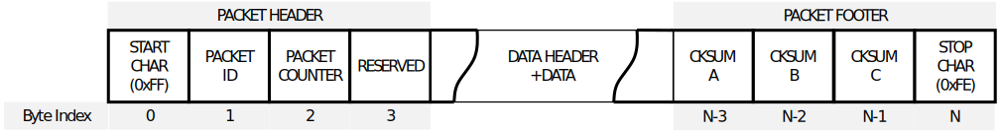
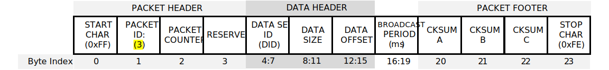
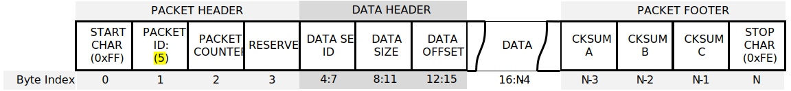

# Inertial Sense Binary Protocol

The Inertial Sense binary protocol provides the most efficient way to communicate with the µINS, µAHRS, and µIMU because it preserved the native floating point and integer binary format used in computers.  Binary protocol is not human readable like [ASCII Protocol](../com-protocol/ascii.md).  Binary protocol uses [Data Set (DID)](../com-protocol/DID-descriptions.md) C structures defined in SDK/src/data_sets.h of the InertialSense SDK.  

## Communication

Writing to and reading from InertialSense products is done using "Set" and "Get" commands.

### Setting Data

The `is_comm_set_data()` function will encode a message used to set data or configurations.  

```c++
// Set INS output Euler rotation in radians to 90 degrees roll for mounting
float rotation[3] = { 90.0f*C_DEG2RAD_F, 0.0f, 0.0f };
int messageSize = is_comm_set_data(comm, DID_FLASH_CONFIG, offsetof(nvm_flash_cfg_t, insRotation), sizeof(float) * 3, rotation);
if (messageSize != serialPortWrite(serialPort, comm->buffer, messageSize))
{
	printf("Failed to encode and write set INS rotation\r\n");
	return -3;
}
```
### Getting Data

Data broadcasting or streaming is enabled by using the Realtime Message Controller (RMC) or the get data command.

#### Get Data Command

The `is_comm_get_data()` function will encode a PID_GET_DATA message that enables broadcast of a given message at a multiple of the [*Data Source Update Rates*](#data-source-update-rates).  Set the data rate (period multiple) to zero disable message broadcast and pull a single packet of data.  Set the data size and offset to zero to request the entire data set.

```c++
// Ask for INS message w/ update 40ms period (4ms source period x 10).  Set data rate to zero to disable broadcast and pull a single packet.
int messageSize = is_comm_get_data(comm, DID_INS_1, 0, 0, 10);
if (messageSize != serialPortWrite(serialPort, comm->buffer, messageSize))
{
	printf("Failed to encode and write get INS message\r\n");
}
```

#### Data Source Update Rates

| DID                                                    | Update Rate (Period)                                         |
| ------------------------------------------------------ | ------------------------------------------------------------ |
| DID_INS_[1-4]                                          | (4ms default) Configured with DID_FLASH_CONFIG.startupNavDtMs |
| DID_IMU, <br/>DID_PIMU<sup>*</sup>   | (4ms default) Configured with DID_FLASH_CONFIG.startupImuDtMs |
| DID_BAROMETER                                          | ~8ms                                                         |
| DID_MAGNETOMETER_[1-2]                                 | ~10ms                                                        |
| DID_GPS[1-2]_[X] <br/>(Any DID beginning with DID_GPS) | (200ms default) Configured with DID_FLASH_CONFIG. startupGPSDtMs |
| All other DIDs                                         | 1ms                                                          |

<sup>*DID_PIMU integration period (dt) and output data rate are the same as DID_FLASH_CONFIG.startupNavDtMs and cannot be output at any other rate.  If a different output data rate is desired, DID_IMU which is derived from DID_PIMU can be used instead.</sup>

#### Realtime Message Controller (RMC)

The RMC is used to enable message broadcasting and provides updates from onboard data as soon as it becomes available with minimal latency.   All RMC messages can be enabled using the [*Get Data Command*](#get-data-command), which is the preferred method, or by directly setting the RMC bits. The RMC bits are listed below. Message data rates are listed in the [*Data Source Update Rates*](#data-source-update-rates) table.

| RMC Message                                   |
| --------------------------------------------- |
| RMC_BITS_INS[1-4]                             |
| RMC_BITS_DUAL_IMU, RMC_BITS_PIMU |
| RMC_BITS_BAROMETER                            |
| RMC_BITS_MAGNETOMETER[1-2]                    |
| RMC_BITS_GPS[1-2]_NAV                         |
| RMC_BITS_GPS_RTK_NAV, RMC_BITS_GPS_RTK_MISC   |
| RMC_BITS_STROBE_IN_TIME                       |

The following is an example of how to use the RMC.  The `rmc.options` field controls whether RMC commands are applied to other serial ports.   `rmc.options = 0` will apply the command to the current serial port.

```c++
	rmc_t rmc;

    // Enable broadcasts of DID_INS_1 and DID_GPS_NAV
	rmc.bits = RMC_BITS_INS1 | RMC_BITS_GPS1_POS;       
    // Remember configuration following reboot for automatic data streaming.
	rmc.options = RMC_OPTIONS_PERSISTENT;				
    // INS output data rate at 20Hz
    rmc.insPeriodMs = 50;

	int messageSize = is_comm_set_data(comm, DID_RMC, 0, sizeof(rmc_t), &rmc);
	if (messageSize != serialPortWrite(serialPort, comm->buffer, messageSize))
	{
		printf("Failed to encode and write RMC message\r\n");
	}
```
#### Persistent Messages

The *persistent messages* option saves the current data stream configuration to flash memory for use following reboot,  eliminating the need to re-enable messages following a reset or power cycle.  

- **To save persistent messages** - (to flash memory), bitwise OR `RMC_OPTIONS_PERSISTENT (0x200)` with the RMC option field or set DID_CONFIG.system = 0x00000001 and DID_CONFIG.system = 0xFFFFFFFE.   See the [save persistent messages example](../../SDK/CommunicationsBinary/#step-7-save-persistent-messages) in the Binary Communications example project.
- **To disable persistent messages** - a [stop all broadcasts packet](../../SDK/CommunicationsBinary/#step-4-stop-any-message-broadcasting) followed by a *save persistent messages* command.   

[ASCII persistent messages](../ascii/#persistent-messages) are also available. 

##### Enabling Persistent Messages - EvalTool  

- Enable the desired messages in the EvalTool "Data Sets" tab. 
- Press the "Save Persistent" button in the EvalTool "Data Logs" tab to store the current message configuration to flash memory for use following reboot.
- Reset the system and verify the messages are automatically streaming.  You can use the EvalTool->Data Logs dialog to view the streaming messages.

**To disable all persistent messages using the EvalTool**, click the "Stop Streaming" button and then "Save Persistent" button.  

##### Enabling Persistent Messages - CLTool  

Persistent messages are enabled using the CLTool by including the `-persistent` option along with the options for the desired messages in the command line.

```
cltool -c /dev/ttyS3 -persistent -msgINS2 -msgGPS
```

#### Example Projects

Examples on how to use the Inertial Sense SDK for binary communications are found in the [Binary Communications Example Project](../SDK/CommunicationsBinary.md) and [cltool project](../SDK/InertialSenseClassCLTool.md).  [ASCII communications](../com-protocol/ascii.md) examples are found in the [ASCII Example Project](../SDK/CommunicationsAscii.md).

### Parsing Data

The [ISComm](https://github.com/inertialsense/InertialSenseSDK/blob/master/src/ISComm.h ) library in the [InertialSenseSDK]( https://github.com/inertialsense/InertialSenseSDK/ ) provides a communications parser that can parse InertialSense binary protocol as well as other protocols. 

#### One Byte (Simple Method)

The following parser code is simpler to implement.  This method uses the `is_comm_parse_byte()` function to parse one byte at a time of a data stream.  The return value is a non-zero protocol_type_t when valid data is found.    

```c++
	uint8_t c;
	protocol_type_t ptype;
	// Read from serial buffer until empty
	while (mySerialPortRead(&c, 1))
	{
		if ((ptype = is_comm_parse_byte(comm, c)) != _PTYPE_NONE)
		{
			switch (ptype)
			{
			case _PTYPE_INERTIAL_SENSE_DATA:
			case _PTYPE_INERTIAL_SENSE_CMD:
				break;
			case _PTYPE_UBLOX:
				break;
			case _PTYPE_RTCM3:
				break;
			case _PTYPE_ASCII_NMEA:
				break;
			}
		}
	}
```

#### Set of Bytes (Fast Method)

The following parser code uses less processor time to parse data by copying multiple bytes at a time.  This method uses `is_comm_free()` and `is_comm_parse()` along with a serial port read or buffer copy.   The return value is a non-zero protocol_type_t when valid data is found. 

```c++
	// Read a set of bytes (fast method)
	protocol_type_t ptype;

	// Get available size of comm buffer
	int n = is_comm_free(comm);

	// Read data directly into comm buffer
	if ((n = mySerialPortRead(comm->buf.tail, n)))
	{
		// Update comm buffer tail pointer
		comm->buf.tail += n;

		// Search comm buffer for valid packets
		while ((ptype = is_comm_parse(comm)) != _PTYPE_NONE)
		{
			switch (ptype)
			{
			case _PTYPE_INERTIAL_SENSE_DATA:
			case _PTYPE_INERTIAL_SENSE_CMD:
				break;
			case _PTYPE_UBLOX:
				break;
			case _PTYPE_RTCM3:
				break;
			case _PTYPE_ASCII_NMEA:
				break;
			}
		}
	}
```

## Packet Structure

The SDK is provided to encode and decode binary packets. This section can be disregareded if the SDK is used.  This section is provided to detail the packet and data structures format used in the binary protocol.  The µINS, µAHRS, and µIMU communicate using the following binary packet formatting:


<p style="text-align: center;">
<span style="color:grey">
<i>
Figure 1 – Packet Structure
</i>
</span>
</p>

**Packet Header (4 bytes)** <br>
1 byte – packet start byte (`0xFF`) <br>
1 byte – packet identifier, determines the format of packet data <br>
1 byte – packet counter (for retries) <br>
1 byte – flags <br>

**Packet data may be 0 bytes, depending on packet identifier (PID)**



<p style="text-align: center;">
<span style="color:grey">
<i>
Figure 2 – PID_GET_DATA Packet
</i>
</span>
</p>



<p style="text-align: center;">
<span style="color:grey">
<i>
Figure 3 – PID_SET_DATA and PID_DATA Packet
</i>
</span>
</p>

The format of the packet data is determined by the packet identifier. For a data packet (PID_DATA (4) or
PID_SET_DATA (5)) the first 12 bytes are always the data identifier (4 byte int), the offset into the data (4 byte int), and the length of data (4 byte int, not including the 12 bytes or packet header / footer).


**Packet footer (4 bytes)**<br>
1 byte – checksum byte A (most significant byte)<br>
1 byte – checksum byte B (middle byte)<br>
1 byte – checksum byte C (least significant byte)<br>
1 byte – packet stop byte (`0xFE`)<br>

The packet checksum is a 24-bit integer that can be created as follows:

 * Start the checksum value at `0x00AAAAAA` and skip the packet start byte
 * Exclusive OR the checksum with the packet header (identifier, counter, and packet flags)
    * checksum ^= packetId
    * checksum ^= (counter << 8)
    * checksum ^= (packetFlags << 16)
 * Exclusive OR the checksum with each data byte in packet, repeating the following three steps, until all data is included (i == dataLength).
    * checksum ^= ( dataByte[i++] )
    * checksum ^= ( dataByte[i++] << 8 )
    * checksum ^= ( dataByte[i++] << 16 )
 * Decode encoded bytes (bytes prefixed by 0xFD) before calculating checksum for that byte.
 * Perform any endianness byte swapping AFTER checksum is fully calculated.

If the CPU architecture does not match the packet flags, the bytes need to be swapped appropriately. The SDK does this automatically.

### Packet Encoding/Decoding - Special Bytes
Bytes `0x0A`, `0x24`, `0xB5`, `0xD3`, `0xFD`, `0xFE` and `0xFF` are reserved bytes, with `0xFD` being a
reserved byte prefix. When those bytes are written to a packet, they are prefixed with `0xFD` and then written with all the bits inverted. The packet start and end byte are never encoded. When calculating a checksum, decode the byte if necessary first and then add the byte to the checksum calculation.

A raw packet can never be more than 2048 bytes. A decoded packet will never be more than 1024 bytes.

For a full example of encoding and decoding binary packets, please reference the following files in the SDK source: `com_manager.c`, `com_manager.h`, `data_structures.c` and `data_structures.h`, and in particular, the functions `encodeBinaryPacket()` and `decodeBinaryPacket()`.

## Stop Broadcasts Packets

Two *stop all broadcasts* packets are special packet types that will disable all binary and ASCII data streams.  The following functions calls are provided in the SDK to generate and send the stop all broadcasts packet.

### All Ports

```c
int messageSize = is_comm_stop_broadcasts_all_ports(comm);
serialPortWrite(serialPort, comm->buffer, messageSize);
```
Hexadecimal value of the stop all broadcasts packet.  

```
0xff 0x06 0x00 0x11 0xbb 0xaa 0xac 0xfe
```

### Current Port Only

```c
int messageSize = is_comm_stop_broadcasts_current_port(comm);
serialPortWrite(serialPort, comm->buffer, messageSize);
```

Hexadecimal value of the stop all broadcasts packet.  

```
0xff 0x08 0x00 0x11 0xbb 0xaa 0xa2 0xfe
```


