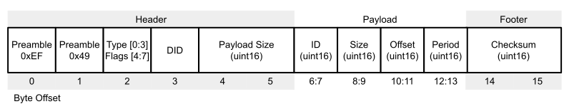

# Inertial Sense Binary (ISB) Protocol

The Inertial Sense binary protocol provides the most efficient way to communicate with the IMX and GPX because it preserved the native floating point and integer binary format used in computers.  Binary protocol is not human readable like [NMEA Protocol](../com-protocol/nmea.md).  Binary protocol uses [Data Set (DID)](../com-protocol/DID-descriptions.md) C structures defined in SDK/src/data_sets.h of the InertialSense SDK.  

## Endianness

The IMX and GPX devices use little-endian byte order in the ISB protocol.

## Communication

Writing to and reading from InertialSense products is done using "Set" and "Get" commands.  The following helper function `portWrite()` which assists with writing data to the serial port is used throughout this document.

```c++
static int portWrite(int port, const unsigned char* buf, int len)
{
    return serialPortWrite(&serialPort, buf, len);
}
```

### Setting Data

The `is_comm_set_data()` function will encode a message used to set data or configurations.  

```c++
// Set INS output Euler rotation in radians to 90 degrees roll for mounting
void setInsOutputRotation()
{
    float rotation[3] = { 90.0f*C_DEG2RAD_F, 0.0f, 0.0f };
    is_comm_set_data(portWrite, 0, comm, DID_FLASH_CONFIG, sizeof(float) * 3, offsetof(nvm_flash_cfg_t, insRotation), rotation);
}
```
### Getting Data

Data broadcasting or streaming is enabled by using the ***Realtime Message Controller*** (**RMC**) or the get data command.

#### Get Data Command

The `is_comm_get_data()` function will encode a PKT_TYPE_GET_DATA message that enables broadcast of a given message at a multiple of the [*Data Source Update Rates*](#data-source-update-rates).  Set the data rate (period multiple) to zero disable message broadcast and pull a single packet of data.  Set the data size and offset to zero to request the entire data set.

```c++
// Ask for INS message w/ update 40ms period (4ms source period x 10).  Set data rate to zero to disable broadcast and pull a single packet.
is_comm_get_data(portWrite, 0, comm, DID_INS_1, 0, 0, 10);
```

#### Data Source Update Rates

| DID                                                    | Default Update Rate (Period)                                 |
| ------------------------------------------------------ | ------------------------------------------------------------ |
| DID_INS_[1-4]                                          | (7ms default) Configured with DID_FLASH_CONFIG.startupNavDtMs |
| DID_IMU, <br/>DID_PIMU<sup>*</sup>                     | (14ms default) Configured with DID_FLASH_CONFIG.startupImuDtMs |
| DID_BAROMETER                                          | ~20ms                                                        |
| DID_MAGNETOMETER_[1-2]                                 | ~20ms                                                        |
| DID_GPS[1-2]_[X] <br/>(Any DID beginning with DID_GPS) | (200ms default) Configured with DID_FLASH_CONFIG. startupGPSDtMs |
| All other DIDs                                         | 1ms                                                          |

<sup>*DID_PIMU integration period (dt) and output data rate are the same as DID_FLASH_CONFIG.startupNavDtMs and cannot be output at any other rate.  If a different output data rate is desired, DID_IMU which is derived from DID_PIMU can be used instead.</sup>

#### Realtime Message Controller (RMC)

The RMC is used to enable message broadcasting and provides updates from onboard data as soon as it becomes available with minimal latency.   All RMC messages can be enabled using the [*Get Data Command*](#get-data-command), which is the preferred method, or by directly setting the RMC bits. The RMC bits are listed below. Message data rates are listed in the [*Data Source Update Rates*](#data-source-update-rates) table.

| RMC Message                                   |
| --------------------------------------------- |
| RMC_BITS_INS[1-4]                             |
| RMC_BITS_DUAL_IMU, RMC_BITS_PIMU |
| RMC_BITS_BAROMETER                            |
| RMC_BITS_MAGNETOMETER[1-2]                    |
| RMC_BITS_GPS[1-2]_NAV                         |
| RMC_BITS_GPS_RTK_NAV, RMC_BITS_GPS_RTK_MISC   |
| RMC_BITS_STROBE_IN_TIME                       |

The following is an example of how to use the RMC.  The `rmc.options` field controls whether RMC commands are applied to other serial ports.   `rmc.options = 0` will apply the command to the current serial port.

```c++
	rmc_t rmc;
    // Enable broadcasts of DID_INS_1 and DID_GPS_NAV
	rmc.bits = RMC_BITS_INS1 | RMC_BITS_GPS1_POS;       
    // Remember configuration following reboot for automatic data streaming.
	rmc.options = RMC_OPTIONS_PERSISTENT;

	is_comm_set_data(portWrite, 0, comm, DID_RMC, 0, 0, &rmc);
```

The update rate of the EKF is set by DID_FLASH_CONFIG.startupNavDtMs (reboot is required to apply the change).  Independently, the DID_INS_x broadcast period multiple can be used to set the output data rate down to 1ms.

#### Persistent Messages

The *persistent messages* option saves the current data stream configuration to flash memory for use following reboot,  eliminating the need to re-enable messages following a reset or power cycle.  

- **To save persistent messages** - (to flash memory), bitwise OR `RMC_OPTIONS_PERSISTENT (0x200)` with the RMC option field or set DID_CONFIG.system = 0x00000001 and DID_CONFIG.system = 0xFFFFFFFE.   See the [save persistent messages example](../SDK/CommunicationsBinary.md#step-7-save-persistent-messages) in the Binary Communications example project.
- **To disable persistent messages** - a [stop all broadcasts packet](../SDK/CommunicationsBinary.md#step-4-stop-any-message-broadcasting) followed by a *save persistent messages* command.   

[NMEA persistent messages](nmea.md#persistent-messages) are also available. 

##### Enabling Persistent Messages - EvalTool  

- Enable the desired messages in the EvalTool "Data Sets" tab. 
- Press the "Save Persistent" button in the EvalTool "Data Logs" tab to store the current message configuration to flash memory for use following reboot.
- Reset the system and verify the messages are automatically streaming.  You can use the EvalTool->Data Logs dialog to view the streaming messages.

**To disable all persistent messages using the EvalTool**, click the "Stop Streaming" button and then "Save Persistent" button.  

##### Enabling Persistent Messages - CLTool  

Persistent messages are enabled using the CLTool by including the `-persistent` option along with the options for the desired messages in the command line.

```
cltool -c /dev/ttyS3 -persistent -msgINS2 -msgGPS
```

#### Example Projects

Examples on how to use the Inertial Sense SDK for binary communications are found in the [Binary Communications Example Project](../SDK/CommunicationsBinary.md) and [cltool project](../SDK/InertialSenseClassCLTool.md).  [NMEA communications](../com-protocol/nmea.md) examples are found in the [NMEA Example Project](../SDK/CommunicationsAscii.md).

### Parsing Data

The [ISComm](https://github.com/inertialsense/InertialSenseSDK/blob/main/src/ISComm.h ) library in the [InertialSenseSDK]( https://github.com/inertialsense/InertialSenseSDK/ ) provides a communications parser that can parse InertialSense binary protocol as well as other protocols. 

#### One Byte (Simple Method)

The following parser code is simpler to implement.  This method uses the `is_comm_parse_byte()` function to parse one byte at a time of a data stream.  The return value is a non-zero protocol_type_t when valid data is found.    

```c++
	uint8_t c;
	protocol_type_t ptype;
	// Read from serial buffer until empty
    while (serialPortReadChar(&s_serialPort, &c) > 0)
    {
        // timeMs = current_timeMs();
        switch (is_comm_parse_byte(&comm, inByte))
        {
        case _PTYPE_INERTIAL_SENSE_DATA:
            break;
        case _PTYPE_UBLOX:
            break;
        case _PTYPE_RTCM3:
            break;
        case _PTYPE_NMEA:
            break;
        }
    }
```

#### Set of Bytes (Fast Method)

The following parser code uses less processor time to parse data by copying multiple bytes at a time.  This method uses `is_comm_free()` and `is_comm_parse()` along with a serial port read or buffer copy.   The return value is a non-zero protocol_type_t when valid data is found. 

```c++
	// Read a set of bytes (fast method)
	protocol_type_t ptype;

	// Get available size of comm buffer.  is_comm_free() modifies comm->rxBuf pointers, call it before using comm->rxBuf.tail.
	int n = is_comm_free(comm);

	// Read data directly into comm buffer
	if ((n = serialPortRead(comm->rxBuf.tail, n)))
	{
		// Update comm buffer tail pointer
		comm->rxBuf.tail += n;

		// Search comm buffer for valid packets
		while ((ptype = is_comm_parse(comm)) != _PTYPE_NONE)
		{
			switch (ptype)
			{
			case _PTYPE_INERTIAL_SENSE_DATA:
			case _PTYPE_INERTIAL_SENSE_CMD:
				break;
			case _PTYPE_UBLOX:
				break;
			case _PTYPE_RTCM3:
				break;
			case _PTYPE_NMEA:
				break;
			}
		}
	}
```

## ISB Packet Overview

The IMX and GPX communicate using the Inertial Sense Binary (ISB) protocol.  This section details the ISB protocol packet structure specific for protocol 2.x (software releases 2.x).  Refer to the [release 1.x ISB protocol](https://github.com/inertialsense/docs.inertialsense.com/blob/1.11.0/docs/user-manual/com-protocol/binary.md) document for a description of protocol 1.x (software releases 1.x).  The [Inertial-Sense-SDK ISComm](https://github.com/inertialsense/inertial-sense-sdk/blob/main/src/ISComm.h) provides functions to encode and decode ISB packets. 

### ISB Packet


The ISB packet structure is defined in the typedef `packet_t` found in [ISComm.h](https://github.com/inertialsense/inertial-sense-sdk/blob/main/src/ISComm.h).

#### Header Type and Flags

The packet type and flags are found in the byte at offset 2 in the ISB packet.  The **Type** is the lower nibble and the **Flags** are the upper nibble.  The packet  and is defined in [ISComm.h](https://github.com/inertialsense/inertial-sense-sdk/blob/main/src/ISComm.h).

```c++
typedef enum
{
	PKT_TYPE_INVALID                        = 0,    // Invalid packet id
	PKT_TYPE_ACK                            = 1,    // (ACK) received valid packet
	PKT_TYPE_NACK                           = 2,    // (NACK) received invalid packet
	PKT_TYPE_GET_DATA                       = 3,    // Request for data to be broadcast, response is PKT_TYPE_DATA. See data structures for list of possible broadcast data.
	PKT_TYPE_DATA                           = 4,    // Data sent in response to PKT_TYPE_GET_DATA (no PKT_TYPE_ACK is sent)
	PKT_TYPE_SET_DATA                       = 5,    // Data sent, such as configuration options.  PKT_TYPE_ACK is sent in response.
	PKT_TYPE_STOP_BROADCASTS_ALL_PORTS      = 6,    // Stop all data broadcasts on all ports. Responds with an ACK
	PKT_TYPE_STOP_DID_BROADCAST             = 7,    // Stop a specific broadcast
	PKT_TYPE_STOP_BROADCASTS_CURRENT_PORT   = 8,    // Stop all data broadcasts on current port. Responds with an ACK
	PKT_TYPE_COUNT                          = 9,    // The number of packet identifiers, keep this at the end!
	PKT_TYPE_MAX_COUNT                      = 16,   // The maximum count of packet identifiers, 0x1F (PACKET_INFO_ID_MASK)
	PKT_TYPE_MASK                           = 0x0F, // ISB packet type bitmask

	ISB_FLAGS_MASK                          = 0xF0, // ISB packet flags bitmask (4 bits upper nibble)
	ISB_FLAGS_EXTENDED_PAYLOAD              = 0x10, // Payload is larger than 2048 bytes and extends into next packet.
	ISB_FLAGS_PAYLOAD_W_OFFSET              = 0x20, // The first two bytes of the payload are the byte offset of the payload data into the data set.
} eISBPacketFlags;
```

#### Header DID

The data ID (DID) values are defined at the top of [data_sets.h](https://github.com/inertialsense/inertial-sense-sdk/blob/main/src/data_sets.h#L33) and identify which data set is requested or contained in the ISB packet.

#### Header Payload Size

In the ISB protocol, the packet payload size is a 16-bit unsigned integer (uint16) that specifies the payload’s byte length, excluding the packet header and footer/checksum.  If the ISB_FLAGS_PAYLOAD_W_OFFSET flag (0x20) is set in the header’s flags byte, the optional 16-bit offset value is included in the payload length.

#### Footer Checksum

The ISB packet footer contains a Fletcher-16 (16-bit integer).  The following algorithm is used for this checksum and is found in [ISComm.h](https://github.com/inertialsense/inertial-sense-sdk/blob/main/src/ISComm.h).   

```c++
uint16_t is_comm_fletcher16(uint16_t cksum_init, const void* data, uint32_t size)
{
	checksum16_u cksum;
	cksum.ck = cksum_init;
	for (uint32_t i=0; i<size; i++)
	{
		cksum.a += ((uint8_t*)data)[i];
		cksum.b += cksum.a;
	}	
	return cksum.ck;
}
```

The ISB packet footer checksum is computed using the Fletcher-16 algorithm starting with an initial value of zero and sequencing over the entire packet (excluding the two footer checksum bytes).

### ISB Packet with Data Offset


*The first two bytes of the payload may be a uint16 offset for the data offset in the target data set when the `ISB_FLAGS_PAYLOAD_W_OFFSET` flag is set in the header flags.

### ISB Packet with No Payload


Packet types `PKT_TYPE_STOP_BROADCASTS_ALL_PORTS`, `PKT_TYPE_STOP_DID_BROADCAST`, 
`PKT_TYPE_STOP_BROADCASTS_CURRENT_PORT` have payload size zero and no payload.  

### ISB Get Data Packet



The ***Get Data*** packet of type `PKT_TYPE_GET_DATA` is used to query specific data according to data set ID, size, offset, and streaming period multiple.  The payload size is 8.  Setting the payload period to zero will result in a single response and a continuous stream of data for a non-zero period.

## Stop Broadcasts Packets

!!! note
    The [NEMA $STPB](nmea.md#stpb) stop broadcasts command is recommended as the protocol version-independent method for disabling data streaming. 

Two *stop all broadcasts* packets are special packet types that will disable all binary and NMEA data streams.  The following functions calls are provided in the SDK to generate the stop all broadcasts packets.  

### All Ports

```c++
is_comm_stop_broadcasts_all_ports(portWrite, 0, &comm);
```
The hexadecimal string to stop all broadcasts on all ports is: 

```c++
0xef 0x49 0x06 0x00 0x00 0x00 0x3e 0x1f
```

### Current Port Only

```c++
is_comm_stop_broadcasts_current_port(portWrite, 0, &comm);
```

The hexadecimal string to stop all broadcasts on the current port is:  

```c++
0xef 0x49 0x08 0x00 0x00 0x00 0x40 0x27
```

## RMC Presets

### RMC Preset Stream PPD

The hexadecimal string for the RMC Preset enable PPD is:

```c++
0xef 0x49 0x05 0x09 0x0c 0x00 0xe2 0x3c 0x35 0x01 0x90 0x00 0x00 0xc0 0x00 0x01 0x00 0x00 0xf7 0xb0
```


