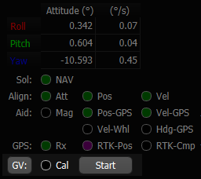
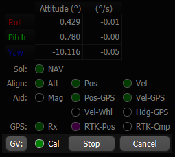

# Ground Vehicle Dead Reckoning

## Overview

The IMX inertial navigation integrates IMU data to dead reckon (estimate position and velocity) when GPS position fix is not available.  The amount of position error during dead reckoning can vary based on several factors including system runtime, motion experienced, and sensor bias stability.  

Knowledge about the vehicle's kinematic constraints is applied to reduce drift and improve position estimation. 

## Installation

!!! important
    It is critical to ensure the IMX remains fixed relative to the vehicle.  Any shift or change in the IMX location relative to the vehicle will result in degraded or inaccurate dead reckoning solution. 

!!! important
    Heavy vibrations can degrade the IMX measurements and dead reckoning solution.   

1. Mount the IMX and GNSS antenna at fixed locations on the vehicle.  
2. Set the GPS antenna offsets relative to the IMX origin in meters.  EvalTool > Data Sets > DID_FLASH_CONFIG > gps1AntOffsetX/Y/Z.

### Enabling

Dead reckoning is enabled by setting the `DID_FLASH_CONFIG.insDynModel` to 4 for ground vehicles.  This is done automatically during Learning Mode and stored to flash memory.

### Learning Mode

Learning mode is be used following installation or any change in the IMX position relative to the vehicle.  Learning is used to estimate the vehicle kinematic calibration which is used during normal operation. 

#### Learning Mode Instructions 

1. `Start` learning mode.
2. Drive with sufficient motion for learning.  This is identified with the EvalTool `GV: Cal` indicator in the INS tab turns GREEN (`DID_GROUND_VEHICLE.status & GV_STATUS_LEARNING_CONVERGED` is not zero).  Either of the following patterns is typically adequate.  
   - At least 200 meters straight, 5 left turns (+90 degrees) and 5 right turns
   - Three figure eight patterns.
3. `Stop` learning and save kinematic calibration to flash memory.

##### Using the EvalTool

From the EvalTool INS tab:

1. Press the `GV:` button to reveal the ground vehicle options.
2. Press the `Start` button to clear and start learning.
3. Press the `Stop` button to stop learning and save kinematic calibration to flash memory.  

##### Using the DID_GROUND_VEHICLE Message

1. Enable learning mode by setting the `DID_GROUND_VEHICLE.mode` to any of the following commands.  The `DID_GROUND_VEHICLE.mode` value will toggle to 1 indicating the system is in learning mode and 0 to indicate learning mode is off.

   **2 "Start"** - Start with user supplied values in the `DID_GROUND_VEHICLE.transform` and enable learning mode. 

   **3 "Resume"** - Start with the existing calibration and enable learning mode. 

   **4 "Clear & Start"** - Set transform to zero and start with aggressive learning mode. This is the same as the "Start" button in the EvalTool INS tab.

   **5 "Stop & Save"** - End learning mode and save kinematic calibration to flash memory.

2. Disable learning and save kinematic calibration to flash memory by setting `DID_GROUND_VEHICLE.mode` to 5.

## Examples

[Dead reckoning examples can be found here.](../dead_reckoning_examples)

<a href="https://inertialsense.com/">

</a>

