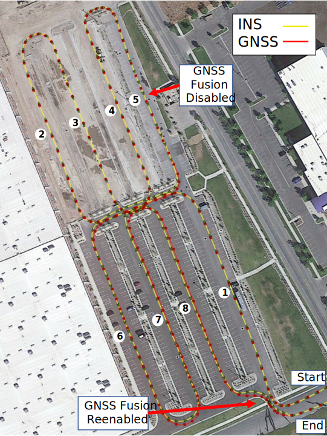
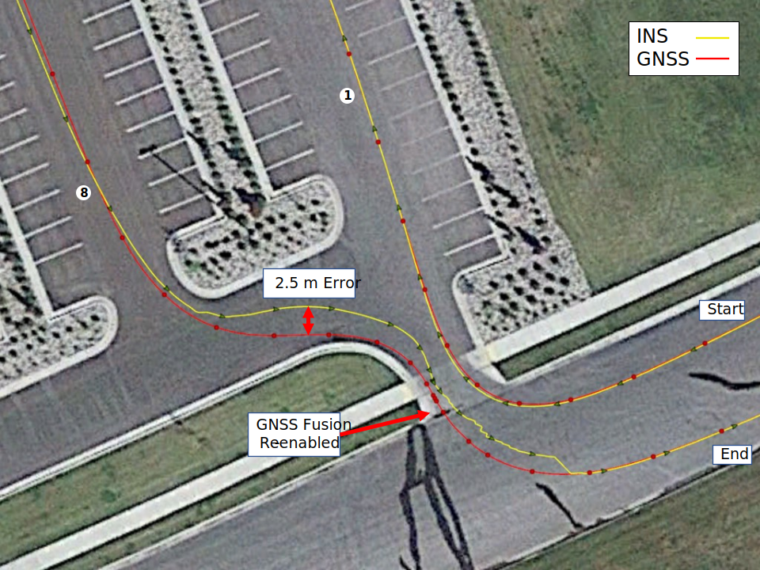
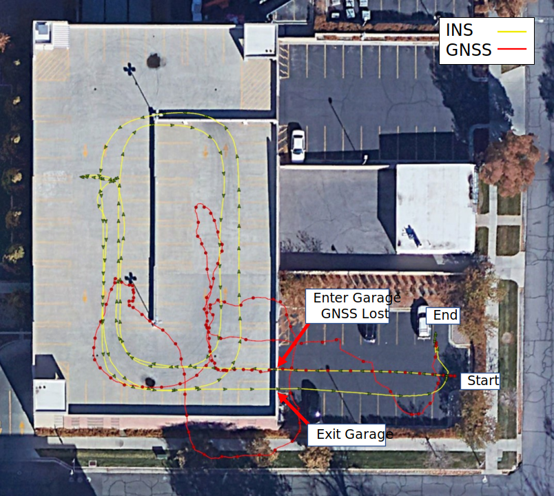
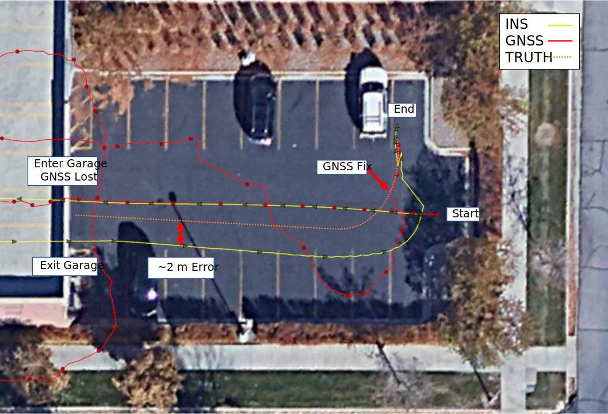

# uINS Dead Reckoning Examples

Dead Reckoning is the process of calculating the current position of a moving object by using a previously determined position, or fix, and then incorporating estimations of speed, heading direction, and course over elapsed time. Knowledge about the vehicle's kinematic constraints (i.e. wheels on the ground) is applied to reduce drift and improve position estimation. 

Inertial Sense has added dead reckoning capability to uINS to estimate position for extended periods of time during GNSS outages. In this report RTK-GNSS is used.

The following are examples dead reckoning of a car test vehicle.  No wheel sensors were used in these examples.  The dead reckoning position is shown in the yellow "INS" line and GNSS position in the red "GNSS" line. 

------

## Parking Lot Simulated GNSS Outage

In this example GNSS outage was simulated by disabling GNSS fusion into the INS Kalman filter (EKF).  This was done by setting the `Disable Fusion - GPS1` option found in the General settings of the EvalTool app.   By disabling GPS fusion and keeping fix, we can use the GNSS position as truth and compare it to the dead reckoning solution.

Dead reckoning duration:  **30 seconds**, **605 meters**

Max position error:  **2.5 meters**, **0.4% drift**

In the drive the car starts and ends the drive at the bottom right corner of the image.  The numbered path segments show the order of travel.  GPS fusion was disabled in the middle of path segment 5.  

When GNSS fusion is re-enabled, error in the INS solution is removed and the INS position estimate jumps back onto the GNSS position.  There is 2.5m of error between the dead reckoning position and the GNSS position. 

------

## Multi-Level Parking Garage

In this example our test vehicle drove in and out of a parking garage.  The drive consisted of starting outside with GNSS fix, entering the garage (losing GNSS fix), driving up one level, parking, and then following the path back down and out of the garage where GNSS fix was regained.   

Dead reckoning duration:  **105 seconds**, **349 meters**

Exit position error:  **~2 meters**, **0.6% drift**

Here we see outside parking lot where the test vehicle started and ended.  GNSS fix was lost upon entry of the garage and regained several seconds after exiting the garage.

Above is the top view of the parking garage.  When inside the garage, the GNSS fix is lost shown by the red line erratic deviation.  The dead reckoning (INS) position shown by the yellow line matches the actual driven path.

GNSS fix was not regained until about 20 meters after exiting the garage, just prior to parking at the top right corner of the outside parking lot.  The actual position is shown by the orange truth dotted line.  GNSS position is shown by the red line and dead reckoning by the yellow INS line.  GNSS fix occurs when the red GNSS line jumps and joins the orange truth dotted line.  When exiting the garage, the position error was approximately 2 meters following 105 seconds of dead reckoning from GNSS outage.  

------

## Conclusion

The uINS with dead reckoning and without wheel sensor can estimate position to within ~3m over 100 seconds of typical automotive parking lot driving.  

<a href="https://inertialsense.com/">

</a>

