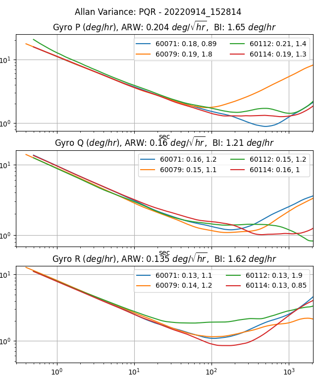

# Frequently Asked Questions

## What is a Tactical Grade IMU?

An Inertial Measurement Unit (IMU) is industry qualified as "Tactical Grade" when the In Run Bias Stability (IRBS) of the gyroscopes is between 0.5 deg/hour and 5 deg/hour.  The IRBS represents the IMU stability during benign conditions (i.e. ideal integration time, stable temperature, and no inertial motion).

IEEE-STD-952-1997 defines IRBS as the minima on the Allan Variance curve. The following plots identify the Allan Variance representation of four IMX-5 tactical grade IMUs (serial numbers 60071, 60079, 60112, and 60114).

## Why the name change from *uINS* to *IMX*?

The name **IMX** means inertial measurement device with extensible capabilities.  IMX is a derivative of the acronym **IMU**.  Our flagship product was named the **uINS** which means miniature Inertial Navigation System (INS).  This name has helped others to recognize the inertial navigation functionality.  However, we felt that a more generic name would better cover all of the various functionality and capabilities contained in the **IMX**, namely: 

- Tactical grade Inertial Measurement Unit (IMU)
- Barometer and magnetometer sensors
- Vertical Reference Unit (VRU)
- Attitude Heading Reference System (AHRS)
- GNSS aided Inertial Navigation System (GNSS-INS or GPS-INS)
- RTK-GNSS aided INS
- Dual-GNSS (GPS compassing) aided INS
- Ground vehicle Dead Reckoning system

## What is Inertial Navigation?

Inertial navigation is a technique of estimating position, velocity, and orientation (roll, pitch, heading) by integrating IMU inertial motion data from gyros and accelerometers to continuously calculate the dead reckoning position.  The inertial sensors are supplemented with other sensors such as GPS, altimeter, and magnetometer.  Inertial navigation is commonly used on moving vehicles such as mobile robots, ships, aircraft, submarines, guided missiles, and spacecraft.   

## What does an Inertial Navigation System (INS) offer over GPS alone?

**Dead Reckoning** - An inertial navigation system (INS) integrates the IMU data to dead reckon (estimate position and velocity) between GPS updates and during GPS outage.   

**Higher Data Rates** - Typical GPS receivers data rates vary from 1Hz to 20Hz whereas INS systems like the IMX have data rates up to 1KHz.  

**Signal Conditioning** - An INS filters out noise in the GPS data and provides a smoother, more continuous data stream.  

**Orientation Data** - An INS is capable of observing the orientation (roll, pitch, and heading) of the system regardless of the motion or direction of travel.  This is because of how an INS fuses inertial data with GPS data.  A GPS with one antenna can measure direction of travel (ground track heading) but cannot estimate vehicle roll, pitch, or heading.

## Our Sensors - IMU vs AHRS vs INS

**Inertial Measurement Unit (IMU)** - Uses gyros and accelerometers to measure angular rate and linear acceleration.

**Attitude Heading Reference System (AHRS)** - Adds sensor fusion to IMU and magnetometer output to estimate orientation or roll, pitch, and heading. 

**Inertial Navigation System (INS)** - Adds sensor fusion to IMU, GPS, magnetometer, and barometer data to estimate orientation, velocity, and position. 

### I have my own GPS system and just need raw motion data, which sensor is for me?

If you have your own filters in place and need raw data for measuring motion, then the **IMU** is the best option. The IMU provides raw, calibrated data for temperature, 3D acceleration (accelerometer), 3D magnetic field (magnetometer), and 3D rate of turn.

### Which sensor will also provide attitude (roll/pitch/yaw) and heading data?

The **AHRS** sensor has all the capabilities of the IMU plus data on roll, pitch, and yaw. This sensor uses algorithms to fuse raw data from the IMU with the Earth’s gravity to provide orientation and is perfect for a robotic arm or indoor floor cleaner.

**I need geographic positional data. Which sensor contains a GPS?**

If the AHRS doesn’t get you what you need, packaging this with one or more GPS sensors will give you the geographic positional data you need. Like the AHRS, your sensor or should provide some sort of “sensor fusion” by combining all the data from each of these sensors to give a more accurate and holistic view of your rover’s state.

**What do I need to get started?**

We recommend beginning with some sort of Development Kit. Ours comes with all of the necessary components to simplify testing and integration: the sensor you selected, the needed cable and antennas for connectivity, the firmware & software, and 3-5 hrs of complementary engineering support from a team of Inertial Sense engineers. 

Additionally, Inertial Sense provides customers with a custom datalogger, called the EvalTool. An easy to use data logging software to test and troubleshoot your new sensor is **essential** to your sensor integration experience.

## How long can the IMX dead reckoning estimate position without GPS?

The IMX inertial navigation integrates the IMU data to dead reckoning position and velocity estimation between GPS updates and for a short period of time during GPS outages.  This dead reckoning is designed to filter out GPS noise and provide cleaner faster updates than are available via GPS alone. The IMX dead-reckons, or estimates position and velocity, between GPS updates and through brief GPS outages.  However, it is not designed for extended position navigation without GPS aiding.  Dead reckoning is disabled after 7 seconds of GPS outage in order to constrain position and velocity drift.  The amount of position drift during dead reckoning can vary based on several factors, including system runtime, motion experienced, and bias stability.  

## Can the IMX estimate position without GPS?

IMX can estimate the position for extended periods of time without GPS for ground vehicle dead reckoning applications only (see [Ground Vehicle Dead Reckoning](imx/dead-reckoning/dead_reckoning.md)).  When in standard mode (not ground vehicle dead reckoning) GPS is required to provide initial position estimation and to aid in IMU bias estimation.  The IMX can dead reckon (estimate position without GPS) for brief periods of time.  However, the quality of dead reckoning is a function of IMU bias estimation, which improves while the GPS is aiding the INS.      

## How does the IMX estimate roll/pitch during airborne coordinate turns (acceleration only in the Z axis and not in the X and Y axes)?  

Using acceleration alone will incorrectly indicate the platform is level.  GPS informs the IMX extended Kalman filter (EKF) about any motion the system experiences and as a result the EKF can distinguish between acceleration due to motion and gravity.  Without a GPS (in AHRS mode) the IMX EKF can only assume the direction of gravity equals the average direction of acceleration measured slowly over time.  The IMX can estimate roll/pitch under accelerated conditions during a coordinated turn because gyro integration prevents attitude drift over short term and level coordinate turns are cyclical allowing the average gravity for an entire heading rotation to be observed.  However, the IMX AHRS solution under accelerated conditions (moving) will have degraded attitude accuracy.  The IMX solution is more accurate when aided by GPS.

## How does vibration affect navigation accuracy? 

The IMX accuracy may degrade in the presence of mechanical vibrations that exceed 3g of acceleration. Empirical data shows degradation at approximately 100 - 150 Hz. Adding vibration isolation to the mount may be necessary to reduce the vibrations seen by the product and to improve accuracy.

## Can the IMX operate underwater?

The IMX can only dead reckon for short periods of time and in general requires GPS to provide position and velocity data.  The GPS antenna must be above the water surface in order for the GPS to function properly.  It is ideal that the GPS antenna be fixed relative to the IMX (IMU) module in order to maintain precision when moving faster than 2 m/s or 0.8 m/s^2.  However, the GPS antenna may be tethered above the IMX, where the GPS antenna is floating on the water surface and the IMX is below the water surface.  System position will reflect the GPS antenna position and attitude (roll, pitch, heading) will reflect the IMX module orientation. 

## Can the IMX operate at >4g acceleration?

Typical L1 GPS receivers lose fix above 4g acceleration because the doppler variation starts to get too large and the receiver may become unstable or not be able to get/keep a fix.  Additionally, the acceleration begins to affect the stability of the GPS XTAL oscillator.

On the IMX, the GPS will regain fix within seconds after acceleration drops below 4g. The IMX will track the velocity and position using inertial navigation for up to 5 seconds of GPS outage. As long as GPS outage is below 5 seconds, the IMX should be able to track position through a launch.

## Customer Support 

Have other questions or needs?  Please email us at [support@inertialsense.com](mailto:support@inertialsense.com).
