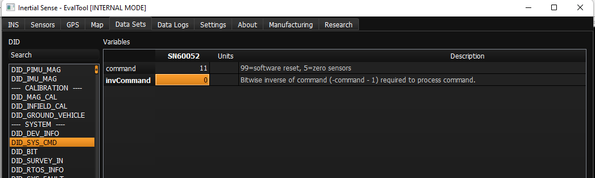

# Using uBlox SBAS corrections

The uBlox F9P receivers can be configured to enable the SBAS corrections constelations

## Firmware update

SBAS corrections require a later version of F9P firmware. Use FW version HPG 1.32 from the F9P downloads page on the uBlox site. To update the firmware on the F9P, follow these steps:

1. Open the Inertial Sense EvalTool
1. Navigate to the Data Sets tab. Open `DID_SYS_CMD` from the sidebar (see the image below)
1. Set `command` to `11` and `invCommand` to `-12` to enable passthrough to GNSS1 (set `12` and `-13` for GNSS2)
1. Close the serial port (Settings tab)
1. Open the device in uBlox u-center (u-center 22.07)
1. Update the firmware in u-center per u-blox instructions. Baudrate should be set to 921600.

## Configuration of the F9P

With the uBlox 1.32 firmware installed on the F9P SBAS can be enabled using the standard constelation selection methods described in the [GNSS Constelations](SBAS.md) page.
