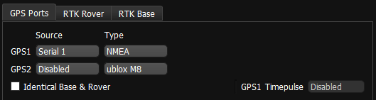
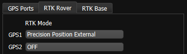

GNSS receivers that output NMEA ascii protocol can be used to aid the IMX EKF.

## Configure IMX for NMEA GNSS Input

1. Set serial port baudrate, matching DID_FLASH_CONFIG.serXBaudRate.

2. Configure GPS1 using EvalTool GPS Setting tab or the DID_FLASH_CONFIG.ioConfig. 

   

   | DID_FLASH_CONFIG            | Value      |
   | --------------------------- | ---------- |
   | ioConfig (firmware >=1.8.5) | 0x00840040 |

3. Enabled the NMEA messages on the external GNSS:

   | Message | Description                                                  |
   | ------- | ------------------------------------------------------------ |
   | **GNS** | GNS Fix data (preferred) or **GGA** - Time, position, and fix related data. |
   | **ZDA** | UTC time and date.                                           |
   | **RMC** | Position, velocity, and time (optional / recommended).       |
   | **GSV** | Satellite signal strength (optional / recommended).          |

4. If RTK positioning is supported by the NMEA receiver, Enable RTK rover mode by selecting **Precision Position External**.  This will run the INS kalman filter in high accuracy mode and forward any RTK base station corrections to the external GNSS receiver. 

   

   | DID_FLASH_CONFIG | Value      |
   | ---------------- | ---------- |
   | RTKCfgBits       | 0x00000002 |

## Electrical Interface

The external NMEA GNSS receiver can be connected to Serial 0, Serial 1, and Serial 2 ports (3.3V TTL UART) on the IMX.  See the [PCB Module](../../hardware/module_imx5/) hardware page for a description of the IMX pinout.  Serial 0 and 2 can be accessed on the main connector of [Rugged-1](../../hardware/rugged1/) and [Rugged-2](../../hardware/rugged2/) and all serial ports can be accessed on header H7 of the [EVB-2](../../hardware/EVB2/). 

## Enabling NMEA on ZED-F9P

The recommended procotol with the IMX and ZED-F9P receiver is the uBlox binary protocol.  However, the ZED-F9 can operate using NMEA protocol if necessary.  The following steps can be used to enable NMEA protocol output on the ublox ZED-F9P receiver. 

1. Enable NMEA output using the [u-blox u-center]( https://www.u-blox.com/en/product/u-center ) application.  
   - **Set the configuration**: (ublox u-center menu -> View -> Configuration View) change the following.  You must press the "Send" button to apply each change.
     - **PRT (Ports)** - Set Baudrate to match the GPS port baudrate (i.e. ser1BaudRate 921600)
     - **PRT (Ports)** - Enable NMEA on the connected port/UART
     - **PRT (Ports)** - Enable RTCM3 on the connected port/UART if using RTK
     - **RATE (Rates)** - Measurement Period: 200ms
     - **RATE (Rates)** - Navigation Rate: 1cyc
     - **MSG (Messages)** - Enable NMEA messages listed above for the connected port/UART (i.e. UART1 On)
       - F0-0D NMEA GxGNS
       - F0-08 NMEA GxZDA
       - F0-04 NMEA GxRMC
       - F0-03 NMEA GxGSV
   - **Save the configuration**: Send the CFG (Configuration) to 1 - FLASH or press the "Save Config" button with the small gear save icon (or menu Receiver -> Action -> Save Config).
