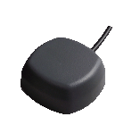
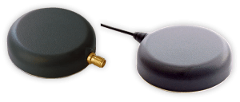
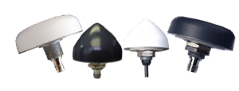
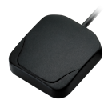
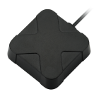
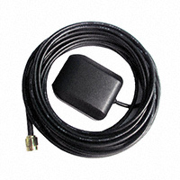
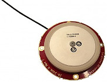
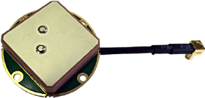
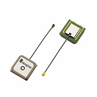

# GNSS Antennas

## Selecting a GNSS Antenna

- Using a passive GNSS antenna is possible but not recommended.  This requires a high RHCP antenna gain, good view of the sky, and a short matched/tuned 50 Ω input impedance line.  This option may be appropriate to minimize BOM costs.
- Best performance is achieved by using an active antenna with integrated LNA.  The LNA gain must be >17dB for standard GPS-INS use.  
- For RTK and dual antenna (GPS compassing) use, the following characteristics are recommended: gain >26dB, multipath signal rejection, better signal to noise ratio, and improved carrier phase linearity.
- Antennas with integrated SAW filter may be necessary to reject interference from near frequencies or harmonic signals, such as wireless and LTE.
- For RTK and dual antenna applications we recommend dual feed (dual element) GNSS antennas

## GNSS Antenna Integration Considerations

### GNSS Antenna Ground Plane

A GNSS antenna ground plane blocks multipath signals, creating a shadow area for the antenna to hide in.  The ground plane is acting as an RF blocking device.  It is made of any material that attenuates (or totally blocks or reflects) RF signals.  It creates a shadow area for the antenna to hide in.  That shadow is a cone above the ground plane.  Any signals that come down from the satellites and are bouncing back upward from the earth can’t get to the antenna.  Only signals coming directly from above can get to the antenna.  The distance of the physical antenna above the ground plane changes the shape of the RF blocked shadow area. 

The signal gain on some antennas can be improved by increasing the ground plane size up to a given size.  Beyond that given size the antenna gain is not affected much.

A ground plane width of 8 to 12 cm is typically large enough for most applications.

#### Helpful Links:

[u-Blox: RF design considerations for GNSS receivers Application Note](https://www.u-blox.com/sites/default/files/products/documents/GPS-Antenna_AppNote_(GPS-X-08014).pdf?utm_source=en%2Fimages%2Fdownloads%2FProduct_Docs%2FGPS_Antennas_ApplicationNote(GPS-X-08014).pdf) 

[Taoglas:  GPS Patch Integration Application Note](https://www.taoglas.com/images/product_images/original_images/TAOGLAS - GPS Patch Antenna Integration Application Note.pdf) 

[electronics.stackexchange.com: How big a ground plane does a GPS antenna need?](https://electronics.stackexchange.com/questions/150849/how-big-a-ground-plane-does-a-gps-antenna-need/247725) 

## Recommended GNSS Components

The following components are optional components that may be used with the μINS, μAHRS, and μIMU.  

Frequencies: GPS (L1), GLONASS (G1), Beidou (B1), and Galileo (E1).

**Recommended for RTK** indicates the GNSS antenna will have better performance for applications using RTK and dual GNSS antenna (GNSS compassing).

For multi-frequency GNSS antennas, see [Purchasing the ZED-F9](../multi_band_gnss/#purchasing-the-zed-f9). 

### Enclosed GNSS Antennas

The following GNSS antennas have an environmental case rated at IP67 or better.

|                                            | Manufacturer Part Number      | Description                                                  |
| ------------------------------------------ | --------------------------------- | ------------------------------------------------------------ |
|                | Tallysman TW4722              | Magnet Mount, L1/G1/B1/E1 freq., Dual-feed, 26dB LNA, SAW filter, SMA 3m cable, **Recommended for RTK** |
|                | Tallysman TW2712              | Through-Hole Mount, L1/G1/B1/E1 freq., Dual-feed, 26dB LNA, SAW filter, SMA 3m cable, **Recommended for RTK** |
|                | Tallysman TW3712              | Through-Hole Mount, L1/G1/E1/B1 freq., Dual-feed, 26dB LNA, SAW filter, SMA 3m cable, **Recommended for RTK** |
|  | Taoglas Limited AA.162.301111 | Magnet Mount, L1/G1 freq., 29dB LNA, SAW Filter, SMA 3m cable. |
|  | Taoglas Limited AA.171.301111 | Magnet Mount, L1/G1/E1/B1 freq., 29dB LNA, SAW Filter, SMA 3m cable. |
|        | Abracon LLC APAMPG-130        | Magnet Mount, L1/G1 freq., 30dB LNA, SAW Filter, SMA 3m cable. |

### OEM GNSS Antennas

These non-enclosed embedded antennas have exposed PCA with no environmental protection.  OEM antennas are easily detuned by the local environment (caused by mounting inside enclosures).  We recommend contacting the manufacturer for custom tuning services for optimized integration into OEM end-user modules.

|                                                      | Manufacturer Part Number           | Description                                                  |
| ---------------------------------------------------- | -------------------------------------- | ------------------------------------------------------------ |
|                          | Tallysman TW2708                   | Dual-feed, L1/G1/B1/E1 freq., 1-3 dB axial ratio, 28dB LNA and SAW Filter, 56mm dia. x 7.6mm, RG174 cable,  **Recommended for RTK** |
|                          | Tallysman TW1722                   | Dual-feed, L1/G1/B1/E1 freq., 28dB LNA and SAW Filter, 35mm dia. x 6mm, RG174 cable, **Recommended for RTK** |
|  | Taoglas Limited AGGBP.25A.07.0060A | L1/G1/B1/E1 freq.. 28dB LNA and SAW Filter, 25x25mm, U.FL 6cm cable |

### Related GNSS Parts

|                     | Manufacturer Part Number       | Description                                                  |
| ------------------- | ---------------------------------- | ------------------------------------------------------------ |
| GNSS Backup Battery | Seiko Instruments MS621T-FL11E | Coin, 6.8mm 3V Lithium Battery Rechargeable (Secondary) 3mAh |
| GNSS Backup Battery | Panasonic ML-614S/FN           | Coin, 6.8mm 3V Lithium Battery Rechargeable (Secondary) 3.4mAh |

