The IMX can be configured for use with uBlox ZED-F9P multi-band GNSS receivers.  This can be done using either the EvalTool GPS Setting tab or the IMX `DID_FLASH_CONFIG.ioConfig` and `DID_FLASH_CONFIG.RTKCfgBits` fields.    

| GPS Ports      | Value                                          |
| -------------- | ---------------------------------------------- |
| GPS Source     | serial 0, serial 1, or serial 2                |
| GPS Type       | ublox F9P                                      |
| GPS1 Timepulse | *Disable* or IMX pin connected to ZED-F9P PPS |

| RTK Rover    | Value                       |
| ------------ | --------------------------- |
| GPS RTK Mode | F9P Position or F9P Compass |

| RTK Base                         | Value        |
| -------------------------------- | ------------ |
| Serial Port 0 (Single GNSS only) | GPS1 - RTCM3 |
| USB Port                         | GPS1 - RTCM3 |

The following sections detail how to interface and configure the IMX for operation using the ZED-F9P.  See [RTK precision positioning](rtk_positioning_overview.md) and [RTK compassing](rtk_compassing.md) for RTK operation principles.  

### Rugged-3

The Rugged-3 INS contains the either single or dual ZED-F9P onboard supporting RTK positioning and compassing.  GPS 1 and GPS 2 are connected to serial ports 1 and 0 respectively on the IMX.

#### Single GNSS Settings

Use the following IMX settings with the Rugged-3-G1 (single GNSS receiver).  These settings can be applied either using the EvalTool GPS Settings tab or the IMX `DID_FLASH_CONFIG.ioConfig` and `DID_FLASH_CONFIG.RTKCfgBits` fields.

##### GPS Ports

Set the GPS1 source to **Serial 1** and type to **ublox F9P**. 

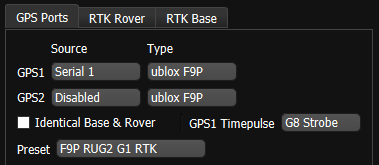

| DID_FLASH_CONFIG            | Value      |
| --------------------------- | ---------- |
| ioConfig (firmware >=1.8.5) | 0x0244a040 |

##### RTK Rover

Enable RTK rover mode by selecting **F9P Precision Position**.

| DID_FLASH_CONFIG | Value      |
| ---------------- | ---------- |
| RTKCfgBits       | 0x00000002 |

##### RTK Base

To configuring a system as an RTK base, disable the RTK Rover by setting the GPS1 and GPS2 RTK Mode to **OFF**, and select the appropriate correction output port on the IMX. 

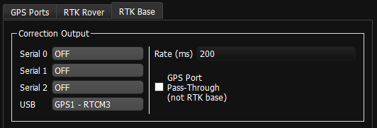

| DID_FLASH_CONFIG | Value      |
| ---------------- | ---------- |
| RTKCfgBits       | 0x00000900 |

#### Dual GNSS Settings

Use the following IMX settings with the Rugged-3-G2 (dual GNSS receivers).  These settings can be applied either using the EvalTool GPS Settings tab or the IMX `DID_FLASH_CONFIG.ioConfig` and `DID_FLASH_CONFIG.RTKCfgBits` fields.

##### GPS Ports

Set GPS 1 and 2 to source **Serial 1** and **Serial 0**.  the serial port that the ZED-F9P is connected to and type to **ublox F9P**. 

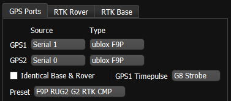

| DID_FLASH_CONFIG            | Value      |
| --------------------------- | ---------- |
| ioConfig (firmware >=1.8.5) | 0x025ca040 |

##### RTK Rover

Enable RTK rover mode by selecting **Precision Position External**.  **GPS1** is designated for **Precision Position External** and **GPS2** for **F9P Compass settings**.  Either or both can be enabled at the same time.  

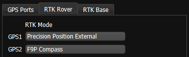

| DID_FLASH_CONFIG | Value      |
| ---------------- | ---------- |
| RTKCfgBits       | 0x00000006 |

##### RTK Base

To configuring a system as an RTK base, skip the RTK rover settings, and select the appropriate correction output port on the IMX.  Notice that IMX serial port 0 and 1 may be unavailable and occupied by the dual ZED-F9P receivers.

| DID_FLASH_CONFIG | Value      |
| ---------------- | ---------- |
| RTKCfgBits       | 0x00000900 |

### Rugged-3-IMX-5 to ZED-F9P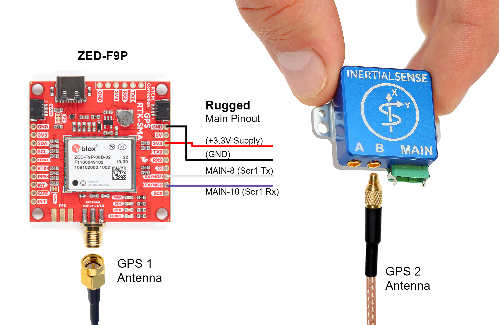

A +3.3V or +5V supply is needed to power the ZED-F9P when using the Rugged-1 IMX.  A USB +5V supply can be used if available.  The Rugged-1 must be configured for Serial Port 1 TTL voltage.  See hardware configuration for [Rugged v1.0](../hardware/rugged1.md#ser1-ttl) or [Rugged v1.1](../hardware/rugged1.md#rugged-v11-dipswitch-config) for details.

#### Settings

See the [single GNSS settings](#single-gnss-settings).

## EVB-2 to ZED-F9P Interface

Use the following wiring when connecting a single ZED-F9P receiver to the EVB-2. GPS1 is typically routed to serial port 1 and provides PPS to the IMX. 

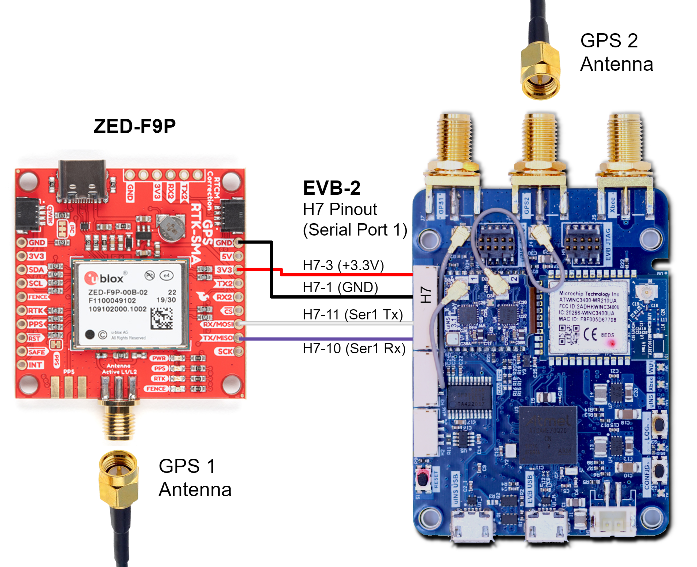

## EVB-2 to Dual ZED-F9 Interface

For dual-receiver RTK compassing setups, connect GPS1 and GPS2 as shown below. Verify both receivers share the same reference clock and PPS to maintain synchronization. 

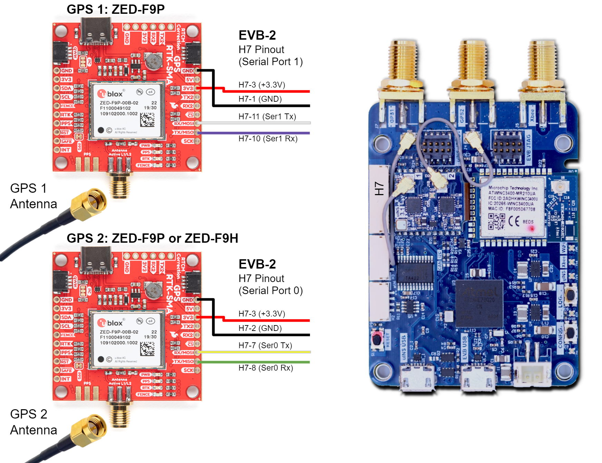

## RTK Base Messages

In RTK mode, the ZED-F9P requires RTCM version 3 messages supporting DGNSS according to RTCM 10403.3.

### ZED-F9 Rover Messages

The ZED-F9P operating in RTK rover mode can decode the following RTCM 3.3 messages. 

| Message type | Description                  |
| ---- | ------------------------------------ |
| RTCM 1001 | L1-only GPS RTK observables |
| RTCM 1002 | Extended L1-only GPS RTK observables |
| RTCM 1003 | L1/L2 GPS RTK observables |
| RTCM 1004 | Extended L1/L2 GPS RTK observables |
| RTCM 1005 | Stationary RTK reference station ARP |
| RTCM 1006 | Stationary RTK reference station ARP with antenna height |
| RTCM 1007 | Antenna descriptor |
| RTCM 1009 | L1-only GLONASS RTK observables |
| RTCM 1010 | Extended L1-only GLONASS RTK observables |
| RTCM 1011 | L1/L2 GLONASS RTK observables |
| RTCM 1012 | Extended L1/L2 GLONASS RTK observables |
| RTCM 1033 | Receiver and antenna description |
| RTCM 1074 | GPS MSM4 |
| RTCM 1075 | GPS MSM5 |
| RTCM 1077 | GPS MSM7 |
| RTCM 1084 | GLONASS MSM4 |
| RTCM 1085 | GLONASS MSM5 |
| RTCM 1087 | GLONASS MSM7 |
| RTCM 1094 | Galileo MSM4 |
| RTCM 1095 | Galileo MSM5 |
| RTCM 1097 | Galileo MSM7 |
| RTCM 1124 | BeiDou MSM4 |
| RTCM 1125 | BeiDou MSM5 |
| RTCM 1127 | BeiDou MSM7 |
| RTCM 1230 | GLONASS code-phase biases |
| RTCM 4072.0 |Reference station PVT (u-blox proprietary RTCM Message) |

### ZED-F9 Base Output Messages

The ZED-F9P operating in RTK base mode will generate the following RTCM 3.3 output messages depending on whether the satellite constellation have been enabled.  See the [Constellation Selection](gnss_constellations.md#constellation-selection) for information on enabling and disabling satellite constellations.

| Message Type | Period (sec) | Description                          |
| ---- | ------------ | ------------------------------------ |
| RTCM 1005 | 2            | Stationary RTK reference station ARP |
| RTCM 1074 | 0.4          | GPS MSM4                             |
| RTCM 1077 | 0.4          | GPS MSM7                             |
| RTCM 1084 | 0.4          | GLONASS MSM4                         |
| RTCM 1087 | 0.4          | GLONASS MSM7                         |
| RTCM 1094 | 0.4          | Galileo MSM4                         |
| RTCM 1097 | 0.4          | Galileo MSM7                         |
| RTCM 1124 | 0.4          | BeiDou MSM4 |
| RTCM 1127 | 0.4 | BeiDou MSM7 |
| RTCM 1230 | 2            | GLONASS code-phase biases            |

### NTRIP Messages

The NTRIP server must provide the necessary subset of [RTCM3 messages](#zed-f9-rover-messages) supported by the IMX-RTK.  See the [NTRIP](rtk_ntrip.md) page for an overview of NTRIP.

## ZED-F9P Firmware Update

The following section describes how to view the current GPS firmware version and how to update the firmware on the uBlox ZED-F9P GNSS receiver through the IMX. 

### GPS Firmware Version

The current GPS firmware version can be read through the `DID_GPS1_VERSION` and `DID_GPS2_VERSION` messages.  

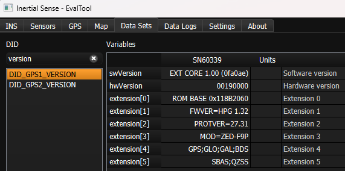

### Firmware Update

The following steps describe how to update the uBlox ZED-F9P firmware.  The uBlox U-Center application software and firmware binary can be downloaded from the uBlox [ZED-F9P documentation and resources webpage](https://www.u-blox.com/en/product/zed-f9p-module). 

1. **Enable IMX Serial Bypass** - Send the system command (`DID_SYS_CMD`)  `SYS_CMD_ENABLE_SERIAL_PORT_BRIDGE_USB_TO_GPS1` or `SYS_CMD_ENABLE_SERIAL_PORT_BRIDGE_USB_TO_GPS2` to enable serial bypass on the IMX.  This will create a direct connection between the current IMX serial port and the GPS.  This is done in the EvalTool using the Factory Options dialog in the Settings -> General tab. 
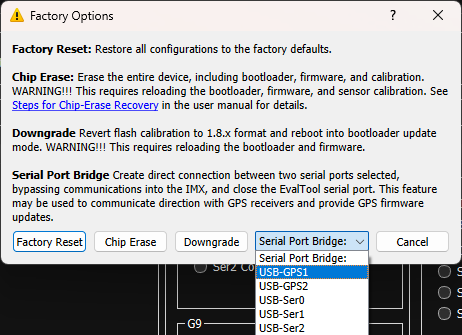
 

2. **Update Using U-Center** - With the IMX serial bypass enabled, the uBlox U-Center software can connect directly to the ZED-F9P GPS.  Use the following steps in the ublox U-Center app:  

   - Open the serial port with baudrate 921600.  

   - Select Tool -> Firmware Update and specify the uBlox F9P firmware file (i.e. `UBX_F9_100_HPG132...bin`).  

   - Enable "Use this baudrate for update" as 921600.

   - Disable "Enter safeboot before update".

   - Enable "Send training sequence".

   - Start the firmware update by pressing the small green "GO" circle in the bottom left corner of the Firmware Update Utility dialog.

     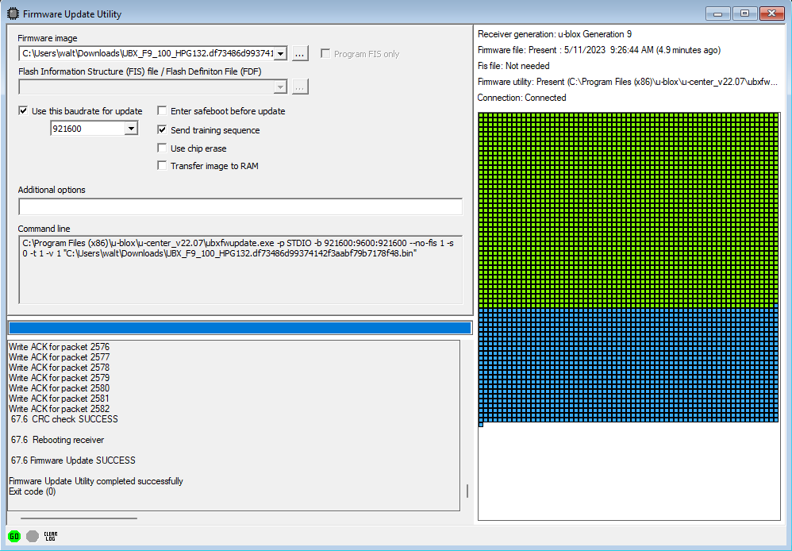 

   - Power cycle the IMX. 

## Purchasing the ZED-F9

The following components work well when sourcing ZED-F9 receivers and matching antennas for multi-band GNSS installations. 

## Multi-Band GNSS Components

The following is a list of the ZED-F9P GNSS receivers and compatible antenna(s).

| Item                                                     | Supplier#                                                    | Description                                                  |
| -------------------------------------------------------- | ------------------------------------------------------------ | ------------------------------------------------------------ |
| 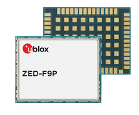                           | [ZED-F9P-01B](https://www.u-blox.com/en/product/zed-f9p-module) | ublox ZED-F9P high precision GNSS SMT module.  GNSS bands: L2OF, L2C, E1B/C, B2I, E5b, L1C/A, L1OF, B1I.  Concurrent GNSS: BeiDou, Galileo, GLONASS, GPS / QZSS.  RTK 1cm horizontal accuracy. |
| 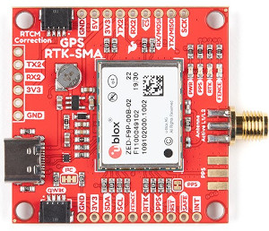 | [GPS-16481](https://www.sparkfun.com/products/16481)         | SparkFun GPS-RTK-SMA breakout board with ZED-F9P GNSS module. |
|                        | SparkFun: [ANN-MB-00](https://www.sparkfun.com/products/15192)  ublox: [ANN-MB-00](https://www.u-blox.com/en/product/ann-mb-series) | ublox Multi‑frequency GNSS antenna (L1, L2/E5b/B2I) active magnet mount.  Supports GPS, GLONASS, Galileo, and BeiDou.  5m SMA cable.  Designed for ZED-F9P. |
| 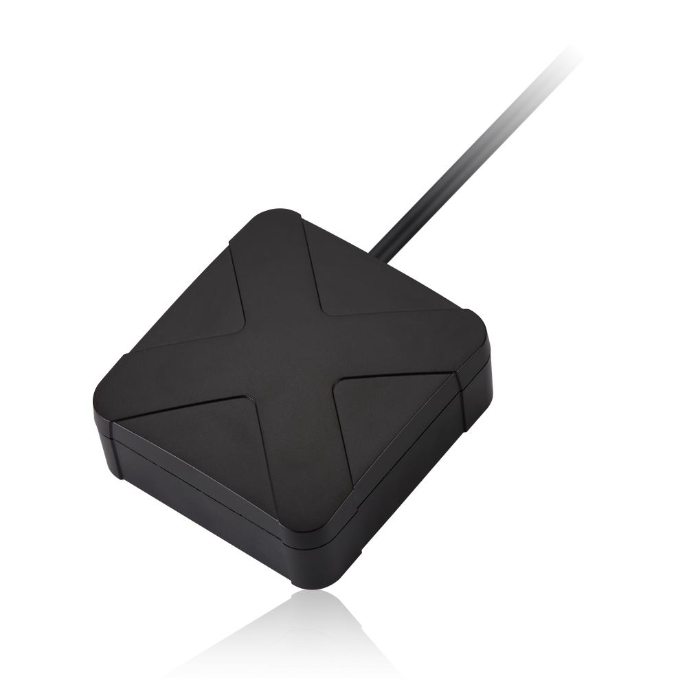                            | [AA.200.151111](https://www.taoglas.com/product/active-multiband-gnss-mag-mount-antenna/) | Taoglas multi‑band GNSS antenna (GPS/QZSS-L1/L2, GLONASS-G1/G2/G3, Galileo-E1/E5a, and BeiDou-B1/B2) active magnet mount.  Supports GPS, GLONASS, Galileo, and BeiDou.  1.5m SMA cable.  63.2 x 67.2 mm. |
| 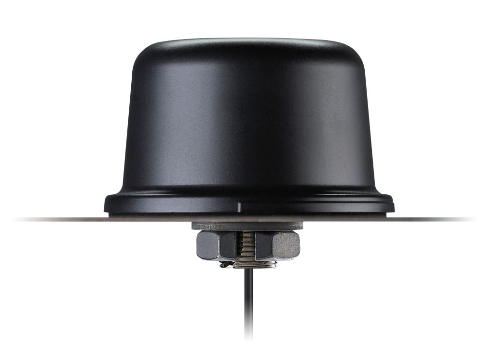                          | [QHA.50.A.301111](https://www.taoglas.com/product/qha-50-a-301111-colosseum-passive-quad-helix/) | Taoglas multi-band GNSS antenna  (GPS/QZSS-L1/L2, GPS/QZSS/IRNSS-L5, QZSS-L6, Galileo-E1/E5a/E5b/E6, GLONASS-G1/G2/G3, BeiDou-B1/B2a/B2b/B3).  permanent mount. IP67 rated waterproof. 3m RG-174 SMA cable.  94mm (dia). |
| 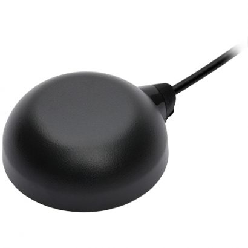                                   | [TW8889](https://www.tallysman.com/product/tw8889-dual-band-gnss-antenna/) | Tallysman multi‑band GNSS antenna (GPS/QZSS-L1/L2, GLONASS-G1/G2/G3, Galileo-E1/E5a, and BeiDou-B1/B2) active magnet mount.  Supports GPS, GLONASS, Galileo, and BeiDou.  3m SMA cable.  47mm (dia), 52g. |
| 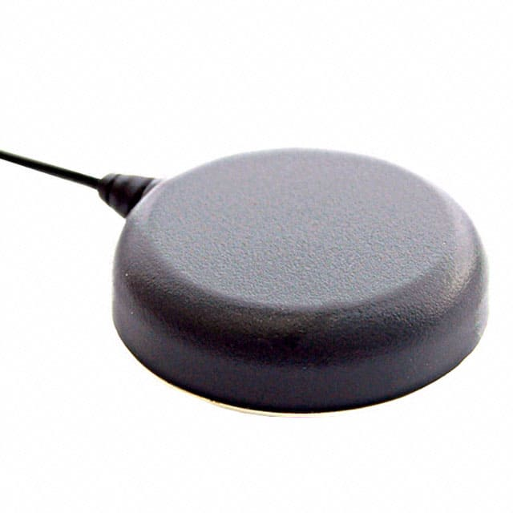                      | [TW7882](https://www.tallysman.com/product/tw7882-dual-band-gnss-antenna/) | Tallysman multi‑band GNSS antenna (GPS/QZSS-L1/L2, GLONASS-G1/G2/G3, Galileo-E1/E5a, and BeiDou-B1/B2) active magnet mount.  Supports GPS, GLONASS, Galileo, and BeiDou.  3m SMA cable.  69mm (dia), 180g. |
| 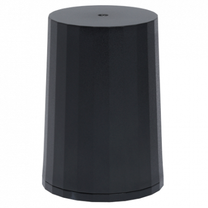                               | [HC882](https://www.tallysman.com/product/hc882-dual-band-helical-antenna-l-band/) | Tallysman multi‑band helical GNSS antenna (GPS/QZSS-L1/L2, GLONASS-G1/G2/G3, Galileo-E1/E5a, and BeiDou-B1/B2) active magnet mount.  Supports GPS, GLONASS, Galileo, and BeiDou.  SMA.  44.2mm (dia), 42g. |
| 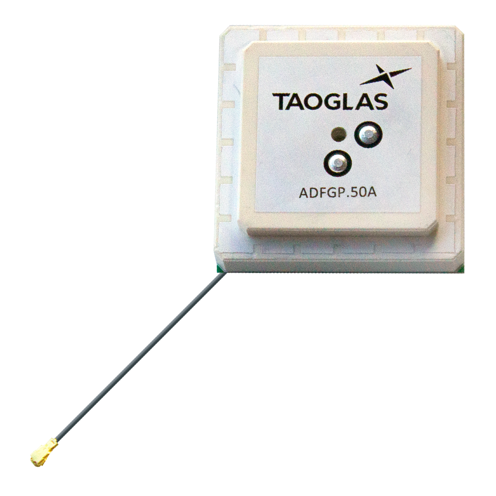                    | [ADFGP.50A.07.0100C](https://www.taoglas.com/product/adfgp-50a-active-gnss-dual-stacked-patch/) | Taoglas embedded multi-band GNSS antenna (GPS/QZSS L1/L2, GLONASS G1/G2/G3, Galileo E1/E5a/E5b, BeiDou B1/B2a/B2b).  50x50mm, 95.5g. |
| 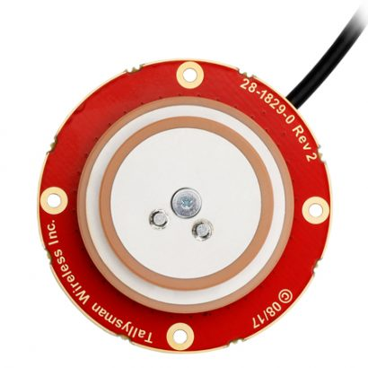                                   | [TW1889](https://www.tallysman.com/product/tw1889-embedded-dual-band-gnss-antenna/) | Tallysman embedded multi-band GNSS antenna (GPS/QZSS L1/L2, GLONASS G1/G2/G3, Galileo E1/E5b, BeiDou B1/B2).  48mm (dia), 37g. |
| 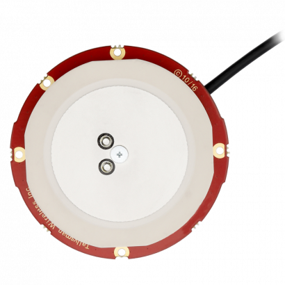                                  | [TW3887](https://www.tallysman.com/product/tw3887-embedded-dual-band-gnss-antenna/) | Tallysman multi-band GNSS antenna (GPS/QZSS-L1/L2, GLONASS-G1/G2/G3, Galileo-E1/E5a, and BeiDou-B1/B2).  60mm (dia), 70g. |
