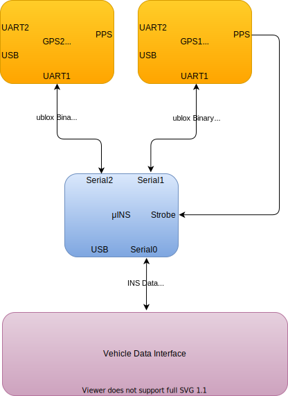
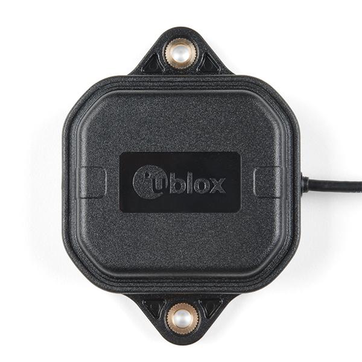

The IMX can be configured for use with the Inertial Sense GPX-1 multi-band GNSS receivers.  This can be done using either the EvalTool GPS Setting tab or the IMX `DID_FLASH_CONFIG.ioConfig` and `DID_FLASH_CONFIG.RTKCfgBits` fields.    

| GPS Ports      | Value                                          |
| -------------- | ---------------------------------------------- |
| GPS Source     | serial 0, serial 1, or serial 2                |
| GPS Type       | GPX-1                                      |
| GPS1 Timepulse | *Disable* or IMX pin connected to GPX-1 |

| RTK Rover    | Value                       |
| ------------ | --------------------------- |
| GPS RTK Mode | Position or Compass |

| RTK Base                         | Value        |
| -------------------------------- | ------------ |
| Serial Port 0 (Single GNSS only) | GPS1 - RTCM3 |
| USB Port                         | GPS1 - RTCM3 |

The following sections detail how to interface and configure the IMX for operation using the GPX-1.  See [RTK precision positioning](../rtk_positioning_overview/) and [RTK compassing](../rtk_compassing/) for RTK operation principles.  

### Typical Interface

The IMX will automatically configure the GPX-1 for communications.    

### Rugged-4 (Coming Soon)

The Rugged-4 INS contains the GPX-1 onboard supporting RTK positioning and compassing.  GPS 1 and GPS 2 are connected to serial port 0 on the IMX-5.

The following is a list of the ZED-F9P GNSS receivers and compatible antenna(s).

| Item                                                     | Supplier#                                                    | Description                                                  |
| -------------------------------------------------------- | ------------------------------------------------------------ | ------------------------------------------------------------ |
|                        | SparkFun: [ANN-MB1-00](https://www.sparkfun.com/products/15192)  ublox: [ANN-MB1-00](https://www.u-blox.com/en/product/ann-mb1-antenna) | ublox Multi‑frequency GNSS antenna (L1, L2/E5b/B2I) active magnet mount.  Supports GPS, GLONASS, Galileo, and BeiDou.  5m SMA cable.  Designed for ZED-F9P. |
