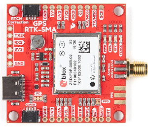
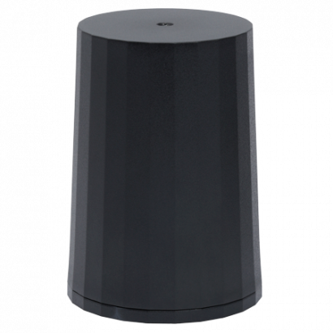
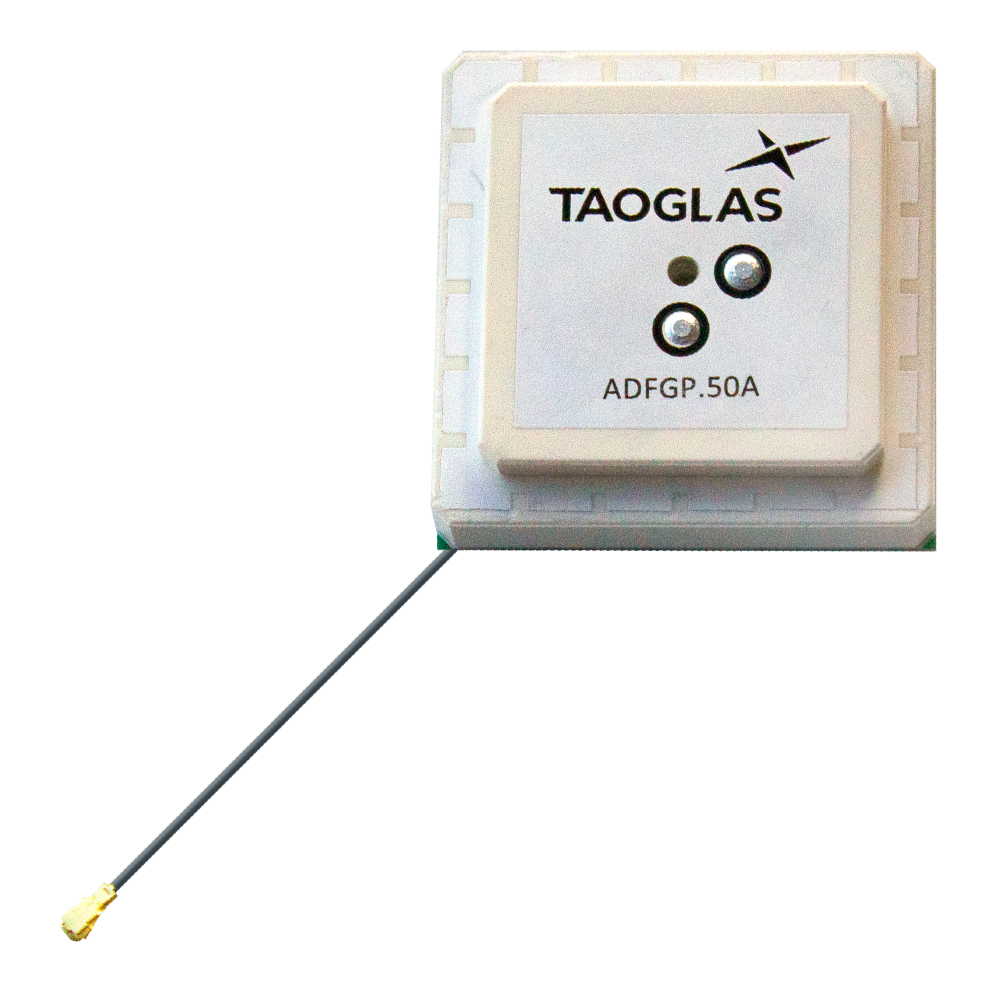

The following is a list of the ZED-F9P GNSS receivers and compatible antenna(s).

| Item                                                     | Supplier#                                                    | Description                                                  |
| -------------------------------------------------------- | ------------------------------------------------------------ | ------------------------------------------------------------ |
|                            | [ZED-F9P-01B](https://www.u-blox.com/en/product/zed-f9p-module) | ublox ZED-F9P high precision GNSS SMT module.  GNSS bands: L2OF, L2C, E1B/C, B2I, E5b, L1C/A, L1OF, B1I.  Concurrent GNSS: BeiDou, Galileo, GLONASS, GPS / QZSS.  RTK 1cm horizontal accuracy. |
|  | [GPS-16481](https://www.sparkfun.com/products/16481)         | SparkFun GPS-RTK-SMA breakout board with ZED-F9P GNSS module. |
|                        | SparkFun: [ANN-MB-00](https://www.sparkfun.com/products/15192)  ublox: [ANN-MB-00](https://www.u-blox.com/en/product/ann-mb-series) | ublox Multi‑frequency GNSS antenna (L1, L2/E5b/B2I) active magnet mount.  Supports GPS, GLONASS, Galileo, and BeiDou.  5m SMA cable.  Designed for ZED-F9P. |
|                             | [AA.200.151111](https://www.taoglas.com/product/active-multiband-gnss-mag-mount-antenna/) | Taoglas multi‑band GNSS antenna (GPS/QZSS-L1/L2, GLONASS-G1/G2/G3, Galileo-E1/E5a, and BeiDou-B1/B2) active magnet mount.  Supports GPS, GLONASS, Galileo, and BeiDou.  1.5m SMA cable.  63.2 x 67.2 mm. |
|                           | [QHA.50.A.301111](https://www.taoglas.com/product/qha-50-a-301111-colosseum-passive-quad-helix/) | Taoglas multi-band GNSS antenna  (GPS/QZSS-L1/L2, GPS/QZSS/IRNSS-L5, QZSS-L6, Galileo-E1/E5a/E5b/E6, GLONASS-G1/G2/G3, BeiDou-B1/B2a/B2b/B3).  permanent mount. IP67 rated waterproof. 3m RG-174 SMA cable.  94mm (dia). |
|                                    | [TW8889](https://www.tallysman.com/product/tw8889-dual-band-gnss-antenna/) | Tallysman multi‑band GNSS antenna (GPS/QZSS-L1/L2, GLONASS-G1/G2/G3, Galileo-E1/E5a, and BeiDou-B1/B2) active magnet mount.  Supports GPS, GLONASS, Galileo, and BeiDou.  3m SMA cable.  47mm (dia), 52g. |
|                       | [TW7882](https://www.tallysman.com/product/tw7882-dual-band-gnss-antenna/) | Tallysman multi‑band GNSS antenna (GPS/QZSS-L1/L2, GLONASS-G1/G2/G3, Galileo-E1/E5a, and BeiDou-B1/B2) active magnet mount.  Supports GPS, GLONASS, Galileo, and BeiDou.  3m SMA cable.  69mm (dia), 180g. |
|                                | [HC882](https://www.tallysman.com/product/hc882-dual-band-helical-antenna-l-band/) | Tallysman multi‑band helical GNSS antenna (GPS/QZSS-L1/L2, GLONASS-G1/G2/G3, Galileo-E1/E5a, and BeiDou-B1/B2) active magnet mount.  Supports GPS, GLONASS, Galileo, and BeiDou.  SMA.  44.2mm (dia), 42g. |
|                     | [ADFGP.50A.07.0100C](https://www.taoglas.com/product/adfgp-50a-active-gnss-dual-stacked-patch/) | Taoglas embedded multi-band GNSS antenna (GPS/QZSS L1/L2, GLONASS G1/G2/G3, Galileo E1/E5a/E5b, BeiDou B1/B2a/B2b).  50x50mm, 95.5g. |
|                                    | [TW1889](https://www.tallysman.com/product/tw1889-embedded-dual-band-gnss-antenna/) | Tallysman embedded multi-band GNSS antenna (GPS/QZSS L1/L2, GLONASS G1/G2/G3, Galileo E1/E5b, BeiDou B1/B2).  48mm (dia), 37g. |
|                                   | [TW3887](https://www.tallysman.com/product/tw3887-embedded-dual-band-gnss-antenna/) | Tallysman multi-band GNSS antenna (GPS/QZSS-L1/L2, GLONASS-G1/G2/G3, Galileo-E1/E5a, and BeiDou-B1/B2).  60mm (dia), 70g. |

