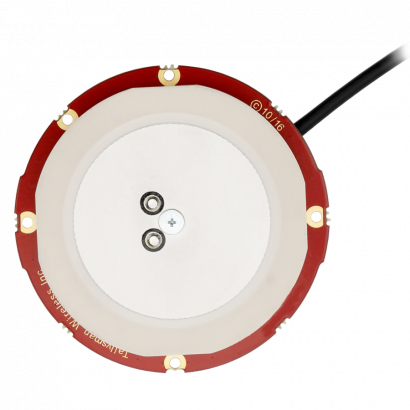

The IMX can be configured for use with the Inertial Sense GPX-1 multi-band GNSS receivers.  This can be done using either the EvalTool GPS Setting tab or the IMX `DID_FLASH_CONFIG.ioConfig` and `DID_FLASH_CONFIG.RTKCfgBits` fields.    

| GPS Ports      | Value                                          |
| -------------- | ---------------------------------------------- |
| GPS Source     | serial 0, serial 1, or serial 2                |
| GPS Type       | GPX-1                                      |
| GPS1 Timepulse | *Disable* or IMX pin connected to GPX-1 |

| RTK Rover    | Value                       |
| ------------ | --------------------------- |
| GPS RTK Mode | Position or Compass |

| RTK Base                         | Value        |
| -------------------------------- | ------------ |
| Serial Port 0 (Single GNSS only) | GPS1 - RTCM3 |
| USB Port                         | GPS1 - RTCM3 |

The following sections detail how to interface and configure the IMX for operation using the GPX-1.  See [RTK precision positioning](../rtk_positioning_overview/) and [RTK compassing](../rtk_compassing/) for RTK operation principles.  

#### Dual GPX-1 Heading Accuracy

When using two multi-band GPX-1 GNSS receivers in moving baseline mode (RTK compassing) such as the [RUG-3-IMX-5-DUAL](https://inertialsense.com/product/dual-compassing-ins-sensor-series-5-ruggedized-module/), the baseline error is composed of the measurement error plus the RTK solution error.  The heading accuracy with ideal conditions is shown in the following plot.

 

### Typical Interface

The IMX will automatically configure the GPX-1 for communications.    

#### Single GNSS RTK Positioning w/ LiDAR

RTK base messages (RTMC3) supplied to any of the IMX serial ports are forwarded to the GPX-11 for RTK positioning.  The RTK precision position is used in the IMX EKF solution. The IMX can be configured to output NMEA messages such as GPGGA or GPRMC on any serial port.

#### Dual GNSS RTK Positioning and RTK Compassing

RTK base messages (RTMC3) supplied to any of the IMX serial ports are forwarded to GPS1 for RTK positioning.  RTK moving base messages from GPS1 are forwarded to GPS2 for RTK compassing.  The RTK precision position from GPS 1 and the RTK compassing heading from GPS2 are used in the IMX EKF solution.  Note that typically the Rugged-3 uses Serial 0 and the EVB-2 uses Serial 2 to communicate with the GPS2 F9P receiver.

### Rugged-4 (Coming Soon)

The Rugged-4 INS contains the GPX-1 onboard supporting RTK positioning and compassing.  GPS 1 and GPS 2 are connected to serial port 0 on the IMX-5.

#### Single GNSS Settings

Use the following IMX settings with the Rugged-3-G1 (single GNSS receiver).  These settings can be applied either using the EvalTool GPS Settings tab or the IMX `DID_FLASH_CONFIG.ioConfig` and `DID_FLASH_CONFIG.RTKCfgBits` fields.

The following is a list of the ZED-F9P GNSS receivers and compatible antenna(s).

| Item                                                     | Supplier#                                                    | Description                                                  |
| -------------------------------------------------------- | ------------------------------------------------------------ | ------------------------------------------------------------ |
|                            | [ZED-F9P-01B](https://www.u-blox.com/en/product/zed-f9p-module) | ublox ZED-F9P high precision GNSS SMT module.  GNSS bands: L2OF, L2C, E1B/C, B2I, E5b, L1C/A, L1OF, B1I.  Concurrent GNSS: BeiDou, Galileo, GLONASS, GPS / QZSS.  RTK 1cm horizontal accuracy. |
|  | [GPS-16481](https://www.sparkfun.com/products/16481)         | SparkFun GPS-RTK-SMA breakout board with ZED-F9P GNSS module. |
|                        | SparkFun: [ANN-MB-00](https://www.sparkfun.com/products/15192)  ublox: [ANN-MB-00](https://www.u-blox.com/en/product/ann-mb-series) | ublox Multi‑frequency GNSS antenna (L1, L2/E5b/B2I) active magnet mount.  Supports GPS, GLONASS, Galileo, and BeiDou.  5m SMA cable.  Designed for ZED-F9P. |
|                             | [AA.200.151111](https://www.taoglas.com/product/active-multiband-gnss-mag-mount-antenna/) | Taoglas multi‑band GNSS antenna (GPS/QZSS-L1/L2, GLONASS-G1/G2/G3, Galileo-E1/E5a, and BeiDou-B1/B2) active magnet mount.  Supports GPS, GLONASS, Galileo, and BeiDou.  1.5m SMA cable.  63.2 x 67.2 mm. |
|                           | [QHA.50.A.301111](https://www.taoglas.com/product/qha-50-a-301111-colosseum-passive-quad-helix/) | Taoglas multi-band GNSS antenna  (GPS/QZSS-L1/L2, GPS/QZSS/IRNSS-L5, QZSS-L6, Galileo-E1/E5a/E5b/E6, GLONASS-G1/G2/G3, BeiDou-B1/B2a/B2b/B3).  permanent mount. IP67 rated waterproof. 3m RG-174 SMA cable.  94mm (dia). |
|                                    | [TW8889](https://www.tallysman.com/product/tw8889-dual-band-gnss-antenna/) | Tallysman multi‑band GNSS antenna (GPS/QZSS-L1/L2, GLONASS-G1/G2/G3, Galileo-E1/E5a, and BeiDou-B1/B2) active magnet mount.  Supports GPS, GLONASS, Galileo, and BeiDou.  3m SMA cable.  47mm (dia), 52g. |
|                       | [TW7882](https://www.tallysman.com/product/tw7882-dual-band-gnss-antenna/) | Tallysman multi‑band GNSS antenna (GPS/QZSS-L1/L2, GLONASS-G1/G2/G3, Galileo-E1/E5a, and BeiDou-B1/B2) active magnet mount.  Supports GPS, GLONASS, Galileo, and BeiDou.  3m SMA cable.  69mm (dia), 180g. |
|                                | [HC882](https://www.tallysman.com/product/hc882-dual-band-helical-antenna-l-band/) | Tallysman multi‑band helical GNSS antenna (GPS/QZSS-L1/L2, GLONASS-G1/G2/G3, Galileo-E1/E5a, and BeiDou-B1/B2) active magnet mount.  Supports GPS, GLONASS, Galileo, and BeiDou.  SMA.  44.2mm (dia), 42g. |
|                     | [ADFGP.50A.07.0100C](https://www.taoglas.com/product/adfgp-50a-active-gnss-dual-stacked-patch/) | Taoglas embedded multi-band GNSS antenna (GPS/QZSS L1/L2, GLONASS G1/G2/G3, Galileo E1/E5a/E5b, BeiDou B1/B2a/B2b).  50x50mm, 95.5g. |
|                                    | [TW1889](https://www.tallysman.com/product/tw1889-embedded-dual-band-gnss-antenna/) | Tallysman embedded multi-band GNSS antenna (GPS/QZSS L1/L2, GLONASS G1/G2/G3, Galileo E1/E5b, BeiDou B1/B2).  48mm (dia), 37g. |
|                                   | [TW3887](https://www.tallysman.com/product/tw3887-embedded-dual-band-gnss-antenna/) | Tallysman multi-band GNSS antenna (GPS/QZSS-L1/L2, GLONASS-G1/G2/G3, Galileo-E1/E5a, and BeiDou-B1/B2).  60mm (dia), 70g. |

