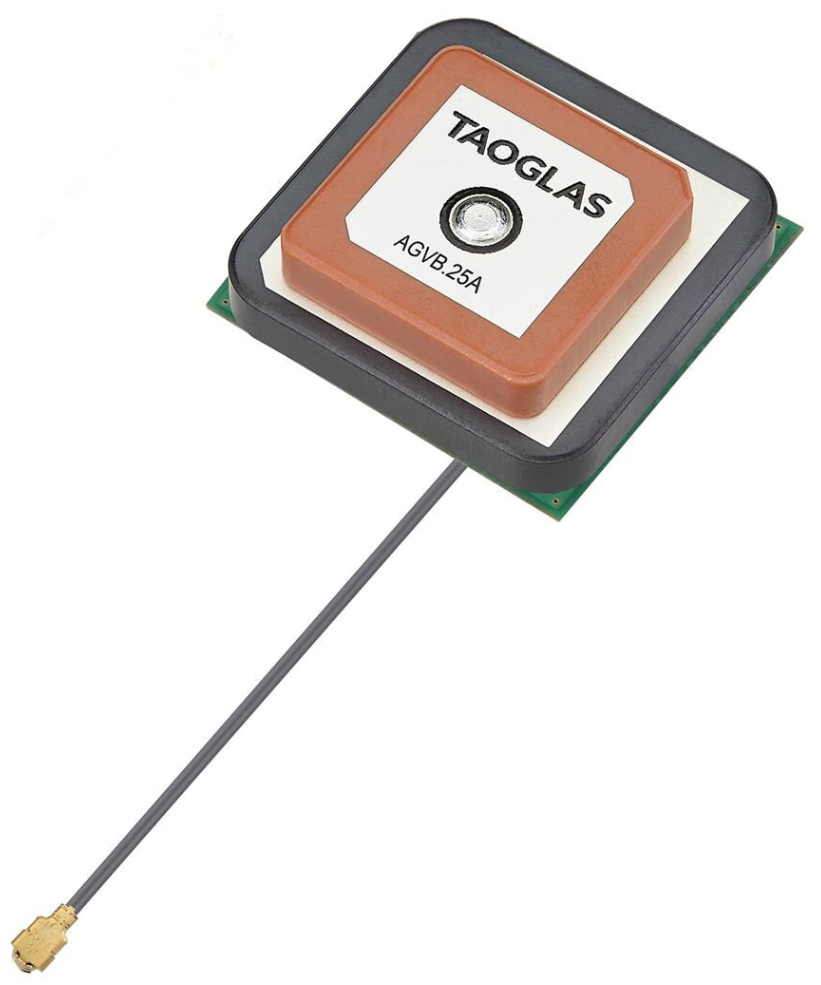

The IMX can be configured for use with the Inertial Sense GPX-1 multi-band GNSS receivers.  This can be done using either the EvalTool GPS Setting tab or the IMX `DID_FLASH_CONFIG.ioConfig` and `DID_FLASH_CONFIG.RTKCfgBits` fields.    

| GPS Ports      | Value                                          |
| -------------- | ---------------------------------------------- |
| GPS Source     | serial 0, serial 1, or serial 2                |
| GPS Type       | GPX-1                                      |
| GPS1 Timepulse | *Disable* or IMX pin connected to GPX-1 |

| RTK Rover    | Value                       |
| ------------ | --------------------------- |
| GPS RTK Mode | Position or Compass |

| RTK Base                         | Value        |
| -------------------------------- | ------------ |
| Serial Port 0 (Single GNSS only) | GPS1 - RTCM3 |
| USB Port                         | GPS1 - RTCM3 |

The following sections detail how to interface and configure the IMX for operation using the GPX-1.  See [RTK precision positioning](rtk_positioning_overview.md) and [RTK compassing](rtk_compassing.md) for RTK operation principles.  

### Typical Interface

The IMX will automatically configure the GPX-1 for communications.    

### Rugged-4 (Coming Soon)

The Rugged-4 INS contains the GPX-1 onboard supporting RTK positioning and compassing.  GPS 1 and GPS 2 are connected to serial port 0 on the IMX-5.

The following is a list of the ZED-F9P GNSS receivers and compatible antenna(s).

| Item                                                    | Supplier#                                                    | Description                                                  |
| ------------------------------------------------------- | ------------------------------------------------------------ | ------------------------------------------------------------ |
|                        | SparkFun: [ANN-MB1-00](https://www.sparkfun.com/gnss-l1-l5-multi-band-high-precision-antenna-5m-sma.html)  ublox: [ANN-MB1-00](https://www.u-blox.com/en/product/ann-mb1-antenna) | ublox Multi‑frequency GNSS antenna (L1, L2/E5b/B2I) active magnet mount.  Supports GPS, GLONASS, Galileo, and BeiDou.  5m SMA cable.  Designed for ZED-F9P. Dimensions: 82 × 60 × 22.5 mm   |
|  | Mouser: [ADFGP.50A.07.0100C](https://mou.sr/3QEZYgF)  Taoglas: [ADFGP.50A.07.0100C](https://www.taoglas.com/product/adfgp-50a-active-gnss-dual-stacked-patch/) | Embedded Active GNSS Dual Stacked Patch Antenna with 100mm of 1.37 & IPEX MHFI Embedded Dual Patch, Dual Feed 4-Pin Assembly Covering Bands:  • GPS/QZSS (L1/L2)  • GPS/QZSS/IRNSS (L5)  • Galileo (E1/E5a/E5b)  • GLONASS (G1/G2/G3)  • BeiDou (B1/B2a/B2b)  Low Axial Ratio Cable: 100mm of 1. 37mm  Connector: IPEX MHFI (U.FL)  Dimensions: 50 x 50 x 16.8 mm  RoHS & Reach Compliant |
|                        | Mouser: [AGVLB.25A/25B](https://www.mouser.com/ProductDetail/Taoglas/AGVB.25A.07.0060A?qs=QNEnbhJQKvaX8%2FxO3iw5qg%3D%3D&srsltid=AfmBOoo19I7a1kD2fe3cVCb0TvfSYxDgvX7-p0x4jodY2FYO2iKhyLyP&utm_source=chatgpt.com) | GPS L1 / L5 & BeiDou B1 Active Stacked Patch Antenna Features: Single Feed Stacked Patch Assembly Covering Bands  - GPS L1 & L5  - BeiDou B1  - IRNSS L5  Low Axial Ratio Tuned for Centre Positioning on a 7070mm Ground Plane  Dimensions: 25 x 25 x 12 mm  Cable: 60mm of Ø1.13mm  Connector: I-PEX MHF® I (U.FL Compatible)  RoHS & REACH Compliant |
|       | Mouser: [APARC2511X-SGL2L5](https://www.mouser.com/ProductDetail/ABRACON/APARC2511X-SGL2L5?qs=OlC7AqGiEDnTfMlek7r93w%3D%3D) | Antennas Internal/Embedded Antennas Active Patch Connector Mount IPEX (F) Dimensions: 25 x 25 x 11.6 mm |
|                                                         |                                                              |                                                              |
