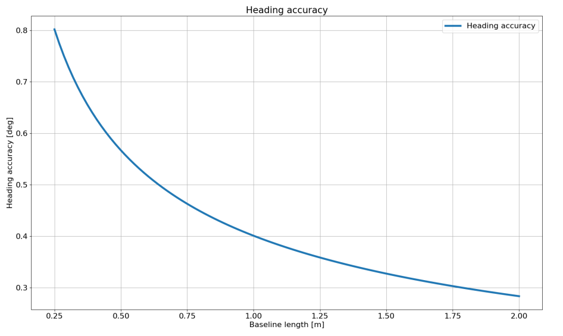

# Multi-band GNSS

## Advantages

The advent of multi-band GNSS (multiple frequency global navigation satellite systems) improves accuracy by reducing the impact of errors caused by multi-path and atmospheric distortion.  When compared to traditional single-band GNSS, dual-band technology provides about a 2x reduction in average position error (circular error probable - CEP).  Benefits of multi-band GNSS systems like the uBlox ZED-F9P or the Inertial Sense GPS-1 receiver include:  

- Concurrent reception of GPS, GLONASS, Galileo and BeiDou for better coverage.
- Faster convergence time (GPS time to fix).
- More reliable / robust performance.
- ~2x reduction in average position error (CEP). 
- Centimeter-level RTK position accuracy. 
- Small and energy efficient module.
- Easy integration of RTK for fast time-to-market.

## Overview

The IMX (GPS-INS) can be interfaced with external multi-band (multi-frequency) GNSS receiver(s) connected via serial port(s) to improve precision the EKF solution.  The supported message protocols are uBlox binary and NMEA.  The following are the GPS settings (accessible in the EvalTool GPS Settings tab and IMX `DID_FLASH_CONFIG.ioConfig` and `DID_FLASH_CONFIG.RTKCfgBits`):

| Setting        | Value                                                        |
| -------------- | ------------------------------------------------------------ |
| GPS Source     | Serial port of the GNSS (serial 0 or 1)                      |
| GPS Type       | GNSS model or protocol (ublox M8, ublox F9, Inertial Sense, or NMEA)         |
| GPS RTK        | *Position* for GPX-1 L1/L5 RTK precision positioning *Compass* for GPX-1 L1/L5 RTK Dual GNSS heading *F9 Position* for ZED-F9P mult-frequency RTK precision positioning *F9 Compass* for ZED-F9P multi-frequency Dual GNSS heading |
| GPS1 Timepulse | Source of the GNSS PPS time synchronization, uBlox GPS type only. |

Refer to the Hardware section of this manual for serial port pinout information. 

#### Dual GNSS Heading Accuracy

When using two multi-band GNSS receivers in moving baseline mode (RTK compassing) such as the [RUG-3-IMX-5-DUAL](https://inertialsense.com/product/dual-compassing-ins-sensor-series-5-ruggedized-module/), the baseline error is composed of the measurement error plus the RTK solution error.  The heading accuracy with ideal conditions is shown in the following plot.

 

#### Single GNSS RTK Positioning w/ LiDAR

RTK base messages (RTMC3) supplied to any of the IMX serial ports are forwarded to the GPX-1 for RTK positioning.  The RTK precision position is used in the IMX EKF solution. The IMX can be configured to output NMEA messages such as GPGGA or GPRMC on any serial port.

#### Dual GNSS RTK Positioning and RTK Compassing

RTK base messages (RTMC3) supplied to any of the IMX serial ports are forwarded to GPS1 for RTK positioning.  RTK moving base messages from GPS1 are forwarded to GPS2 for RTK compassing.  The RTK precision position from GPS 1 and the RTK compassing heading from GPS2 are used in the IMX EKF solution.

