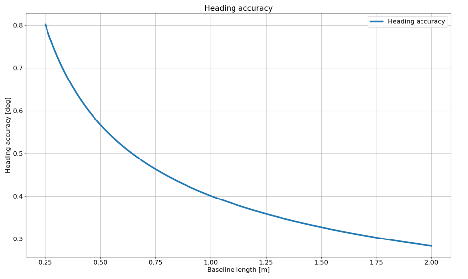
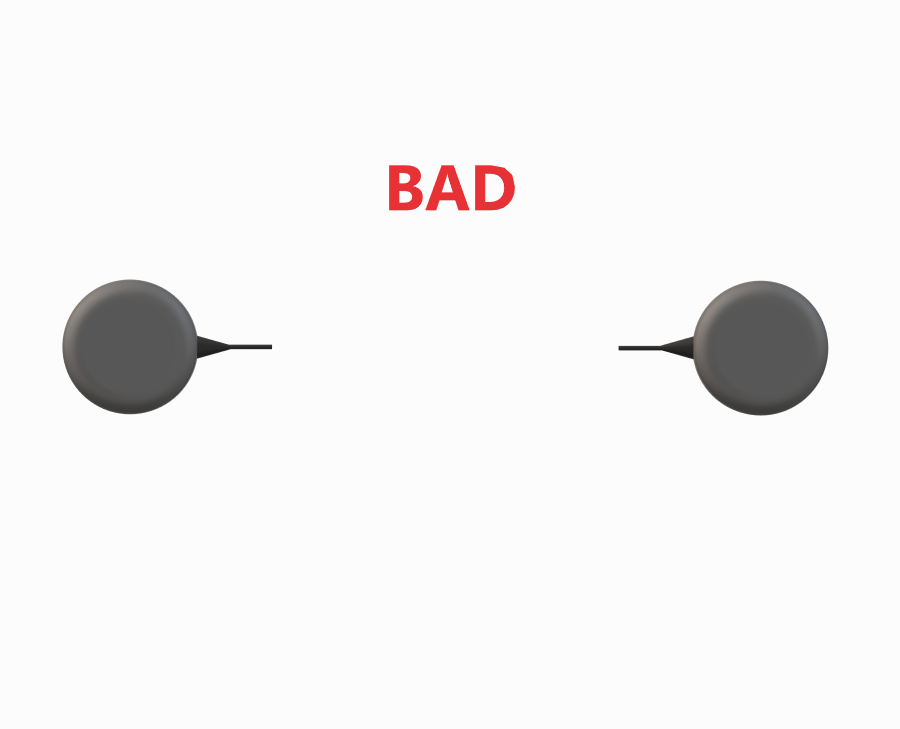
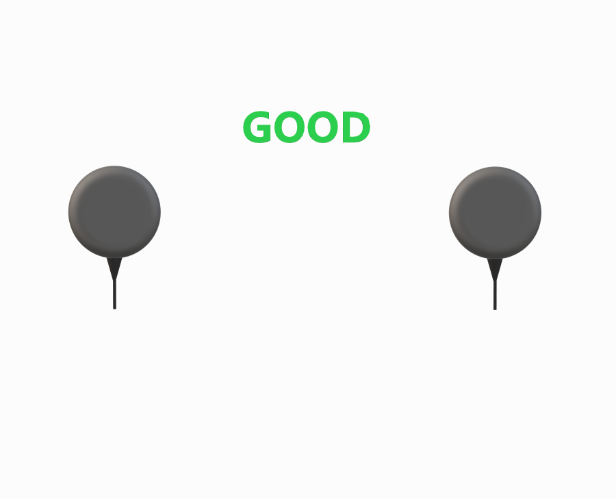
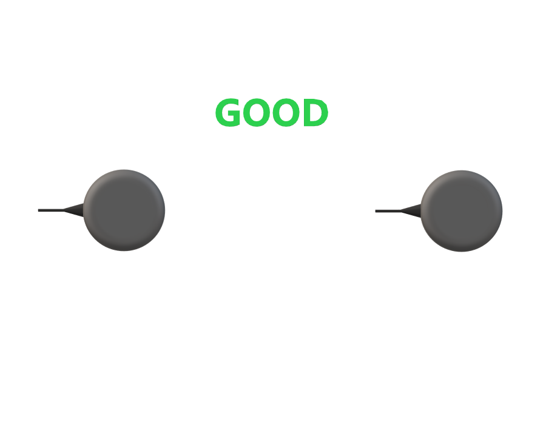
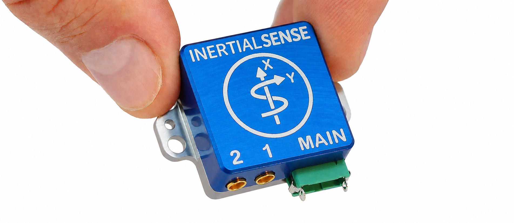
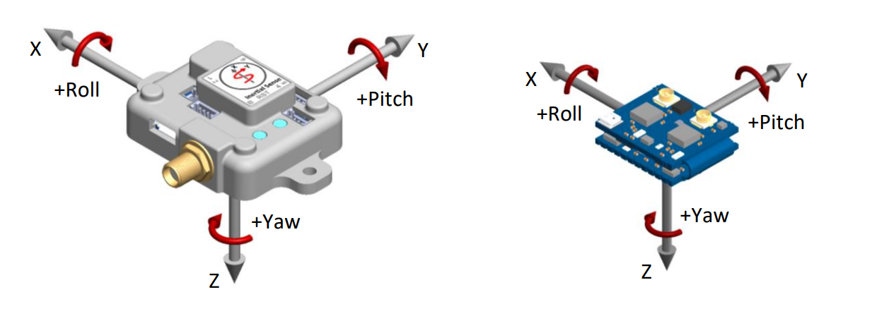
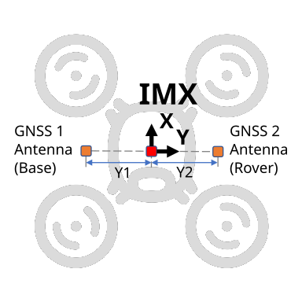
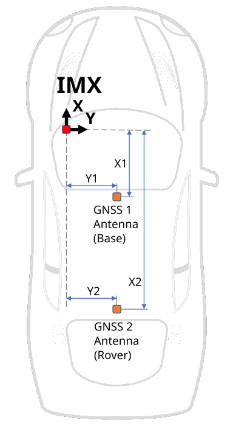
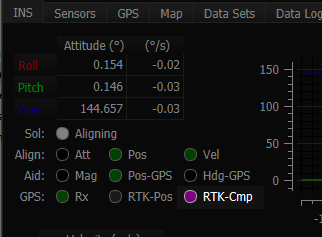
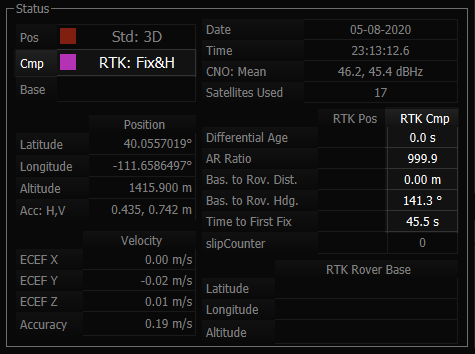

# Dual GNSS RTK Compassing

## Overview

RTK Compassing (Dual GNSS) is a system that determines heading by use of two GNSS receivers and antennas.  It replaces the need for magnetometers which can be problematic in the presence of ferrous materials (e.g. steel) and EMI generating circuits (e.g. electric motors and drivers).  

## Heading Accuracy

[//]: # "This comment won't appear in generated output. Source for above plot: google doc "GPS Compass Static Accuracy Testing" tab "Theoretical Accuracy""

The generalized heading accuracy under ideal conditions is shown in the following plot.  

 

### Recommended Minimum Baseline

The recommended minimum baseline (distance between dual GNSS antennas) is ***0.25 meters*** for multi-band GNSS compassing.  The solution can operate at shorter baseline distances but is less robust and more susceptible to getting caught in a local minimum which may not converge to the correct heading.

## Antenna Orientation 

!!! important
    It is recommended that both GNSS antennas be identical and have the same physical orientation relative to each other (i.e. the antenna cable should exit in the same direction on both antennas).  This will ensure best RF phase center alignment and heading accuracy.  The actual RF phase center is often offset from the physical center of the antenna case.   

|                        Mismatch                        |                          Match                          |                          Match                           |
| :----------------------------------------------------: | :-----------------------------------------------------: | :------------------------------------------------------: |
|  |  |  |

## Rugged GNSS Antenna Ports



On the Rugged IMX, the MMCX ports labeled **1** and **2** are the ***GNSS1*** and ***GNSS2*** antenna inputs.

## Dual Antenna Locations

The location for both GNSS antennas must be correctly specified by the user in the DID_FLASH_CONFIG variables within 1 cm accuracy:

```
DID_FLASH_CONFIG.gnss1AntOffset[X,Y,Z]
DID_FLASH_CONFIG.gnss2AntOffset[X,Y,Z]
```

These values describe the distance of each GNSS antenna from the IMX [Sensor Frame](../reference/coordinate_frames.md#sensor-frame) origin in the direction of the Sensor Frame axes.  The [Sensor Frame](../reference/coordinate_frames.md#sensor-frame) is defined using DID_FLASH_CONFIG.sensorConfig.



### Validate GNSS Antenna Offsets

To validate the GNSS antenna offset values, inspect the INS heading (`DID_INS_1.theta[2]`) and verify that it points in the forward direction of the sensor frame (and the platform).  Note that the RTK compass heading reported in `DID_GNSS2_RTK_CMP_REL.baseToRoverHeading` always reflects the raw heading from the GNSS1 antenna to the GNSS2 antenna and does not change with the antenna offsets; the INS heading, however, incorporates the antenna offsets and orientation to rotate this RTK compass heading into the sensor frame.  Because of this, the antenna offsets can be adjusted and re-validated immediately by simply watching the INS heading update.

### Example Antenna Configurations

The following are examples that illustrate what the GNSS antenna offsets should be for two different antenna configurations. 

#### Drone

<center>



</center>

```
DID_FLASH_CONFIG.gnss1AntOffset[0] =  0.0
DID_FLASH_CONFIG.gnss2AntOffset[1] = -0.3	(negative direction of Y axis)
DID_FLASH_CONFIG.gnss2AntOffset[2] =  0.0

DID_FLASH_CONFIG.gnss2AntOffset[0] =  0.0
DID_FLASH_CONFIG.gnss2AntOffset[1] =  0.3
DID_FLASH_CONFIG.gnss2AntOffset[2] =  0.0
```

#### Automobile

<center>



</center>

```
DID_FLASH_CONFIG.gnss1AntOffsetX = -0.5	(negative direction of X axis)
DID_FLASH_CONFIG.gnss1AntOffsetY =  0.5
DID_FLASH_CONFIG.gnss1AntOffsetZ = -0.5	(negative direction of Z axis, above IMX)

DID_FLASH_CONFIG.gnss2AntOffsetX = -1.5	(negative direction of X axis)
DID_FLASH_CONFIG.gnss2AntOffsetY =  0.5
DID_FLASH_CONFIG.gnss2AntOffsetZ = -0.5 (negative direction of Z axis, above IMX)
```

### GNSS Antenna Ports

The following table explains how ports A and B on the Rugged IMX map to GNSS antennas 1 and 2.

| Ports              | Rugged IMX | IMX Module |
| ------------------ | ----------- | --------------------- |
| GNSS 1 antenna port | A           | 1                     |
| GNSS 2 antenna port | B           | 2                     |

## **Setup**

### Step 1 - Specify Offsets for Both Antennas 

Refer to the [Dual Antenna Locations](#dual-antenna-locations) section for a description of the GNSS antenna offset. 

```
DID_FLASH_CONFIG.gnss1AntOffsetX = ?
DID_FLASH_CONFIG.gnss1AntOffsetY = ?
DID_FLASH_CONFIG.gnss1AntOffsetZ = ?

DID_FLASH_CONFIG.gnss2AntOffsetX = ?
DID_FLASH_CONFIG.gnss2AntOffsetY = ?
DID_FLASH_CONFIG.gnss2AntOffsetZ = ?
```

**Using EvalTool** - select `Data Sets -> DID_FLASH_CONFIG` and set `gnss1AntOffset[X,Y,Z]` and `gnss2AntOffset[X,Y,Z]` with the GNSS antenna offsets. 

**Using CLTool** - run the CLTool using the following options replacing the `[OFFSET]`  with the GNSS antenna offsets.

```
-flashconfig=gnss1AntOffsetX=[OFFSET] 
-flashconfig=gnss1AntOffsetY=[OFFSET] 
-flashconfig=gnss1AntOffsetZ=[OFFSET]
-flashconfig=gnss2AntOffsetX=[OFFSET] 
-flashconfig=gnss2AntOffsetY=[OFFSET] 
-flashconfig=gnss2AntOffsetZ=[OFFSET] 
```

### Step 2 - Enable GNSS Dual Antenna 

Set the `RTK_CFG_BITS_ROVER_MODE_RTK_COMPASSING (0x00000004)` bit of RTKCfgBits.

```c++
DID_FLASH_CONFIG.RTKCfgBits |= RTK_CFG_BITS_ROVER_MODE_RTK_COMPASSING		// |= 0x00000004
```

**Using EvalTool** - go to `Settings -> RTK -> Rover Mode`, set the dropdown menu to `GNSS Compassing`, and press the `Apply` button. 

**Using CLTool** - run the CLTool using the  `-flashconfig=RTKCfgBits=0x4` option to enable GNSS Dual Antenna.

## RTK Compassing Fix Status

### INS and GNSS Status Flags

The RTK compassing fix status can be identified using the valid bit in the INS and GNSS status flags.

```c++
DID_INS_1.insStatus & INS_STATUS_RTK_COMPASSING_VALID			    // INS status - RTK heading is valid and aiding INS heading.
DID_GNSS1_POS.status & GNSS_STATUS_FLAGS_GNSS2_RTK_COMPASS_VALID		// GNSS status - RTK heading is valid and available in DID_GNSS2_RTK_CMP_REL.
```

RTK compassing fix is indicated when the RTK-Cmp radio button turns purple in the EvalTool INS tab.

<center>



</center>

### Progress and Accuracy

The base to rover heading accuracy indicates how much error is in the base to rover heading (RTK compassing heading).   The ambiguity resolution ratio, `arRatio`, is a metric that indicates progress of the solution that ranges from 0 to 999.  Typically values above 3 typically indicate RTK fix progress.   

```c++
DID_GNSS2_RTK_CMP_REL.baseToRoverHeadingAcc			// (rad) RTK compassing accuracy
DID_GNSS2_RTK_CMP_REL.arRatio						// Ambiguity resolution ratio
```

The DID_GNSS2_RTK_CMP_REL status can be monitored in the EvalTool GNSS tab.

<center>



</center>

## Stationary Application

For RTK compassing stationary application, enabling the STATIONARY INS dynamic model (DID_FLASH_CONFIG.dynamicModel = 2) is recommended to reduce heading noise and drift.  This will reduce heading error during RTK compassing fix or loss of fix.  See [INS-GNSS Dynamic Model](../imx/application-config/imu_ins_configuration.md#ins-gnss-dynamic-model) and [Zero Motion Command](../imx/application-config/zero_motion_command.md) for details.  
