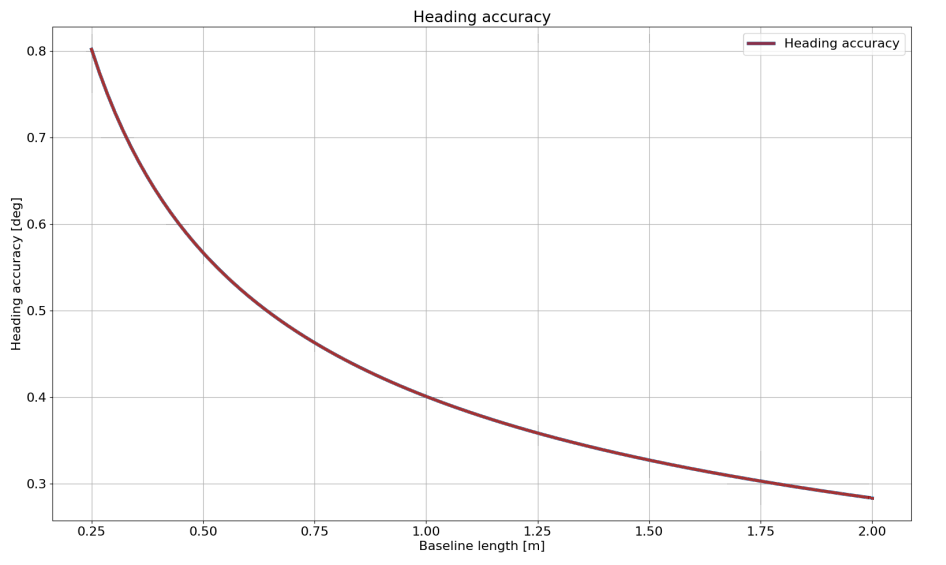

# Dual GNSS RTK Compassing

## Overview

RTK Compassing (Dual GNSS) is a system that determines heading by use of two GNSS receivers and antennas.  It replaces the need for magnetometers which can be problematic in the presence of ferrous materials (e.g. steel) and EMI generating circuits (e.g. electric motors and drivers).  

See the [multi-band dual GNSS](../multi_band_gnss/#evb-2-to-dual-zed-f9-interface) section for details on using our multi-frequency dual ZED-F9 GNSS system.

## Heading Accuracy

[//]: # "This comment won't appear in generated output. Source for above plot: google doc "GPS Compass Static Accuracy Testing" tab "Theoretical Accuracy""

The generalized heading accuracy for both the single-band (L1) and the [dual GNSS multi-band](https://inertialsense.com/product/dual-compassing-ins-sensor-series-5-ruggedized-module/) systems under ideal conditions is shown in the following plot.  

 

### Recommenced Minimum Baseline

The recommended minimum baseline (distance between dual GNSS antennas) is ***0.3 meters*** for single-band (L1) GNSS compassing and ***0.25 meters*** for multi-band ZED-F9 GNSS compassing.  The solution can operate at shorter baseline distances but is less robust and more susceptible to getting caught in a local minimum which may not converge to the correct heading.

## Antenna Orientation 

!!! important
    It is recommended that both GNSS antennas be identical and have the same physical orientation relative to each other (i.e. the antenna cable should exit in the same direction on both antennas).  This will ensure best RF phase center alignment and heading accuracy.  The actual RF phase center is often offset from the physical center of the antenna case.   

|                        Mismatch                        |                          Match                          |                          Match                           |
| :----------------------------------------------------: | :-----------------------------------------------------: | :------------------------------------------------------: |
|  |  |  |

## Rugged GNSS Antenna Ports


On the Rugged IMX, the MMCX port ***A*** is for ***GPS1*** and MMXC port ***B*** is ***GPS2***.  These port labels are changed to ***1*** and ***2*** on newer Rugged units.

## Dual Antenna Locations

The location for both GPS antennae must be correctly specified by the user in the DID_FLASH_CONFIG variables within 1 cm accuracy:

```
DID_FLASH_CONFIG.gps1AntOffset[X,Y,Z]
DID_FLASH_CONFIG.gps2AntOffset[X,Y,Z]
```

These values describe the distance of each GPS antenna from the IMX [Sensor Frame](../../reference/coordinate_frames/#sensor-frame) origin in the direction of the Sensor Frame axes.  The [Sensor Frame](../../reference/coordinate_frames/#sensor-frame) is defined using DID_FLASH_CONFIG.sensorConfig.


### Example Antennae Configurations

The following are examples that illustrate what the GPS antenna offsets should be for two different antenna configurations. 

#### Drone

<center>


</center>

```
DID_FLASH_CONFIG.gps1AntOffset[0] =  0.0
DID_FLASH_CONFIG.gps2AntOffset[1] = -0.3	(negative direction of Y axis)
DID_FLASH_CONFIG.gps2AntOffset[2] =  0.0

DID_FLASH_CONFIG.gps2AntOffset[0] =  0.0
DID_FLASH_CONFIG.gps2AntOffset[1] =  0.3
DID_FLASH_CONFIG.gps2AntOffset[2] =  0.0
```

#### Automobile

<center>


</center>

```
DID_FLASH_CONFIG.gps1AntOffsetX = -0.5	(negative direction of X axis)
DID_FLASH_CONFIG.gps1AntOffsetY =  0.5
DID_FLASH_CONFIG.gps1AntOffsetZ = -0.5	(negative direction of Z axis, above IMX)

DID_FLASH_CONFIG.gps2AntOffsetX = -1.5	(negative direction of X axis)
DID_FLASH_CONFIG.gps2AntOffsetY =  0.5
DID_FLASH_CONFIG.gps2AntOffsetZ = -0.5  (negative direction of Z axis, above IMX)
```

### GPS Antenna Ports

The following table explains how ports A and B on the Rugged IMX map to GPS antennas 1 and 2.

| Ports              | Rugged IMX | IMX Module and EVB-2 |
| ------------------ | ----------- | --------------------- |
| GPS 1 antenna port | A           | 1                     |
| GPS 2 antenna port | B           | 2                     |

## **Setup**

### Step 1 - Specify Offsets for Both Antennae 

Refer to the [Dual Antenna Locations](#dual-antenna-locations) section for a description of the GPS antenna offset. 

```
DID_FLASH_CONFIG.gps1AntOffsetX = ?
DID_FLASH_CONFIG.gps1AntOffsetY = ?
DID_FLASH_CONFIG.gps1AntOffsetZ = ?

DID_FLASH_CONFIG.gps2AntOffsetX = ?
DID_FLASH_CONFIG.gps2AntOffsetY = ?
DID_FLASH_CONFIG.gps2AntOffsetZ = ?
```

**Using EvalTool** - select `Data Sets -> DID_FLASH_CONFIG` and set `gps1AntOffset[X,Y,Z]` and `gps2AntOffset[X,Y,Z]` with the GPS antenna offsets. 

**Using CLTool** - run the CLTool using the following options replacing the `[OFFSET]`  with the GPS antenna offsets.

```
-flashconfig=gps1AntOffsetX=[OFFSET] 
-flashconfig=gps1AntOffsetY=[OFFSET] 
-flashconfig=gps1AntOffsetZ=[OFFSET]
-flashconfig=gps2AntOffsetX=[OFFSET] 
-flashconfig=gps2AntOffsetY=[OFFSET] 
-flashconfig=gps2AntOffsetZ=[OFFSET] 
```

### Step 2 - Enable GPS Dual Antenna 

Set the `RTK_CFG_BITS_COMPASSING (0x00000008)` bit of RTKCfgBits.

```c++
DID_FLASH_CONFIG.RTKCfgBits |= RTK_CFG_BITS_COMPASSING		// |= 0x00000008
```

**Using EvalTool** - go to `Settings -> RTK -> Rover Mode`, set the dropdown menu to `GPS Compassing`, and press the `Apply` button. 

**Using CLTool** - run the CLTool using the  `-flashconfig=RTKCfgBits=0x8` option to enable GPS Dual Antenna.

## RTK Compassing Fix Status

### INS and GPS Status Flags

The RTK compassing fix status can be identified using the valid bit in the INS and GPS status flags.

```c++
DID_INS_1.insStatus & INS_STATUS_RTK_COMPASSING_VALID			    // INS status - RTK heading is valid and aiding INS heading.
DID_GPS1_POS.status & GPS_STATUS_FLAGS_GPS2_RTK_COMPASS_VALID		// GPS status - RTK heading is valid and available in DID_GPS2_RTK_CMP_REL.
```

RTK compassing fix is indicated when the RTK-Cmp radio button turns purple in the EvalTool INS tab.

<center>


</center>

### Progress and Accuracy

The ambiguity resolution ratio, `arRatio`, is a metric that indicates progress of the solution that ranges from 0 to 999.  Typically values above 3 indicate RTK fix progress.  The base to rover heading accuracy indicates how much error is in the base to rover heading (RTK compassing heading). 

```c++
DID_GPS1_RTK_CMP_REL.arRatio						// Ambiguity resolution ratio
DID_GPS1_RTK_CMP_REL.baseToRoverHeadingAcc			// (rad) RTK compassing accuracy
```

The DID_GPS1_RTK_CMP_REL status can be monitored in the EvalTool GPS tab.

<center>


</center>

## Stationary Application

For RTK compassing stationary application, enabling the STATIONARY INS dynamic model (DID_FLASH_CONFIG.dynamicModel = 2) is recommended to reduce heading noise and drift.  This will reduce heading error during RTK compassing fix or loss of fix.  See [INS-GNSS Dynamic Model](../../application-config/imu_ins_gnss_configuration/#ins-gnss-dynamic-model) and [Zero Motion Command](../../application-config/zero_motion_command) for details.  