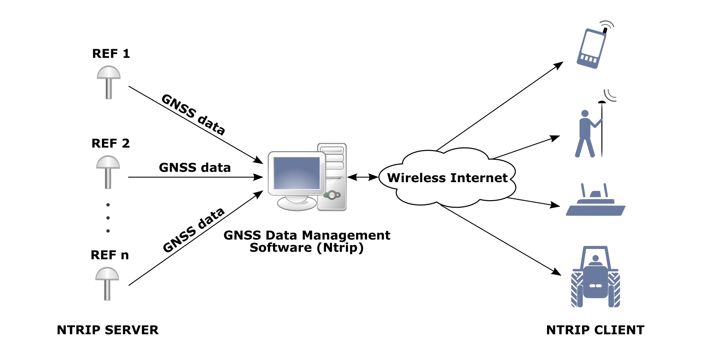

Networked Transport of RTCM via internet protocol, or NTRIP, is an open standard protocol for
streaming differential data over the internet in accordance with specifications published by RTCM.
There are three major parts to the NTRIP system: The NTRIP client, the NTRIP server, and the NTRIP
caster:

1. The NTRIP server is a PC or on-board computer running NTRIP server software communicating directly with a GNSS reference station. 
2. The NTRIP caster is an HTTP server which receives streaming RTCM data from one or more NTRIP servers and in turn streams the RTCM data to one or more NTRIP clients via the internet.
3. The NTRIP client receives streaming RTCM data from the NTRIP caster to apply as real-time corrections to a GNSS receiver. 

The EvalTool/CLTool software applications provide NTRIP client functionality to be used with the IMX RTK rover.  Typically an EvalTool NTRIP client connects over the internet to an NTRIP service provider. The EvalTool/CLTool NTRIP client then provides the RTCM 3.3 corrections to the IMX and ZED-F9P rover connected over USB or serial.  Virtual reference service (VRS) is also supported by the EvalTool/CLTool NTRIP client.

!!! important
    If using a **virtual reference service** (**VRS**), the rover must output the **NMEA GGA** message to return to the NTRIP caster.  Without this, the NTRIP caster will not provide correction information.

## NTRIP RTCM3 Messages

The NTRIP server must provide the necessary subset of [RTCM3 messages](../multi_band_gnss/#zed-f9-rover-messages) supported by the IMX-RTK.  The following is an example of compatible RTCM3 base output messages provided from a Trimble NTRIP RTK base station.

### Required RTCM Messages for RTK Positioning

| Message Type | Description                           |
| ---- | ------------------------------------- |
| RTCM 1005 | Stationary RTK reference station ARP  |
| RTCM 1074, 1075, or 1077 | GPS MSM4, MSM5, or MSM7        |
| RTCM 1084, 1085, or 1087 | GLONASS MSM4, MSM5, or MSM7     |
| RTCM 1094, 1095, or 1097 | Galileo MSM4, MSM5, or MSM7          |
| RTCM 1230 | GLONASS code-phase biases             |
