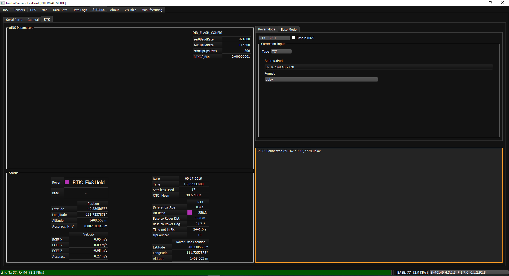
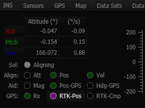
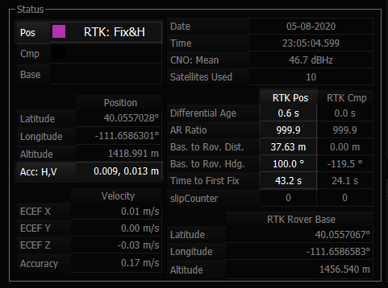

# RTK Precision Positioning

## Overview

Real Time Kinematic (RTK) is a precision satellite positioning technique which utilizes a base station to transmit position corrections to a receiver. The Inertial Sense RTK solution provides centimeter level position accuracy.

To use RTK, a base station, arover (receiver), and a method to send corrections from the base to the rover are required.


See the [multi-band GNSS](../multi_band_gnss/#evb-2-to-zed-f9p-interface) section for details on using our multi-frequency ZED-F9 GNSS system.


## **RTK Hardware Setup**

### **Base Station Options**

Any of the following devices can be used as a RTK base station. All Inertial Sense base station options require a GPS antenna.

- **Inertial Sense EVB 2** - Sends corrections using the onboard 915 MHz radio, the onboard WiFi module, either serial port, or USB.

<!-- (access point mode or over an existing network/hotspot). -->
<!-- (up to several km line-of-sight) -->

- **Inertial Sense µINS module, EVB 1 or Rugged** - Sends corrections on either serial port or USB that can then be forwarded to a rover using a communication method of choice.

- **3rd Party Base Station** - e.g. Emlid Reach Receiver.  

- **Public NTRIP Caster** - e.g. CORS Network.  

### Rover Options

The following configurations can be used for the RTK rover:

- **Inertial Sense EVB 2** - Can receive corrections via the onboard 915 MHz radio, onboard WiFi module, serial ports, or USB.
- **Inertial Sense µINS module, EVB 1 or Rugged** - Can receive corrections via either serial port or USB.

### Base to Rover Communication

1. **Direct Serial** - Using USB, RS232, RS422/485, or TTL to pass corrections from Base to Rover.
2. **Radio Link** - Inertial Sense EVB 2 uses the Digi Xbee Pro SX module to send RTK corrections. Other communication methods such as Bluetooth may also work for the chosen application.
3. **NTRIP** - Transmits RTK correction data over the Internet. To receive messages with NTRIP, the user must supply a URL, port number, and mount point . Often a username and password are also required.
4. **TCP/IP** - A protocol for communicating directly between computers. In order to receive messages using TCP/IP, an address (IP Address or DNS) must be suppled to the Base where the corrections will be transmitted.

## **How to Know RTK is Working**

### **Using the EvalTool**

1. Connect the µINS Rover to a computer with the EvalTool running. Open the comport for the unit in the Settings > Serial Ports.
2. Navigate to Settings > RTK.
3. Under the Status section, RTK functionality can be verified in 3 ways:
   - Status field will show Single. Over the course of several minutes this status will change to Float then Fix.
   - The Differential Age will show a timestamp that increments and resets back to zero about every second. This shows that the Rover is receiving Base messages.
   - The Accuracy: H, V will show a large number at first. This number will decrease over time as the system acquires RTK Fix. Once in Fix, this number will average at +- 0.08, 0.14 m.



### **Using the CLTool**

1. Connect the µINS Rover to a computer with the CLTool running.
2. Include the argument -msgPresetPPD in the CLTool command.
3. Observe the DID_GPS_RTK_NAV message, Status: 0x******** (Single) over the course of several minutes this will change to (Float) then (Fix).

## RTK Fix Status

### **LED Indicators**

The LEDs on the IMX will indicate RTK fix status. 

| LED Behavior                       | Status            | Description                          |
| ---------------------------------- | ----------------- | ------------------------------------ |
|  | 3D Fix, RTK Float | Allows improved accuracy up to ~1m   |
|      | RTK Fix           | Allows increased accuracy up to ~3cm |

### RTK Positioning Valid Flags

The RTK precision positioning fix status can be identified using the valid bit in the INS and GPS status flags.

```c++
// INS status
INS_STATUS_NAV_FIX_STATUS(DID_INS_1.insStatus) == GPS_NAV_FIX_POSITIONING_RTK_FIX

// GPS status
DID_GPS1_POS.status & GPS_STATUS_FLAGS_RTK_POSITION_VALID
```

RTK precision positioning fix is indicated is indicated when the RTK-Pos radio button turns purple in the EvalTool INS tab.

<center>



</center>

### Progress and Accuracy

The ambiguity resolution ratio, `arRatio`, is a metric that indicates progress of the solution that ranges from 0 to 999.  Typically values above 3 indicate RTK fix progress.   

```c++
DID_GPS1_RTK_POS_REL.arRatio						// Ambiguity resolution ratio
```

The DID_GPS1_RTK_POS_REL status can be monitored in the EvalTool GPS tab.

<center>



</center>

## RTK Base Messages

The IMX RTK solution accepts both RTCM3 and uBlox raw GNSS base correction messages.  See the [RTK Base](../rtk_base) or [NTRIP](../rtk_ntrip) pages for details on using base stations.

