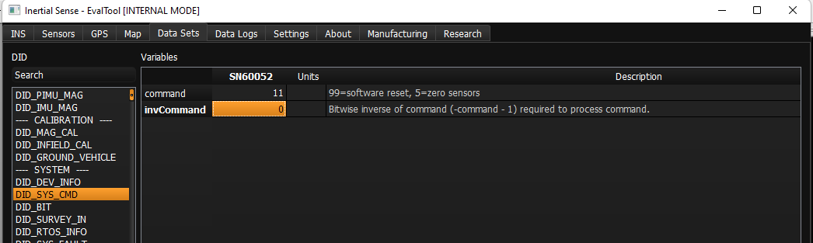
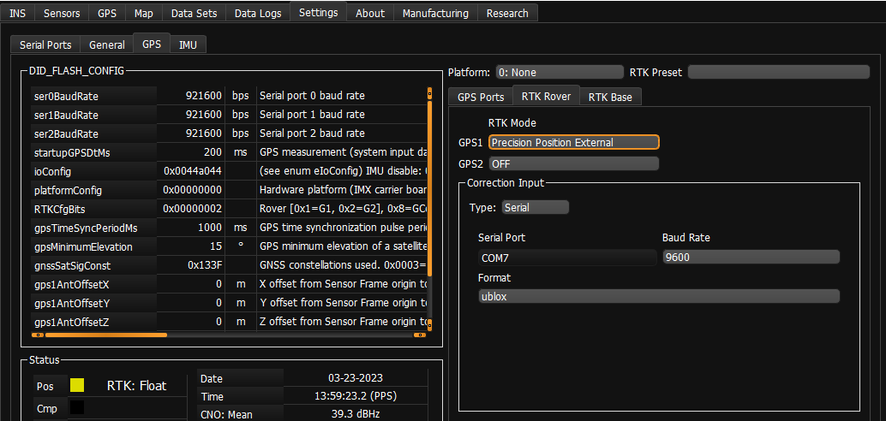

# Using uBlox PointPerfect L-band Corrections

The IMX-5 can receive corrections from the uBlox D9S device, which provides L-band corrections through the uBlox PointPerfect solution. **PointPerfect IP-based corrections are currently not supported (L-band only)**

## Firmware update

L-band corrections requires a later version of F9P firmware. Use FW version HPG 1.32 from the F9P downloads page on the uBlox site. To update the firmware on the F9P, follow these steps:

1. Open the Inertial Sense EvalTool
1. Navigate to the Data Sets tab. Open `DID_SYS_CMD` from the sidebar (see the image below)
1. Set `command` to `11` and `invCommand` to `-12` to enable passthrough to GNSS1 (set `12` and `-13` for GNSS2)
1. Close the serial port (Settings tab)
1. Open the device in uBlox u-center (we currently use u-center 22.07)
1. Update the firmware in u-center per u-blox instructions.

## Configuration of the F9P

By default, the IMX-5 module updates settings on the F9P at bootup. Currently the IMX:

- Configures frequencies and constellations to use in the solution
- Changes the CFG-SPARTN setting to use L-band corrections. IP corrections are not currently supported through the IMX-5 due to a difference in the protocol.

The IMX acts as a transparent pipe for some UBX messages. In the mode shown below, the IMX passes the following messages:

- RXM-SPARTN (from F9P)
- RXM-SPARTNKEY (to/from F9P)
- RXM-PMP (to F9P)
- CFG-* (bidirectional)

For L-band, the messages are sent as UBX-RXM-PMP messages. No additional configuration on the IMX is needed to switch between these messages and RTCM3, either will work. We have not tested using them together, contact uBlox if you are considering this.
