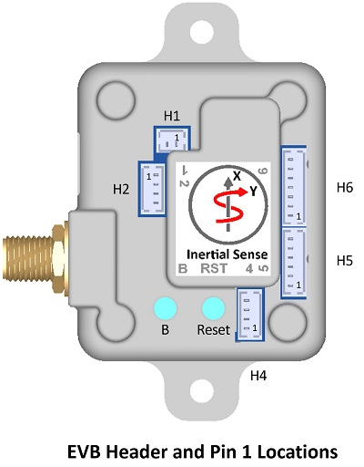
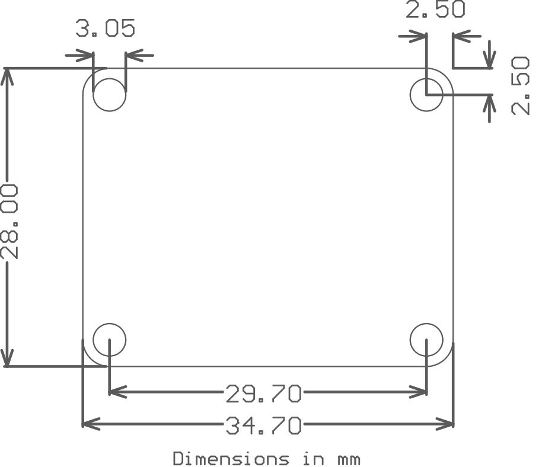
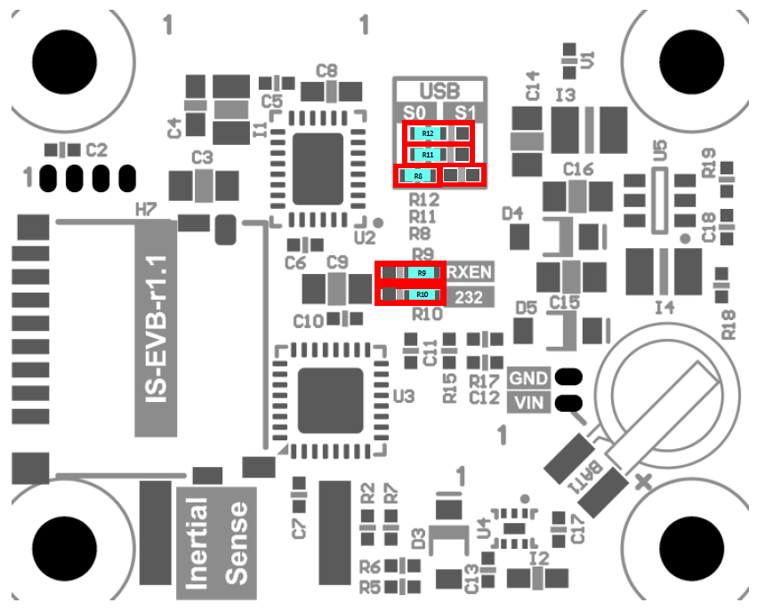
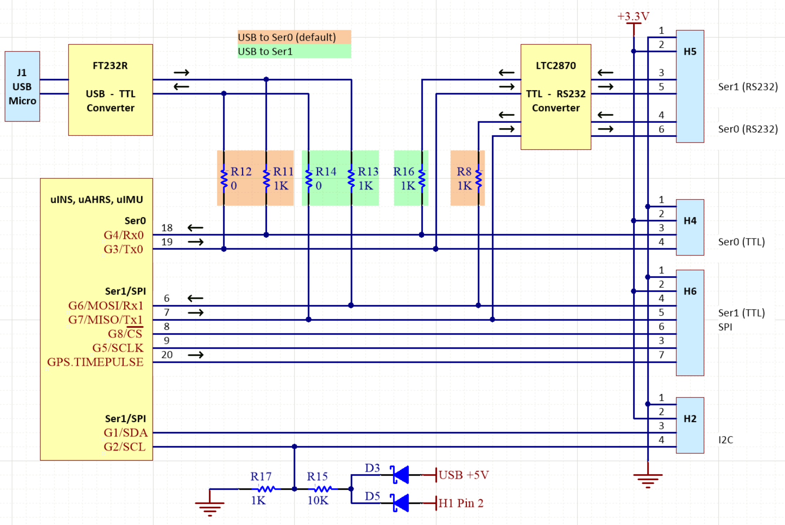
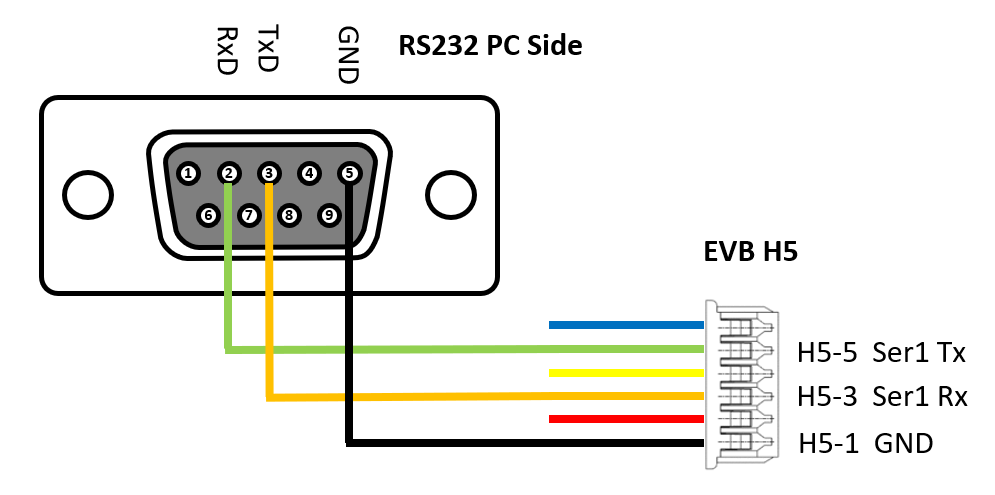

# Hardware Integration: EVB-1

The Inertial Sense EVB1.x is a development board which contains the Inertial Sense µINS, µAHRS, or µIMU module. The EVB1.x functions as a breakout and communications board with the following features:

- Access to all communications pins on the module
- USB connection, either directly to the module or through an on-board FTDI chip
- RS232/RS422/RS485 transceiver

## Connecting the board

For the purposes of basic evaluation, the easiest interface available on the EVB 1.x is the micro USB port. Connecting the micro USB port will provide power and communications with the installed module via the on-board FTDI chip. There are a variety of other interfaces available on the EVB 1.x. 

If using GPS with the module, connect an antenna to the on-board SMA port. More information on compatible antennas is available on the [GNSS Antennas](../gnss/gnss_antennas.md) page.

## Power

The EVB-1 can be powered in using the following methods:

- 4-20V DC regulated supply via H1
- 3.3V DC regulated supply via any +3.3V header pin
- 5V USB connection

## Pinout

Use Molex PicoBlade™ series connectors for the EVB-1 headers.

!!! warning
    **Please note that EVB-1 header pin 1 location and pin order is reversed from that designated by the header manufacturer, Molex.**

**H1 (Power)**

| Pin                                                          | Name | I/O  | Description             |
| ------------------------------------------------------------ | ---- | ---- | ----------------------- |
|  1 | GND  | -    | -                       |
|  2 | VIN  | -    | 4V – 20V supply voltage |

**H2 (I2C)**

| Pin                                | Name          | I/O  | Description                                                  |
| ---------------------------------- | ------------- | ---- | ------------------------------------------------------------ |
|  1  | GND           | -    | -                                                            |
|  2    | 3.3V          | -    | 3.3V supply. Output if H1 is supplied. Otherwise can be 3.3V input to supply IMX. Do NOT power VIN and 3.3V simultaneously! |
|  3 | G1/SDA/I2C_EN | I/O  | GPIO1/*I2C data (Hold HIGH during boot to enable *I2C)       |
|  4 | G2/SCL/STROBE | I/O  | GPIO2/*I2C clock/Strobe time sync input.                     |

**H4 (Serial 0)**

| Pin                                | Name   | I/O  | Description                                                  |
| ---------------------------------- | ------ | ---- | ------------------------------------------------------------ |
|  1  | GND    | -    | -                                                            |
|  2    | 3.3V   | -    | 3.3V supply. Output if H1 is supplied. Otherwise can be 3.3V input to supply IMX. Do NOT power VIN and 3.3V simultaneously! |
|  3 | G4/Rx0 | I    | ‡GPIO4/Serial0 Input (TTL)                                   |
|  4 | G3/Tx0 | O    | ‡GPIO3/Serial0 Output (TTL)                                  |

**H5 (RS232/RS485)**

| Pin                                                          | Name           | I/O  | Description                                                  |
| ------------------------------------------------------------ | -------------- | ---- | ------------------------------------------------------------ |
|  1 | GND            | -    | -                                                            |
|  2 | 3.3V           | -    | 3.3V supply. Output if H1 is supplied. Otherwise can be 3.3V input to supply IMX. Do NOT power VIN and 3.3V simultaneously! |
|  3 | 232Rx1/485Rx1+ | I    | Serial 1 input (RS232)/Serial 1 input+ (RS485)               |
|  4 | 232Rx0/485Rx1- | I    | Serial 0 input (RS232)/Serial 1 input- (RS485)               |
|  5 | 232Tx1/485Tx1+ | O    | Serial 1 output (RS232)/Serial 1 output+ (RS485)             |
|  6 | 232Tx0/485Tx1- | O    | Serial 0 output (RS232)/Serial 1 output- (RS485)             |

**H6 (Serial 1/SPI)**

| Pin                                | Name           | I/O  | Description                                                  |
| ---------------------------------- | -------------- | ---- | ------------------------------------------------------------ |
|  1  | GND            | -    | -                                                            |
|  2    | 3.3V           | -    | 3.3V supply. Output if H1 is supplied. Otherwise can be 3.3V input to supply IMX. Do NOT power VIN and 3.3V simultaneously! |
|  3 | G5/SCLK/STROBE | I/O  | GPIO5/SPI SCLK/Strobe time sync input.                       |
|  4 | G6/Rx1/MOSI    | I    | GPIO6/Serial1 Input (TTL)/SPI MOSI                           |
|  5  | G7/Tx1/MISO    | O    | GPIO7/Serial1 Output (TTL)/SPI MISO                          |
|  6   | G8/CS/STROBE   | I/O  | GPIO8/SPI CS/Strobe time sync input.                         |
|  7 | GPS_PPS        | O    | GPS PPS time synchronization output pulse (1Hz, 10% duty cycle) |

\* Feature will be available in future firmware update.

‡Tied to FTDI USB to serial converter ONLY when USB is connected.

## Mechanical

## Jumpers

The jumpers identified in the following table are used to configure RS485/RS422 features and select which serial port the USB is connected to on the evaluation board.

| Jumper       | Label | Default* | Description                                                  |
| ------------ | ----- | -------- | ------------------------------------------------------------ |
| R9           | RXEN  | RXEN     | Receiver enable for RS232 and RS485 function.                |
| R10          | 232   | 232      | Select RS232 or RS485/RS422 mode on H5. Setting jumper in the “232” position enables RS232 mode. |
| R8, R11, R12 | S0 S1 | S0       | Connects USB to either Ser0 or Ser1. All three jumpers must move together into either the “S0” or “S1” positions. |

 **EVB Bottom View** 

## Schematic

 **EVB Simplified Schematic** 

## RS232 DB9 Adapter

The EVB RS232 interface for the serial port 0 is enabled by default
and available through header H5. The figure to the right illustrates
how a standard DB9 connector is wired to this port.

## USB Driver

The EVB 1.x uses the FTDI FT232R USB to UART IC to provide a serial port over connection over USB.  Depending on the operating system, it may be necessary to download and install the [FTDI device driver](http://www.ftdichip.com/Drivers/D2XX.htm) for the FT232R to register properly as a serial port.

## Using with Inertial Sense Software

Please return to the [getting started](../../getting-started/Overview.md) page to get started programming, updating firmware, viewing data, and logging. 
