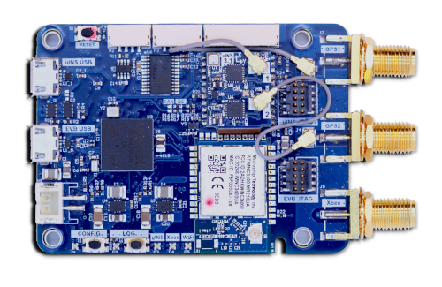
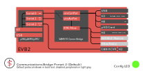
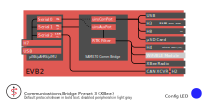
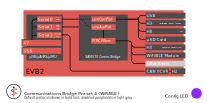
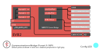
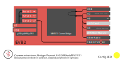
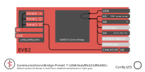
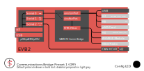
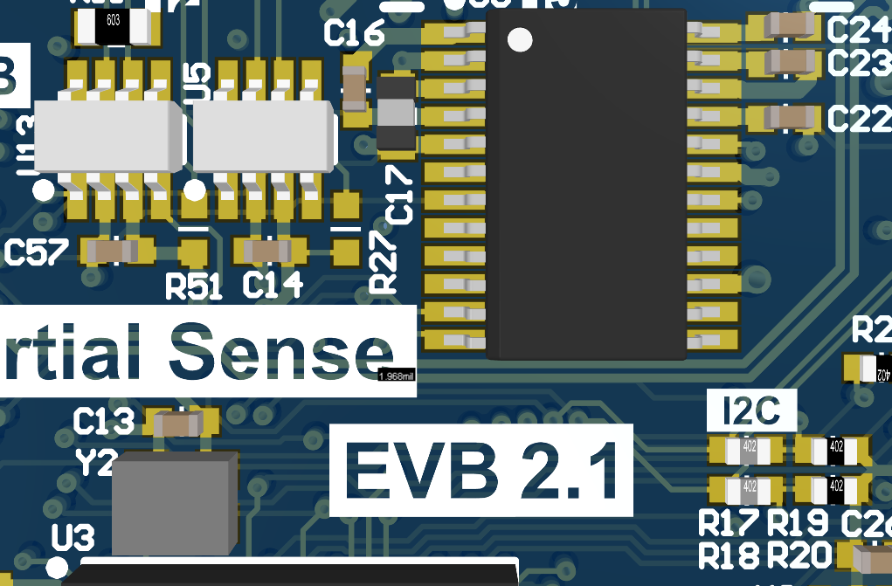
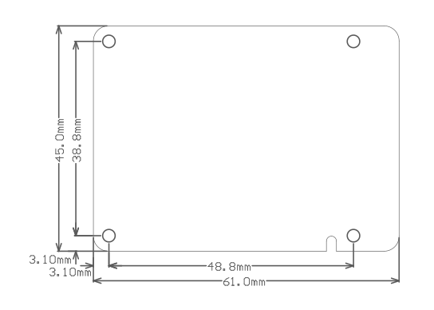

# Hardware Integration: EVB-2

<center>



</center>

The Inertial Sense EVB-2 is a development board which contains the Inertial Sense µINS, µAHRS, or µIMU module. The EVB-2 builds on the foundation established by the EVB-1, but adds new features including:

- 915MHz XBee radio for RTK (real-time-kinematics)
- Wi-Fi and Bluetooth Low energy (BLE) for remote data viewing and logging operation
- Onboard logging to micro SD card.
- Dual antenna ports for GPS compassing
- Companion Microchip SAME70 processor that serves as a communication bridge between the µINS, µAHRS, or µIMU and all other interfaces.

## Configurations

The EVB-2 can be configured to preform a multitude of operations. Below are diagrams of connectivity and configuration options available. The configuration can be changed by pressing the tactile switch labeled "CONFIG" on the EVB-2 until the Config LED shows the desired mode.

| CBPreset |            Config LED            | Mode         | ON                              | OFF                                               |
| :------: | :------------------------------: | :----------- | ------------------------------- | --------------------------                        |
|    2     |   | **Default**  | RS232                           | WiFi/BLE Module, XBee                             |
|    3     |    | **XBee**     | RS232, XBee                     | WiFi/BLE Module                                   |
|    4     |  | **WiFi/BLE** | Wi-Fi/BLE Module,<br/>RS422/485 | XBee                                              |
|    5     |    | **SPI<sup>\*</sup>** | SPI<sup>\*</sup>                | Wi-Fi/BLE Module, XBee                            |
|    6     |  | **USB/232**  | RS232, XBee                     | EVB2 to IMX Connection                           |
|    7     |   | **USB/422/485**  | RS422/485                   | EVB2 to IMX Connection                           |
|    1     |   | **Off**      |                                 | EVB2 to IMX Connection<br/>WiFi/BLE Module, XBee |

<sup>\*</sup>A reset is required following selection of this CBPreset to enable SPI on the IMX, in order to assert the IMX pin 10 (G9/nSPI_EN) during bootup.

=== " Default"

    

=== " XBee"

    

=== " WiFi/BLE"

    

=== " SPI"

    

=== " USB/232"

    

=== " USB/422/485"

    

=== " Off"

    

In the USB hub modes (6-7), the following communications bridge/forwarding exists:

```DID_EVB_FLASH_CFG.uinsComPort``` <-> All ports except XBee, WiFi, and XRadio
```DID_EVB_FLASH_CFG.uinsAuxPort``` <-> XBee, WiFi, and XRadio. XBee and WiFi only enabled when ```DID_EVB_FLASH_CFG.cbPreset == EVB2_CB_PRESET_RS232_XBEE```

```EVB2_PORT_UINS0``` is the default value for both of these. See the source code [here](https://github.com/inertialsense/inertial-sense-sdk/blob/master/EVB-2/IS_EVB-2/src/globals.c#L458-L459).

Bit ```EVB2_PORT_OPTIONS_RADIO_RTK_FILTER``` of ```DID_EVB_FLASH_CFG.portOptions``` only allows RTK corrections to pass through the ```uinsAuxPort```, reducing the wireless communications burden to only essential RTK base connections. This bit is enabled by default.

## EVB-2 Connections

### USB

The most commonly used user interface available on the EVB-2 is the `EVB USB` port. Connecting to the `EVB USB` port will provide power to the device as well communications with the onboard SAME70 processor.  After connecting to a PC the EVB2 will appear as a virtual COM port and can be configured to communicate with every other communication bus on the board. This USB port should be used when updating the EVB-2 firmware or bootloader.

The EVB-2 also has a second USB port, `IMX USB`.  This USB port also supplies power, but it connects directly to the µINS, µAHRS, or µIMU onboard the EVB-2. This USB port should be used when updating the µINS, µAHRS, or µIMU firmware or bootloader.

### GPS Antenna(s)

If using GPS with the module, connect an appropriate antenna to `GPS1 (J7)`. If using the board for GPS compassing, connect a second antenna to `GPS2 (J5)`. More information on GPS antennas is available on the [GNSS Antennas](../gnss/gnss_antennas.md) page. 

### XBee Antenna

If using the onboard XBee radio, ensure that the XBee radio U.FL connector (U10) is connected to the EVB-2 U.FL connector (J8). Connect an appropriate antenna to the EVB-2 RP-SMA connector (J5). 

To communicate with another XBee radio the PID and NID need to match on both radios. The PID and NID can be set using `DID_EVB_FLASH_CFG.radioPID` and `DID_EVB_FLASH_CFG.radioNID`. After setting the PID and NID, the EVB-2 needs to be reset so the radio can be configured. The XBee LED will flash Yellow then Green if the configuration is successful. A red LED signifies a failed radio configuration.

### Wi-Fi Antenna

The XBee radio can be used along with the Wi-Fi module. In this case, a Wi-Fi antenna must be provided and connected to the U.FL port on the Wi-Fi module (U8). 

To use Wi-Fi alone, connect the U.FL connector on the Wi-Fi module (U8) to the EVB-2 U.FL connector (J8), and connect the Wi-Fi antenna to the XBee RP-SMA connector (J5). 
### Header Pinouts

Use JST-PH series connectors for EVB 2.x header H1. Maximum current is 2A per pin.  
Use JST-GH series connectors for all other EVB 2.x headers. Maximum current is 1A per pin.

#### **H1 (Power)** 

| Pin                                                          | Name | Type | Description            |
| ------------------------------------------------------------ | ---- | ---- | ---------------------- |
|  1 | VIN  | -    | 4.5–17V supply voltage                    |
|  2 | GND  | -    | - |

#### **H2 (CAN)** 

To enable IMX CAN interface on H2, the U5 transceiver IC (TCAN334) must be loaded and the R27 jumper removed.  To enable EVB CAN interface on H2, the U13 transceiver IC (TCAN334) must be loaded and the R51 jumper removed. 

| Pin                                | Name | Type | Description              |
| ---------------------------------- | ---- | ---- | ------------------------ |
|  1  | GND  | -    |                          |
|  2    | 3.3V | -    | 3.3V supply              |
|  3  | CANL | I/O  | Low level CAN bus line.  |
|  4 | CANH | I/O  | High level CAN bus line. |

#### **H3 (RS-232/RS-485)**

| Pin                                                          | Name          | Type | Description                                     |
| ------------------------------------------------------------ | ------------- | ---- | ----------------------------------------------- |
|  1 | GND           | -    | -                                               |
|  2 | 232Tx-/485Tx- | O    | Serial output (RS232 transmit-, RS485 transmit-) |
|  3 | 485Tx+        | O    | Serial output (RS485 transmit+)                 |
|  4 | 485Rx-        | I    | Serial input (RS485 receive-)                   |
|  5 | 232Rx/485Rx+  | I    | Serial input (RS232 receive, RS485 receive+)    |

#### **H4 (External Radio)** 

| Pin                                | Name                                               | Type | Description                                                  |
| ---------------------------------- | -------------------------------------------------- | ---- | ------------------------------------------------------------ |
|  1  | GND                                                | -    | -                                                            |
|  2  | GND                                                | -    | -                                                            |
|  3  | GND                                                | -    | -                                                            |
|  4    | 3.3V                                               | -    | Separate radio 3.3V supply. Regulator can supply up to 3.5A. |
|  5    | 3.3V                                               | -    | " "                                                          |
|  6    | 3.3V                                               | -    | " "                                                          |
|  7  | RxD                                                | I    | Serial input from radio transmit pin (TTL) PD25.             |
|  8 | TxD                                                | O    | Serial output to radio receive pin (TTL) PD26.               |
|  9 | <span style="text-decoration: overline">RST</span> | O    | Reset pin                                                    |

#### **H7 (IMX Connections)**   

Pins on H7 (IMX) are shared with the EVB-2 processor.  To prevent conflict when using H7, set EVB-2 CBPreset to 6 or 7 (USB hub mode) to prevent the EVB-2 processor from asserting any I/O on the H7.

| Pin                                 | Name                                          | Type | Default Type | Description                                                  |
| ----------------------------------- | --------------------------------------------- | ---- | ------------ | ------------------------------------------------------------ |
|  1   | GND                                           | -    |              | -                                                            |
|  2   | GND                                           | -    |              | -                                                            |
|  3     | 3.3V                                          | -    |              | 3.3V supply. Output if H1 is supplied. Otherwise can be 3.3V input. |
|  4     | DATA-RDY                                      | I/O  | I            | Indicates data is read to be read from IMX.                 |
|  5   | G1/Rx2<sup>\*</sup>/RxCAN<sup>\*</sup>        | I/O  | I            | GPIO1. Serial 2 input (TTL). Serial input pin from CAN transceiver. |
|  6  | G2/Tx2<sup>\*</sup>/TxCAN<sup>\*</sup>/STROBE | I/O  | O            | GPIO2. Serial 2 output (TTL). Serial output pin to CAN transceiver. Strobe time sync input. |
|  7  | G3/Tx0                                        | I/O  | O            | GPIO3. Serial 0 output (TTL)<br/>(tied to IMX-Ser0 Rx)      |
|  8   | G4/Rx0                                        | I/O  | I            | GPIO4. Serial 0 input (TTL)<br/>(tied to IMX-Ser0 Tx)       |
|  9    | G5/SCLK/STROBE                                | I/O  | I            | GPIO5. SPI SCLK. Strobe time sync input.                     |
|  10 | G6/Rx1/MOSI                                   | I/O  | I            | GPIO6. Serial 1 input (TTL). SPI MOSI<br/>(tied to IMX-Ser1 Tx) |
|  11  | G7/Tx1/MISO                                   | I/O  | O            | GPIO7. Serial 1 output (TTL). SPI MISO<br/>(tied to IMX-Ser1 Rx) |
|  12   | G8/CS/STROBE                                  | I/O  | O            | GPIO8. SPI CS. Strobe time sync input.                       |
|  13  | G9/nSPI_EN/STROBE<br/>/STROBE_OUT             | I/O  | I            | GPIO9. Hold LOW during boot to enable SPI on G5-G8. Strobe time sync input or output. |
|  14 | GPS_PPS                                       | O    | O            | GPS PPS time synchronization output pulse (1Hz, 10% duty cycle) |

<sup>\*</sup>Available on IMX-3.2 and later.

#### **H8 (SAME70 Connections)**   

| Pin                                 | Name        | Type | Default Type | Description                                                  |
| ----------------------------------- | ----------- | ---- | ------------ | ------------------------------------------------------------ |
|  1   | GND         | -    |              | -                                                            |
|  2   | GND         | -    |              | -                                                            |
|  3     | 3.3V        | -    |              | 3.3V supply. Output if H1 is supplied. Otherwise can be 3.3V input. |
|  4     | 3.3V        | -    |              | " "                                                          |
|  5   | M1/TXD1     | O    | O            | GPIO1, USART 1 Output (TTL/SPI), Inverted Serial 1 Output (TTL) |
|  6  | M2/RXD1     | I    | I            | GPIO2, USART 1 Input (TTL/SPI), Inverted Serial 1 Input (TTL) |
|  7  | M3/SCK1/QDA | I/O  |              | GPIO3, USART 1 Clock (SPI), Quadrature Encoder Input A       |
|  8   | M4/CS1/QDB  | I/O  |              | GPIO4, USART 1 Chip Select (SPI), Quadrature Encoder Input B |
|  9    | M5/DA0/AD4  | I/O  |              | GPIO5, DAC 0, ADC 4                                          |
|  10 | M6/DA1/AD5  | I/O  |              | GPIO6, DAC 1, ADC 5                                          |
|  11  | M7/AD10     | I/O  |              | GPIO7, ADC 10                                                |
|  12   | M8/AD4      | I/O  |              | GPIO8, ADC 4                                                 |
|  13  | M9/AD1      | I/O  |              | GPIO9, ADC 1                                                 |
|  14 | M10/AD2     | I/O  |              | GPIO10, ADC 2                                                |

PWM and timer interrupt functions have been excluded from this table. Please see the MCU pin definition spreadsheet for more info.

## IMX Connections

The EVB-2 ATSAME70 (E70) processor interfaces with the IMX over UART (serial 0 and 1) and SPI (serial 1).

### CAN Bus

To use IMX CAN bus interface on the EVB-2, U5 (TCAN334 transceiver) should be loaded and R27 should not be loaded.



### SPI

The EVB-2 must be put into CBPreset mode 6 (CONFIG led color cyan) followed by a system reset to enable SPI mode interface with the IMX.  The EVB-2 (E70) project source code is available in the SDK for reference. 

### Serial 2

To use serial 2, the IMX CAN transciever (U5) and R27 must be depopulated to avoid contention on the data lines.

## Mechanical Dimensions



PCB w/ SMA connectors: 70.0 x 45.0 x 12.0 mm

Enclosure: 78.0 x 48.0 x 18.0 mm

## Using with Inertial Sense Software

Please return to the [getting started](../../getting-started/getting-started.md) page to get started programming, updating firmware, viewing data, and logging.

## Updating Firmware

The EVB-2 and IMX firmware can be updated using the EVB-USB connector and only the IMX firmware when using the IMX-USB connector.

## EVB-2 Design Files


The [EVB-2 PCB assembly design files](https://github.com/inertialsense/IS-hdw/tree/main/Products/EVB-2-1) are available as open source hardware on GitHub.

In particular, full schematics for the board can be found [here](https://github.com/inertialsense/IS-hdw/blob/main/Products/EVB-2-1/Schematic/EVB-2-1-2_Schematic%20Prints.PDF).

## Related Parts

| Part   | Manufacturer | Manufacturer # | Description                                                  |
| ------ | ------------ | -------------- | ------------------------------------------------------------ |
| H7, H8 | JST          | GHR-14V-S      | 14 pin connector 1.25mm pitch for IMX and SAME70 connection. |
| H1     | JST          | PHR-2          | 2 pin connectors 2.00mm pitch for input power.               |

## XBee Radio Frequencies

The EVB-2 shipped standard with the XBee radio default frequency is 915MHz.  An alternate frequency can be achieve by using the European version of the XBee Pro SX module.    

| XBee Pro SX Part#        | Frequency | Frequency Band  |
| ------------------------ | --------- | --------------- |
| XBP9X-DMUS-001 (default) | 915 MHz   | 902MHz ~ 928MHz |
| XB8X-DMUS-001 (Europe)   | 868 MHz   | 863MHz ~ 870MHz |

