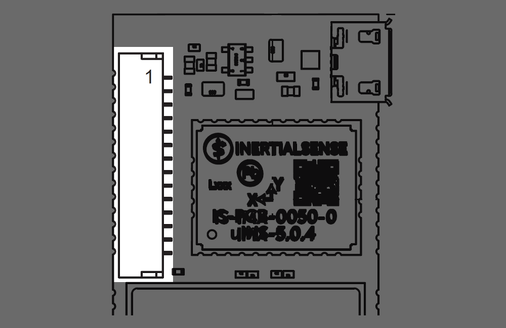

# Hardware Integration: IG-1-IMX-5

The Inertial Sense IG-1 is a PCB module with IMX-5 and dual ublox ZED-F9P multi-frequency GNSS receivers.

- Surface mount reflowable. 
- Onboard dual GNSS for simultaneous RTK positioning and GPS compassing. 
- Micro USB and 14 pin I/O header for convenient evaluation.

## Pinout

**Module Pinout**

**Header H1 Pinout**

The module and header H1 have the same pinout assignment for pins 1-14.  All pins 15 and above are only on the module.

| Module & H1 Pin | Name                              | I/O  | Description                                                  |
| ------------------- | :-------------------------------- | ---- | ------------------------------------------------------------ |
| 0                   | GND                               | PWR  | All other pins not shown in the image are pin 0 tied to GND. |
| 1                   | GND                               | PWR  | -                                                            |
| 2                   | VIN                               | PWR  | 4V-20V supply voltage input                                  |
| 3                   | +3.3V                             | PWR  | Regulated 3.3V supply input/output.                          |
| 4                   | Reserved                          |      | Not Connected                                                |
| 5                   | G1/Rx2/RxCAN/SCL                  | I/O  | GPIO1  Serial 2 input (TTL)  Serial input pin from CAN transceiver\*  I2C SCL line6 |
| 6                   | G2/Tx/TxCAN/SDA/STROBE            | I/O  | GPIO2  Serial 2 output (TTL)  Serial output pin to CAN transceiver\*  I2C SDA line Strobe time sync input |
| 7                   | G3/Tx0                            | I/O  | GPIO3  Serial 0 output (TTL)                            |
| 8                   | G4/Rx0                            | I/O  | GPIO4  Serial 0 input (TTL)                             |
| 9                   | G5/SCLK/STROBE                    | I/O  | GPIO5  SPI SCLK  Strobe time sync input            |
| 10                  | G6/Rx1/MOSI                       | I/O  | GPIO6  Serial 1 input (TTL)  SPI MOSI              |
| 11                  | G7/Tx1/MISO                       | I/O  | GPIO7  Serial 1 output (TTL)  SPI MISO             |
| 12                  | G8/CS/STROBE                      | I/O  | GPIO8  SPI CS  Strobe time sync input              |
| 13                  | G9/nSPI_EN/STROBE /STROBE_OUT/SPI_DRDY | I/O  | GPIO9  SPI Enable: Hold LOW during boot to enable SPI on G5-G8  Strobe time sync input or output. SPI data ready alternate location. |
| 14                  | GPS.TIMEPULSE                     | O    | GPS PPS UTC time synchronization signal.                     |
| 15                  | GND                               | I/O  | -                                                            |
| 16                  | VBAT                              | I/O  | GPS backup supply voltage. (1.4V to 3.6V) enables GPS hardware backup mode for hot or warm startup (faster GPS lock acquisition). MUST connect GPS_VBAT to VCC if no backup battery is used. |
| 17                  | G10/CHIP_ERASE                    | I/O  | Leave unconnected. CHIP ERASE used in manufacturing. !!! WARNING !!! Asserting a logic high (+3.3V) will erase all IMX flash memory, including calibration data. |
| 18                  | G11                               | I/O  | GPIO11                                                       |
| 19                  | G12                               | I/O  | GPIO12 GPS reset                                         |
| 20                  | G13/DRDY                          | I/O  | GPIO13 SPI data ready                                    |
| 21                  | G14/SWCLK                         | I/O  | GPIO14                                                       |
| 22                  | nRESET                            | I    | System reset on logic low. May be left unconnected if not used. |
| 23                  | GND                               | PWR  | -                                                            |
| 24                  | USB_N                             | I/O  | USB  Data Negative Line                                      |
| 25                  | USB_P                             | I/O  | USB Data Positive Line                                       |

## Soldering

The IMX-5 can be reflow soldered. Reflow information can be found in the [Reflow Information](reflow.md) page of this manual

## Hardware Design

### Recommend PCB Footprint and Layout

The default forward direction is indicated in the PCB footprint figure and on the silkscreen as the X axis. The forward direction is reconfigurable in software as necessary.

[Download PDF](https://docs.inertialsense.com/dimensions/IS-IG-1.1-G2-Dual_Dimensions_and_Pinout_IG-1-IMX-5-Dual.pdf)

<object data="https://docs.inertialsense.com/dimensions/IS-IG-1.1-G2-Dual_Dimensions_and_Pinout_IG-1-IMX-5-Dual.pdf" type="application/pdf" width="700px" height="1150px" >
    <embed src="https://docs.inertialsense.com/dimensions/IS-IG-1.1-G2-Dual_Dimensions_and_Pinout_IG-1-IMX-5-Dual.pdf" type="application/pdf" />
</object>

## Design Files

Open source hardware design files, libraries, and example projects for the IMX module are found at the [Inertial Sense Hardware Design repository](https://github.com/inertialsense/IS-hdw) hosted on GitHub.  These include schematic and layout files for printed circuit board designs, and 3D step models of the InertialSense products usable for CAD and circuit board designs.

### Reference Design Projects

The EVB-2 and IG-1 circuit board projects serve as reference designs that illustrate implementation of the IMX PCB module.

[EVB-2 evaluation board](https://github.com/inertialsense/IS-hdw/tree/main/Products/EVB-2-1)

[IG-1 module](https://github.com/inertialsense/IS-hdw/tree/main/Products/IG-1-0)
