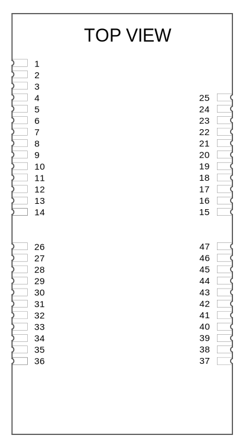

# Hardware Integration: IG-2 (IMX5 + GPX1)

The Inertial Sense IG-2 is a PCB module with IMX-5 and GPX-1 multi-frequency GNSS receiver.

- Surface mount reflowable. 
- Onboard dual GNSS for simultaneous RTK positioning and GPS compassing. 
- Micro USB and 14 pin I/O header for convenient evaluation.

## Pinout

**Module Pinout**

**Header H1 Pinout**

The IG-2 module and IG-2 header H1 have the same pinout assignment for pins 1-14.  Because H1 only has 14 pins, pins 15 and above listed in the following table are only on the IG-2 module.

| IG-2 Module & IG-2 H1 Pin      | Name                                       | I/O  | Description                                                  |
| ---------------------------------- | :----------------------------------------- | ---- | ------------------------------------------------------------ |
| 1   | GND                                        | PWR  | -                                                            |
| 2   | VIN                                        | PWR  | 4V-20V supply voltage input                                  |
| 3     | +3.3V                                      | PWR  | Regulated 3.3V supply input/output.                          |
| 4     | Reserved                                   |      | Not Connected                                                |
| 5   | G1/Rx2/RxCAN/SCL                           | I/O  | IMX GPIO1  Serial 2 input (TTL)  Serial input pin from CAN transceiver\*  I2C SCL line6 |
| 6  | G2/Tx/TxCAN/SDA/STROBE                     | I/O  | IMX GPIO2  Serial 2 output (TTL)  Serial output pin to CAN transceiver\*  I2C SDA line Strobe time sync input |
| 7  | G3/Tx0                                     | I/O  | IMX GPIO3  Serial 0 output (TTL)                        |
| 8   | G4/Rx0                                     | I/O  | IMX GPIO4  Serial 0 input (TTL)                         |
| 9    | G5/SCLK/STROBE                             | I/O  | IMX GPIO5  SPI SCLK  Strobe time sync input        |
| 10 | G6/Rx1/MOSI                                | I/O  | IMX GPIO6  Serial 1 input (TTL)  SPI MOSI          |
| 11  | G7/Tx1/MISO                                | I/O  | IMX GPIO7  Serial 1 output (TTL)  SPI MISO         |
| 12   | G8/CS/STROBE                               | I/O  | IMX GPIO8  SPI CS  Strobe time sync input          |
| 13  | G9/nSPI_EN/STROBE /STROBE_OUT/SPI_DRDY | I/O  | IMX GPIO9  SPI Enable: Hold LOW during bootup to enable SPI on G5-G8  Strobe time sync input or output. SPI data ready alternate location. |
| 14 | GPS.TIMEPULSE                              | O    | GPS PPS UTC time synchronization signal.                     |
| 15                                 | GND                                        | PWR  | -                                                            |
| 16                                 | VBAT                                       | I/O  | GPS backup supply voltage. (1.4V to 3.6V) enables GPS hardware backup mode for hot or warm startup (faster GPS lock acquisition). MUST connect GPS_VBAT to VCC if no backup battery is used. |
| 17                                 | G10/BOOT_MODE                              | I/O  | Leave unconnected. IMX BOOT MODE used in manufacturing. !!! WARNING !!! Asserting a logic high (+3.3V) will cause the IMX to reboot into ROM bootloader (DFU) mode. |
| 18                                 | G11                                        | I/O  | IMX GPIO11                                                   |
| 19                                 | G12                                        | I/O  | IMX GPIO12 GPS reset                                     |
| 20                                 | G13/DRDY                                   | I/O  | IMX GPIO13 SPI data ready                                |
| 21                                 | G14/SWCLK                                  | I/O  | IMX GPIO14                                                   |
| 22                                 | nRESET                                     | I    | System reset (IMX and GPX) on logic low. May be left unconnected if not used. |
| 23                                 | GND                                        | PWR  | -                                                            |
| 24                                 | USB_N                                      | I/O  | IMX USB Data Negative Line                                   |
| 25                                 | USB_P                                      | I/O  | IMX USB Data Positive Line                                   |
| 26                                 | GPX_G16/QDEC0A                             | I/O  | GPX GPIO16                                                   |
| 27                                 | GPX_G17/QDEC0B                             | I/O  | GPX GPIO17                                                   |
| 28                                 | GPX_G18/QDEC1A                             | I/O  | GPX GPIO18                                                   |
| 29                                 | GPX_G19/QDEC1B                             | I/O  | GPX GPIO19                                                   |
| 30                                 | +3.3V                                      | PWR  | Regulated 3.3V supply input/output.                          |
| 31                                 | GPX_G10_BOOT                               | I/O  | GPX GPIO10                                                   |
| 32                                 | GPX_G5/SCLK                                | I/O  | GPX GPIO5 GPX SPI clock                                  |
| 33                                 | GPX_G6/Rx1/MOSI                            | I/O  | GPX GPIO6 GPX Serial 1 input (TTL) GPX SPI MOSI      |
| 34                                 | GPX_G7/Tx1/MISO                            | I/O  | GPX GPIO7 GPX Serial 1 output (TTL) GPX SPI MISO     |
| 35                                 | GPX_G8/CS                                  | I/O  | GPX GPIO8 GPX SPI chip select                            |
| 36                                 | GPX_G9/SPI_EN                              | I/O  | GPX GPIO9 GPX SPI Enable: Hold LOW during bootup to enable SPI on G5-G8 |
| 37-47                              | GND                                        | PWR  | -                                                            |

## IG-2 Schematic

[Download Schematic](https://docs.inertialsense.com/datasheets/IG-2_schematic.pdf)

<object data="https://docs.inertialsense.com/datasheets/IG-2_schematic.pdf" type="application/pdf" width="700px" height="1150px" >
    <embed src="https://docs.inertialsense.com/datasheets/IG-2_schematic.pdf" type="application/pdf" />
</object>
## Soldering

The IMX-5 can be reflow soldered. Reflow information can be found in the [Reflow Information](reflow.md) page of this manual

## Hardware Design

### Recommend PCB Footprint and Layout

The default forward direction is indicated in the PCB footprint figure and on the silkscreen as the X axis. The forward direction is reconfigurable in software as necessary.

[Download PDF](https://docs.inertialsense.com/dimensions/IS-IG-2.0_Dimensions_and_Pinout.pdf)

<object data="https://docs.inertialsense.com/dimensions/IS-IG-2.0_Dimensions_and_Pinout.pdf" type="application/pdf" width="800px" height="600px" >
    <embed src="https://docs.inertialsense.com/dimensions/IS-IG-2.0_Dimensions_and_Pinout.pdf" type="application/pdf" />
</object>

## Design Files

Open source hardware design files, libraries, and example projects for the IMX module are found at the [Inertial Sense Hardware Design repository](https://github.com/inertialsense/IS-hdw) hosted on GitHub.  These include schematic and layout files for printed circuit board designs, and 3D step models of the InertialSense products usable for CAD and circuit board designs.

### Reference Design Projects

The EVB-2, IG-1, and IG-2 circuit board projects serve as reference designs that illustrate implementation of the IMX PCB module.

[EVB-2 evaluation board](https://github.com/inertialsense/IS-hdw/tree/main/Products/EVB-2-1)

[IG-1 module](https://github.com/inertialsense/IS-hdw/tree/main/Products/IG-1-1-G2)

[IG-2 module](https://github.com/inertialsense/IS-hdw/tree/main/Products/IG-2-0)

## Related Parts

| Part | Manufacturer | Manufacturer # | Description                                           |
| ---- | ------------ | -------------- | ----------------------------------------------------- |
| H1   | JST          | GHR-14V-S      | 14 pin connector 1.25mm pitch for IMX I/O connection. |
