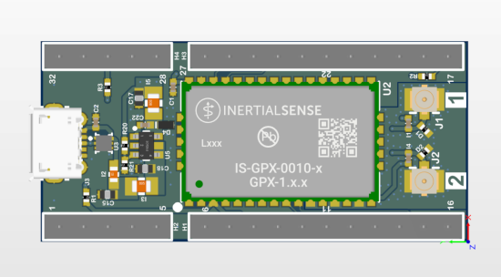

# Hardware Integration: IK-1 (IMX5 or GPX1)

The Inertial Sense IK-1 is a breakout evaluation board for either the IMX-5 or GPX-1 multi-frequency GNSS receiver.

- 0.1" pitch header for convenient interface.
- Interfaces with standard breadboard. 
- Onboard Micro USB connector
- Onboard voltage regulation.
- Dual U.FL connectors for GPX GNSS antennas.

## Connecting Your Unit

For the purposes of basic evaluation, the easiest interface available on the IK-1 is by using a micro-USB cable. A cable included in the evaluation kit. The cable provides power and communications with the installed module via USB virtual communications port.

## Pinout

**Module Pinout**

The IK-1 module pinout is as follows

| IK1                                     | IMX | GPX | Name                                          | Type | Description                                                  |
| --------------------------------------------- | ---- | ---- | ------------------------------------------------------------ | ------------------------------------------------------------ | --------------------------------------------- |
| 1-3 | 11,21 | 11,13,15,31 | GND | Power | Supply ground |
| 4 | - | 20 | G20/LNA-EN | I/O | GPIO20, GPX LNA enable |
| 5 | - | 21 | PPS2 | O | GNSS2 PPS time synchronization output pulse (1Hz, 10% duty cycle) |
| 6 | 1   | 1    | USB_P                                         | I/O  | USB full-speed Positive Line. USB will be supported in future firmware updates.           |
| 7 | 2   | 2    | USB_N                                         | I/O  | USB full-speed Negative Line. USB will be supported in future firmware updates.           |
| 8 | 3   | 3    | VBKUP                                       | Power | Backup supply voltage input (1.75V to 3.6V). Future firmware updates will use voltage applied on this pin to backup GNSS ephemeris, almanac, and other operating parameters for a faster startup when VCC is applied again. This pin MUST be connected to a backup battery or VCC. |
| 9 | 4   | 4    | G1/Rx2/RxCAN/SCL                              | I/O  | GPIO1  Serial 2 input (TTL)  Serial input pin from CAN transceiver\*  I2C SCL line |
| 10 | 5   | 5    | G2/Tx2/TxCAN/SDA/STRB                        | I/O  | GPIO2  Serial 2 output (TTL)  Serial output pin to CAN transceiver\*  I2C SDA line Strobe time sync input |
| 11 | 6   | 6    | G6/Rx1/MOSI                                   | I/O  | GPIO6  Serial 1 input (TTL)  SPI MOSI                        |
| 12 | 7   | 7    | G7/Tx1/MISO                                   | I/O  | GPIO7  Serial 1 output (TTL)  SPI MISO                       |
| 13 | 8   | 8    | G8/CS/STRB                                  | I/O  | GPIO8  SPI CS  Strobe time sync input                       |
| 14 | 9   | 9    | G5/SCLK/STRB                                | I/O  | GPIO5  SPI SCLK  Strobe time sync input                     |
| 15 | 10 | 10   | G9/nSPI_EN/DRDY/STRB  | I/O  | GPIO9  SPI Enable: Hold LOW during boot to enable SPI on G5-G8  Strobe time sync input or output. SPI data ready alternate location |
| 17 | 12 | 22   | nRESET                                        | I    | System reset on logic low. May be left unconnected if not used. |
| 18 | 13 | 23   | G14/SWCLK                                     | I/O  | GPIO14                                       |
| 19 | 14 | 24   | G13/XSDA/PPS2/DRDY                            | I/O  | GPIO13 Alt I2C SDA GNSS2 PPS time synchronization input pulse (1Hz, 10% duty cycle) SPI Data Ready |
| 20 | 15 | 25   | G12/XSCL                                      | I/O  | GPIO12  Alt I2C SCL                                                  |
| 21 | 16 | 26   | G11/SWDIO                                     | I/O  | GPIO11                                                             |
| 22 | 17 | 27   | G10/BOOT                                 | I/O  | Leave unconnected. BOOT mode used in manufacturing. !!! WARNING !!! Asserting a logic high (+3.3V) will cause the IMX to reboot into ROM bootloader (DFU) mode. |
| 23 | 18 | 28   | G4/Rx0                                        | I/O  | GPIO4  Serial 0 input (TTL)                                  |
| 24 | 19 | 29   | G3/Tx0                                        | I/O  | GPIO3  Serial 0 output (TTL)                                 |
| 25 | 20 | 30   | PPS1                                | O (IMX) I (GPX) | GNSS1 PPS time synchronization pulse (1Hz, 10% duty cycle) |
| 27 | 22 | 32   | VCC                                           | Power | 1.8V to 3.3V supply input.                                       |
| 28 | - | 38 | G16/QDEC0.A | I/O | GPIO16 |
| 29 | - | 39 | G17/QDEC0.B | I/O | GPIO17 |
| 30 | - | 40 | VAUX | Power | Input supplies for the USB and VCC_RF (GNSS antenna supply).  Connect to +3.3V (3.0V to 3.6V) to supply USB and VCC_RF.  Can be left floating if USB or VCC_RF are not needed.  |
| 31 | - | 41 | G18/QDEC1.A | I/O | GPIO18 |
| 32 | - | 42 | G19/QDEC1.B | I/O | GPIO19 |
| U.FL1 | - | 12  | GNSS1_RF                            | I    | GNSS1 antenna RF input. Use an active antenna or LNA with a gain of 15-25dB. Place the LNA as close to the antenna as possible. Filtered 3.3V from VCC is injected onto the pad to power active antennas (power injection can be disabled in software).  Connect to ground with 5V-14V TVS diode for ESD and surge projection (e.g. Littlefuse PESD0402-140). |
| U.FL2 | - | 14 | GNSS2_RF                           | I    | GNSS2 antenna RF input. Same requirements as GNSS1_RF |

## Schematic

[Download Schematic](https://docs.inertialsense.com/datasheets/IK-1_schematic.pdf)

<object data="https://docs.inertialsense.com/datasheets/IK-1_schematic.pdf" type="application/pdf" width="700px" height="600px" >
    <embed src="https://docs.inertialsense.com/datasheets/IK-1_schematic.pdf" type="application/pdf" />
</object>

## Design Files

Open source hardware design files, libraries, and example projects for the IMX module are found at the [Inertial Sense Hardware Design repository](https://github.com/inertialsense/IS-hdw) hosted on GitHub.  These include schematic and layout files for printed circuit board designs, and 3D step models of the InertialSense products usable for CAD and circuit board designs.

### Reference Design Projects

The EVB-2, IG-1, IG-2, and IK-1 circuit board projects serve as reference designs that illustrate implementation of the IMX PCB module.

[EVB-2 evaluation board](https://github.com/inertialsense/IS-hdw/tree/main/Products/EVB-2)

[IG-1 module](https://github.com/inertialsense/IS-hdw/tree/main/Products/IG-1)

[IG-2 module](https://github.com/inertialsense/IS-hdw/tree/main/Products/IG-2)

[IK-1 module](https://github.com/inertialsense/IS-hdw/tree/main/Products/IK-1)

## Related Parts

| Part | Manufacturer | Manufacturer # | Description                                           |
| ---- | ------------ | -------------- | ----------------------------------------------------- |
|      |              |                |                                                       |
