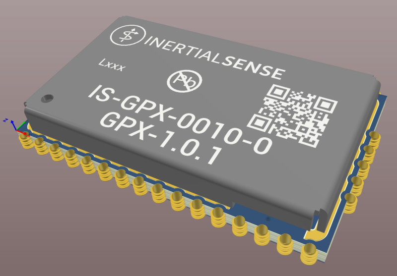

# Hardware Integration: GPX-1 Module

## Pinout

The GPX-1 module footprint and pinout similar that of the IMX-5 such that the common power and interface pins are at the same location.  The GPX-1 is extended to accommodate additional GNSS inputs and output.  The GPX-1 is designed to work in conjunction with the IMX-5.

| Pin  | Name                                          | I/O  | Description                                                  |
| ---- | --------------------------------------------- | ---- | ------------------------------------------------------------ |
| 0    | Not Connected                                 |  -   | Not connected internally.  May be left floating or connected to ground (GND). |
| 1    | USB_P                                         | I/O  | USB full-speed Positive Line. USB will be supported in future firmware updates.           |
| 2    | USB_N                                         | I/O  | USB full-speed Negative Line. USB will be supported in future firmware updates.           |
| 3    | VBKUP                                       | -    | Backup supply voltage (1.65V to 3.6V). Future firmware updates will use voltage applied on this pin to backup GNSS ephemeris, almanac, and other operating parameters for a faster startup when VCC is applied again. If not used connect to VCC or leave floating. |
| 4    | G1/Rx2/RxCAN/SCL                              | I/O  | GPIO1  Serial 2 input (TTL)  Serial input pin from CAN transceiver\*  I2C SCL line |
| 5    | G2/Tx2/TxCAN/SDA/STROBE                        | I/O  | GPIO2  Serial 2 output (TTL)  Serial output pin to CAN transceiver\*  I2C SDA line Strobe time sync input |
| 6    | G6/Rx1/MOSI                                   | I/O  | GPIO6  Serial 1 input (TTL)  SPI MOSI                        |
| 7    | G7/Tx1/MISO                                   | I/O  | GPIO7  Serial 1 output (TTL)  SPI MISO                       |
| 8    | G8/CS/STROBE                                  | I/O  | GPIO8  SPI CS  Strobe time sync input                       |
| 9    | G5/SCLK/STROBE                                | I/O  | GPIO5  SPI SCLK  Strobe time sync input                     |
| 10   | G9/nSPI_EN/STROBE /STROBE_OUT/DRDY        | I/O  | GPIO9  SPI Enable: Hold LOW during boot to enable SPI on G5-G8  Strobe time sync input or output. SPI data ready alternate location |
| 11,12,14,16,31,P | GND                               | -    | Supply ground                                          |
| 13   | GNSS1_RF                            | I    | GNSS1 antenna RF input. Use an active antenna or LNA with a gain of 15-25dB. Place the LNA as close to the antenna as possible. Filtered 3.3V from VCC is injected onto the pad to power active antennas (power injection can be disabled in software). |
| 15   | GNSS2_RF                           | I    | GNSS2 antenna RF input. Same requirements as GNSS1_RF |
| 21 | GNSS2_PPS | O | GNSS2 PPS time synchronization output pulse (1Hz, 10% duty cycle) |
| 22   | nRESET                                        | I    | System reset on logic low. May be left unconnected if not used. |
| 23   | G14/SWCLK                                     | I/O  | GPIO14                                       |
| 24   | G13/DRDY/XSDA                                 | I/O  | GPIO13  SPI Data Ready  Alt I2C SDA                                           |
| 25   | G12/XSCL                                      | I/O  | GPIO12  Alt I2C SCL                                                  |
| 26   | G11/SWDIO                                     | I/O  | GPIO11                                                             |
| 27   | G10/CHIP_ERASE                                | I/O  | Leave unconnected. CHIP ERASE used in manufacturing. !!! WARNING !!! Asserting a logic high will erase all flash memory, including calibration data. |
| 28   | G4/Rx0                                        | I/O  | GPIO4  Serial 0 input (TTL)                                  |
| 29   | G3/Tx0                                        | I/O  | GPIO3  Serial 0 output (TTL)                                 |
| 30   | GNSS1_PPS                                 | O    | GNSS1 PPS time synchronization output pulse (1Hz, 10% duty cycle) |
| 32   | VCC                                           | I    | 3.3V supply input                                                 |

\*External transceiver required for CAN interface.

## Application

## Soldering

The GPX-1 can be reflow soldered. Reflow information can be found in the [Reflow Information](reflow.md) page of this manual

## Hardware Design

### Recommend PCB Footprint and Layout

A single ceramic 100nF decoupling capacitor should be placed in close proximity between the Vcc and GND pins. It is recommended that this capacitor be on the same side of the PCB as the GPX and that there not be any vias between the capacitor and the Vcc and GND pins.

[Download PDF](https://docs.inertialsense.com/dimensions/IS-GPX-1.0_Dimensions_and_Pinout_GPX-1.pdf)

<object data="https://docs.inertialsense.com/dimensions/IS-GPX-1.0_Dimensions_and_Pinout_GPX-1.pdf" type="application/pdf" width="700px" height="1150px" >
    <embed src="https://docs.inertialsense.com/dimensions/IS-GPX-1.0_Dimensions_and_Pinout_GPX-1.pdf" type="application/pdf" />
</object>

## Design Files

Open source hardware design files, libraries, and example projects for the GPX module are found at the [Inertial Sense Hardware Design repository](https://github.com/inertialsense/IS-hdw) hosted on GitHub.  These include schematic and layout files for printed circuit board designs, and 3D step models of the InertialSense products usable for CAD and circuit board designs.

### Reference Design Projects

Coming soon
