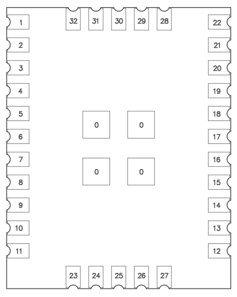
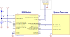
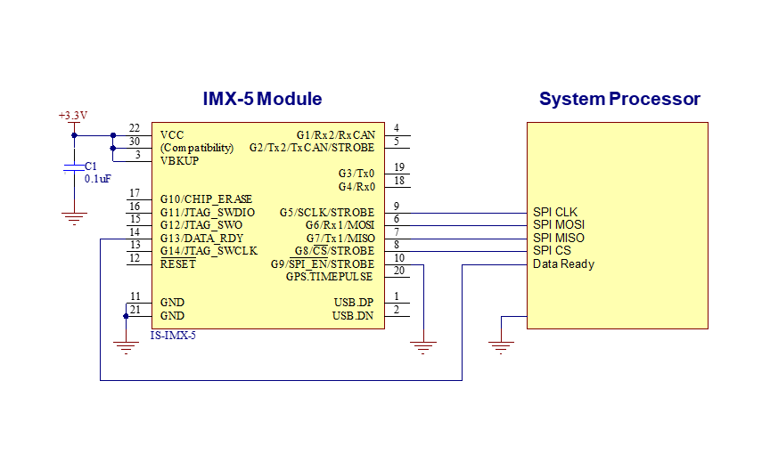
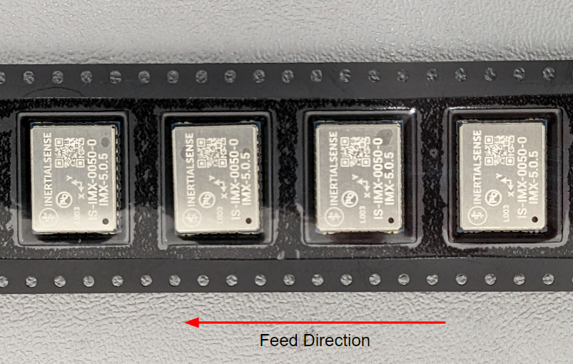

# Hardware Integration: IMX-5 Module

## Pinout

IMX-5 Pinout from the TOP

| Pin  | Name                                          | I/O  | Description                                                  |
| ---- | --------------------------------------------- | ---- | ------------------------------------------------------------ |
| 23-29, 31,32 | Not Connected                               |  -   | Not connected internally.  Connect to ground (GND). |
| 30 | Not Connected | - | Not connected internally.  (For IMX-6 compatibility, this pin must be tied to 3.3V to enable IMX-6 USB operation.) |
| 0,11,21 | GND                                           | -    | Supply ground |
| 1    | USB_P                                         | I/O  | USB Data Positive Line                                       |
| 2    | USB_N                                         | I/O  | USB Data Negative Line                                       |
| 3    | VBKUP                                  | I   | GNSS backup supply voltage. (1.4V to 3.6V) enables GNSS hardware backup mode for hot or warm startup (faster GNSS lock acquisition).  MUST connect VBKUP to VCC if no backup battery is used. |
| 4    | G1/Rx2/RxCAN/SCL  | I/O  | GPIO1  Serial 2 input (TTL)  Serial input pin from CAN transceiver\*  I2C SCL line |
| 5    | G2/Tx2/TxCAN/SDA/STRB | I/O  | GPIO2  Serial 2 output (TTL)  Serial output pin to CAN transceiver\*  I2C SDA line Strobe time sync input |
| 6    | G6/Rx1/MOSI                                   | I/O  | GPIO6  Serial 1 input (TTL)  SPI MOSI                        |
| 7    | G7/Tx1/MISO                                   | I/O  | GPIO7  Serial 1 output (TTL)  SPI MISO                       |
| 8    | G8/CS/STRB                                  | I/O  | GPIO8  SPI CS  Strobe time sync input                       |
| 9    | G5/SCLK/STRB                                | I/O  | GPIO5  SPI SCLK  Strobe time sync input                     |
| 10   | G9/nSPI_EN/STRB/DRDY             | I/O  | GPIO9 SPI Enable: Hold LOW during boot to enable SPI on G5-G8 Strobe time sync input or output.  SPI data ready alternate location |
| 12   | nRESET                                        |  I   | System reset on logic low. May be left unconnected if not used. |
| 13   | G14/SWCLK                                | I/O    | GPIO14                                       |
| 14   | G13/XSDA/PPS2/DRDY                    |   I/O   | GPIO13 GNSS2 PPS SPI Data Ready  Alt I2C SDA                        |
| 15   | G12/XSCL/SWO                              | I/O    | GPIO12  Alt I2C SCL                                                  |
| 16   | G11/SWDIO                                      | I/O    | GPIO11                                                             |
| 17   | G10/BOOT                         | I/O    | Leave unconnected. BOOT mode used in manufacturing. !!! WARNING !!! Asserting a logic high (+3.3V) will cause the IMX to reboot into ROM bootloader (DFU) mode. |
| 18   | G4/Rx0                                        | I/O  | GPIO4  Serial 0 input (TTL)                                  |
| 19   | G3/Tx0                                        | I/O  | GPIO3  Serial 0 output (TTL)                                 |
| 20   | G15/PPS1                              | I   | Input for GNSS PPS for time synchronization pulse. |
| 22   | VCC                                           | I   | 3.3V supply input                                |

\*External transceiver required for CAN interface.

## Application

### Serial Interface

The following schematic demonstrates a typical setup for the IMX-5 module. A rechargeable lithium backup battery enables the GNSS to perform a warm or hot start. If no backup battery is connected, VBKUP (pin 3) should be connected to VCC and the module will perform a cold start on power up. If the system processor is not capable of updating the IMX firmware, it is recommended to add a header to an alternate IMX serial port for firmware updates via an external computer. The reset line is not necessary for typical use.

The following are recommended components for the typical application. Equivalent or better components may be used.

| Designator | Manufacturer | Manufacturer # | Description                        |
| ---------- | ------------ | -------------- | ---------------------------------- |
| BAT1       | Panasonic    | ML-614S/FN     | BATTERY LITHIMU 3V RECHARGABLE SMD |
| D1         | Panasonic    | DB2J31400L     | DIODE SCHOTTKY 30V 0.03A SMINI2    |
| R1         |              |                | RES 1.00K OHM 1/16W 1%             |
| C1         |              |                | CAP CER .10UF 50V X7R 10%          |

### SPI Interface

The SPI interface is enabled by holding the pin 10 low during boot up.

## Manufacturing
### Soldering

The IMX-5 can be reflow soldered. Reflow information can be found in the [Reflow Information](reflow.md) page of this manual.

### Tape Packaging

The IMX-5 modules are available in **cut tape** as well as **tape and reel** packaging.  The follow image shows the feed direction and illustrates the orientation of the IMX-5 module on the tape:

The feed direction to the pick and place pick-up is shown by the orientation of the IMX-5 pin 1 location. With pin 1 location on the bottom of the tape, the feed direction into the pick and place pick-up is from the reel (located to the right of the figure) towards the left.

The dimensions of the tapes for the IMX-5 are shown in the drawing below:

<object data="https://docs.inertialsense.com/dimensions/Tape_and_Reel_IMX.pdf" type="application/pdf" width="700px" height="600px" >
    <embed src="https://docs.inertialsense.com/dimensions/Tape_and_Reel_IMX.pdf" type="application/pdf" />
</object>

<!-- ### Reels
The GPS-1 modules are delivered in quantities of 100 pieces on a reel. -->

## Hardware Design

### Recommend PCB Footprint and Layout

A single ceramic 100nF decoupling capacitor should be placed between and in close proximity to the IMX pins 21 and 22 (GND and Vcc).  It is recommended that this capacitor be on the same side of the PCB as the IMX and that there not be any vias between the capacitor and the Vcc and GND pins. The default forward direction is indicated in the PCB footprint figure and on the IMX shield as the X axis. The forward direction is reconfigurable in software as necessary.

[Download PDF](https://docs.inertialsense.com/dimensions/IS-IMX-5.0_Dimensions_and_Pinout_IMX-5.pdf)

<object data="https://docs.inertialsense.com/dimensions/IS-IMX-5.0_Dimensions_and_Pinout_IMX-5.pdf" type="application/pdf" width="700px" height="1150px" >
    <embed src="https://docs.inertialsense.com/dimensions/IS-IMX-5.0_Dimensions_and_Pinout_IMX-5.pdf" type="application/pdf" />
</object>

## Design Files

Open source hardware design files, libraries, and example projects for the IMX module are found at the [Inertial Sense Hardware Design repository](https://github.com/inertialsense/IS-hdw) hosted on GitHub.  These include schematic and layout files for printed circuit board designs, and 3D step models of the InertialSense products usable for CAD and circuit board designs.

### Reference Design Projects

The EVB-2 and IG-1 circuit board projects serve as reference designs that illustrate implementation of the IMX PCB module.

[EVB-2 evaluation board](https://github.com/inertialsense/IS-hdw/tree/main/Products/EVB-2)

[IG-1 module](https://github.com/inertialsense/IS-hdw/tree/main/Products/IG-1)
