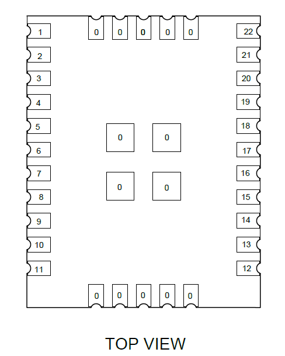
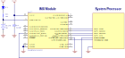

# Hardware Integration: Module

!!! warning
    Our module must be hand soldered ONLY! Solder reflow may result in damage! See [Soldering](#soldering) for details.

## Pinout

| Pin  | Name                                          | I/O  | Description                                                  |
| ---- | --------------------------------------------- | ---- | ------------------------------------------------------------ |
| 0    | GND                                           |  -   | GND
| 1    | USB_P                                         | I/O  | USB Data Positive Line                                       |
| 2    | USB_N                                         | I/O  | USB Data Negative Line                                       |
| 3    | GPS_VBAT                                      | -    | GPS backup supply voltage. (1.4V to 3.6V) enables GPS hardware backup mode for hot or warm startup (faster GPS lock acquisition). MUST connect GPS_VBAT to VCC if no backup battery is used. |
| 4    | G1/Rx2/RxCAN/SDA    | I/O  | GPIO1  Serial 2 input (TTL)  Serial input pin from CAN transceiver\*  SPI SDA line|
| 5    | G2/Tx/TxCAN/STROBE | I/O  | GPIO2  Serial 2 output (TTL)  Serial output pin to CAN transceiver\*  Strobe time sync input  SPI SCL line|
| 6    | G6/Rx1/MOSI                                   | I/O  | GPIO6  Serial 1 input (TTL)  SPI MOSI                        |
| 7    | G7/Tx1/MISO                                   | I/O  | GPIO7  Serial 1 output (TTL)  SPI MISO                       |
| 8    | G8/CS/STROBE                                  | I/O  | GPIO8  SPI CS  Strobe time sync input                       |
| 9    | G5/SCLK/STROBE                                | I/O  | GPIO5  SPI SCLK  Strobe time sync input                     |
| 10   | G9/nSPI_EN/STROBE /STROBE_OUT             | I/O  | GPIO9  SPI Enable: Hold LOW during boot to enable SPI on G5-G8  Strobe time sync input or output. |
| 11   | GND                                           | -    | GND                                                            |
| 12   | nRESET                                        |  I   | System reset on logic low. May be left unconnected if not used. |
| 13   | G14/SWCLK                                      | I/O    | GPIO14 SPI SWCLK                                       |
| 14   | G13/DRDY/XSDA                                 |   I/O   | GPIO13  SPI Data Ready  SPI XSDA                                                   |
| 15   | G12/SWO/XSCL                                  | I/O    | GPIO12  SPI SWO SPI XSCL                                                          |
| 16   | G11/SWDIO                                      | I/O    | GPIO11 SWDIO                                                             |
| 17   | G10/CHIP_ERASE                                 | I/O    | Leave unconnected. CHIP ERASE used in manufacturing. !!! WARNING !!! Asserting a logic high (+3.3V) will erase all IMX flash memory, including calibration data. |
| 18   | G4/Rx0                                        | I/O  | GPIO4  Serial 0 input (TTL)                                  |
| 19   | G3/Tx0                                        | I/O  | GPIO3  Serial 0 output (TTL)                                 |
| 20   | GPS_PPS                                       | O    | GPS PPS time synchronization output pulse (1Hz, 10% duty cycle) |
| 21   | GND                                           | -    | -                                                            |
| 22   | VCC                                           | -    | 3.3V regulated supply                                        |

\*External transceiver required for CAN interface.

## Application

### Serial Interface

The following schematic demonstrates a typical setup for the μINS module. A rechargeable lithium backup battery enables the GPS to perform a warm or hot start. If no backup battery is connected, GPS.VBAT should be connected to VCC and the module will perform a cold start on power up. If the system processor is not capable of updating the μINS firmware, it is recommended to add a header to an alternate μINS serial port for firmware updates via an external computer. The reset line is not necessary for typical use.

The following are recommended components for the typical application. Equivalent or better components may be used.

| Designator | Manufacturer | Manufacturer # | Description                        |
| ---------- | ------------ | -------------- | ---------------------------------- |
| BAT1       | Panasonic    | ML-614S/FN     | BATTERY LITHIMU 3V RECHARGABLE SMD |
| D1         | Panasonic    | DB2J31400L     | DIODE SCHOTTKY 30V 0.03A SMINI2    |
| R1         |              |                | RES 1.00K OHM 1/16W 1%             |
| C1         |              |                | CAP CER .10UF 50V X7R 10%          |

### SPI Interface

The SPI interface is enabled by holding the pin 10 low during boot up.

## Soldering

!!! warning
    These parts must be hand soldered ONLY!  Solder reflow may result in damage!

The uINS, uAHRS, and uIMU are designed as surface mount components that can be hand soldered onto another circuit board.  These parts are not designed to withstand the high temperatures associated with standard solder reflow processes.  Solder assembly must be done using a soldering iron.  

## Hardware Design

### Recommend PCB Footprint and Layout

A single ceramic 100nF decoupling capacitor should be placed in close proximity between the Vcc and GND pins. It is recommended that this capacitor be on the same side of the PCB as the μINS and that there not be any vias between the capacitor and the Vcc and GND pins. The default forward direction is indicated in the PCB footprint figure and on the μINS silkscreen as the X axis. The forward direction is reconfigurable in software as necessary.

[Download PDF](https://docs.inertialsense.com/dimensions/IS-uINS-5.0.4_Dimensions_and_Pinout.pdf)

<object data="https://docs.inertialsense.com/dimensions/IS-uINS-5.0.4_Dimensions_and_Pinout.pdf" type="application/pdf" width="700px" height="1150px" >
    <embed src="https://docs.inertialsense.com/dimensions/IS-uINS-5.0.4_Dimensions_and_Pinout.pdf" type="application/pdf" />
</object>

## Design Files

 * [uINS PCB Design Libraries](https://github.com/inertialsense/IS-hdw/tree/main/Products) - Schematic and layout files for printed circuit board designs. Also includes 3D step models of uINS and EVB used for CAD and circuit board designs.

## EVB-2 Reference Design

A reference design for implementation of uINS module can be found in the [EVB-2 PCB assembly design files](https://github.com/inertialsense/IS-hdw/tree/main/Products/EVB-2-1) available as open source hardware on GitHub.

## uIG-1 Reference Design
A reference design for the implemenation of the IMX5 with a GNSS receiver on a single carrier board. This design can be also be found in the [uIG-1 Design Files](https://github.com/inertialsense/IS-hdw/tree/main/Products/IG-1-0) available as open source hardware on GitHub.