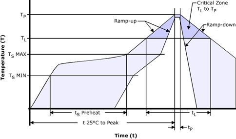

# Reflow Soldering
 
 
 

## Use of "No Clean" soldering paste is recommended as it does not require cleaning after the soldering process. The following examples of paste meet these criteria.
 
 

| Solder                | Details                                                               |
| ----------------------| ---------------------------------------------                         |
|Soldering Paste        | OM338 SAC405 / Nr.143714 (Cookson Electronics)                        |
|Allow Specification    | Sn 95.5/ Ag 4/ Cu 0.5 (95.5% Tin/ 4% Silver/ 0.5% Copper)             |
|Melting temperatures   | 217 °C

 
 
 

## The following reflow profile is recommended for soldering:

 
 

| Phase     | Name                  | Recommended   | Details                                               |
| ------    |-----------------------|---------------|-------------------------------------------------------|
<b>Preheat  |                       |               |                                                       |
<b>         |dT/dt                  | 3°C/sec       | Preheat Temperature Rise Rate                         |
|           |TsMIN       | 150°C         | Preheat Minimum Temperature                           |  
|           |TsMAX       | 200°C         | Preheat Maximum Temperature                           |
|           |tsPreheat   | 60 - 120 sec  | Time Spent Between Preheat MIN and Max temperatures   | 
<b>Reflow   |                       |               |                                                       |
|           |TL          | 217°C         | Reflow Liquidus temperatures                          |
|           |TP          | 245°C         | Reflow Peak temperatures                              |
|           |tL          | 40-60 sec     | Time Spent above Reflow Liquidus temperatures         |
<b> Cooling |                       |               |                                                       |
|           |dT/dt                  | 4°C/sec| Maximum Cooling Temperature Fall Rate|

 
 
 

### Note:
- A convection soldering oven is highly recommended over an infrared type radiation oven as it allows precision control of the temperature and all parts will be heated evenly.
- To avoid falling off, the uINS should be placed on the topside of a PCB during soldering.
- The part must not be soldered with a damp heat process.
