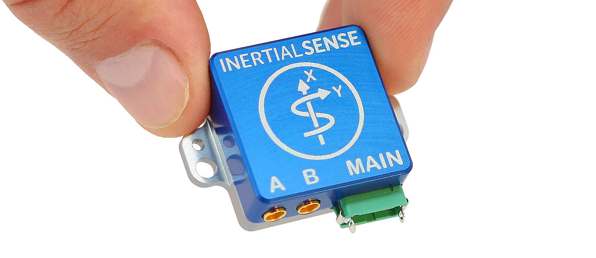
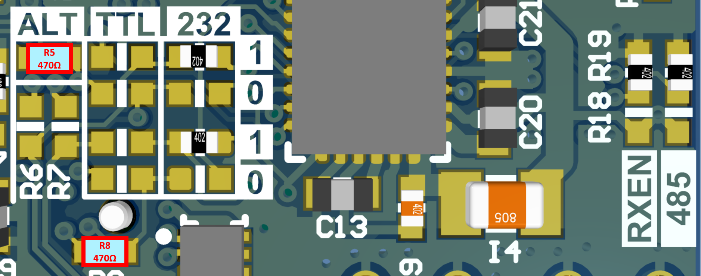
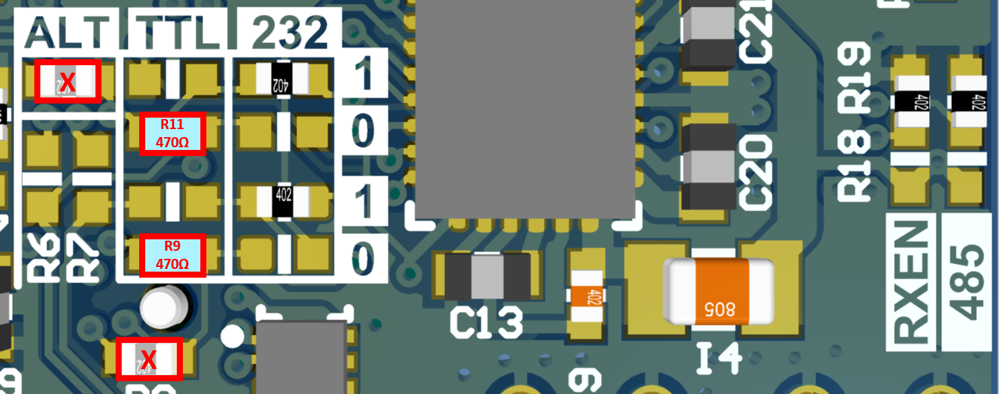
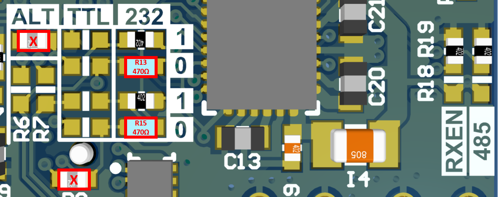
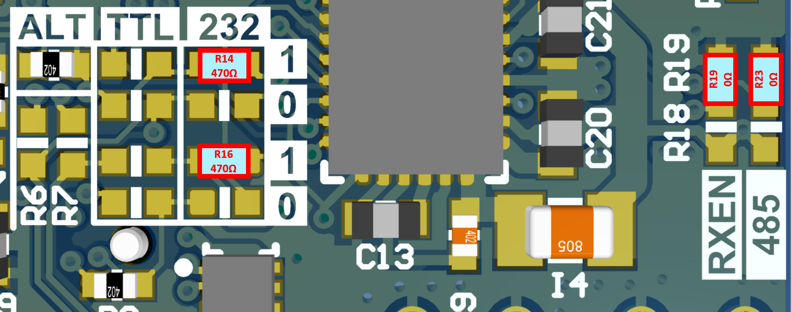
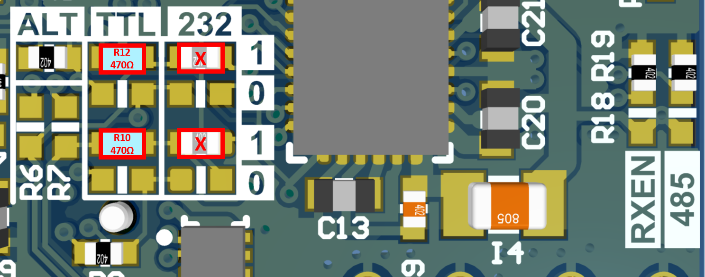
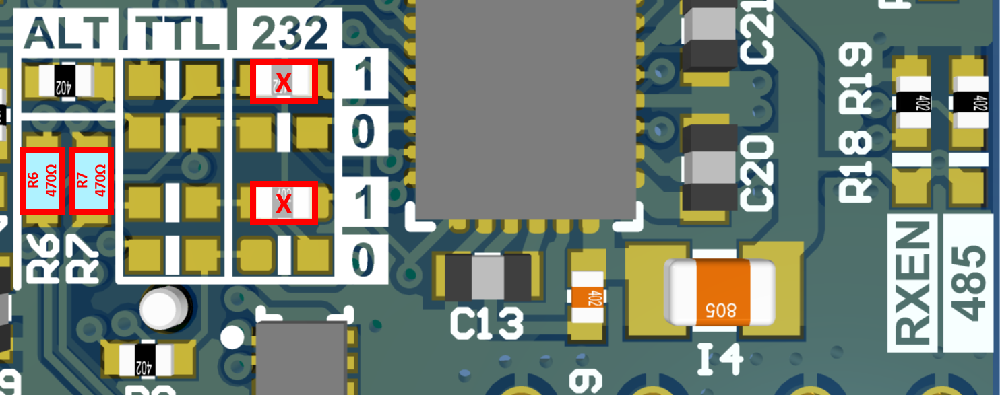
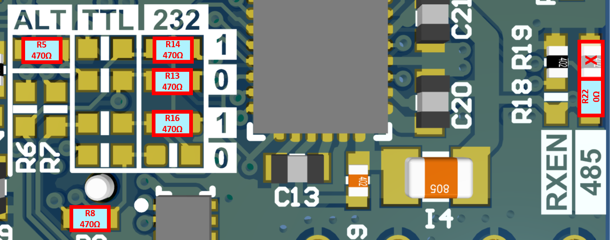
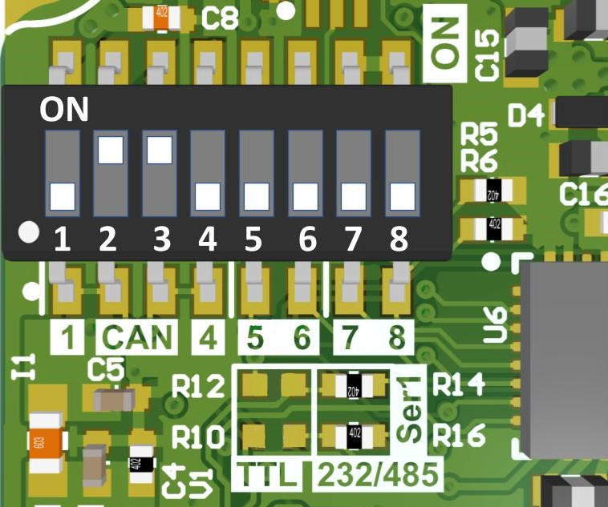
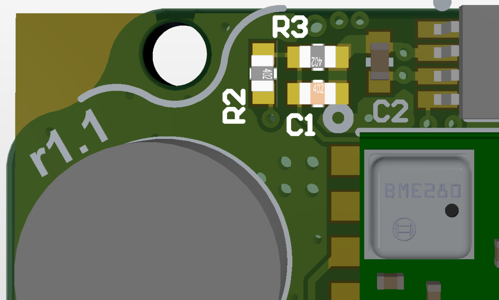

# Hardware Integration: Rugged-1

The Inertial Sense Rugged-1 is a ruggedized carrier board and case for the Inertial Sense µINS, µAHRS, or µIMU module. The Rugged-1 has similar functions compared to the EVB-1, but in a more compact form factor with the following added features:

- Dual antenna ports for GPS compassing
- Integrated CAN transceiver

## Connecting Your Unit

For the purposes of basic evaluation, the easiest interface available on the rugged is the included USB to Gecko connector cable, included in the evaluation kit. The cable provides power and communications with the installed module via the on-board FTDI chip.

### GPS Antenna Ports

If using GPS with the module, connect an appropriate antenna to MMCX port ***1***. If the module is used for RTK compassing, connect a second antenna to MMCX port ***2***.  MMCX port ***1*** is for ***GPS1*** and MMXC port ***2*** is ***GPS2***.  These port were labeled ***A*** and ***B*** on older Rugged-1 units.

## Pinout

| Pin  | Name                                       | I/O  | Description                                                  |
| ---- | :----------------------------------------- | ---- | ------------------------------------------------------------ |
| 1    | GND                                        | -    | -                                                            |
| 2    | VIN                                        | -    | 4V-20V supply voltage input1                      |
| 3    | USB.VCC                                    | -    | 5V system supply input1 from USB bus.  Using this pin will enable the FTDI USB.  Use the VIN pin instead to disable the FTDI USB. |
| 4    | USB.D+                                     | I/O  | USB Data Positive Line (Serial 0)                            |
| 5    | GPS_PPS                                    | O    | GPS PPS time synchronization output pulse (1Hz, 10% duty cycle) |
| 6    | USB.D-                                     | I/O  | USB Data Negative Line (Serial 0)                            |
| 7    | G3/Tx0/485Tx1-                             | I/O  | Serial 0 output (TTL or RS232)2 Serial 1 output- (RS485/RS422)3 |
| 8    | G7/Tx1/485Tx1+                             | I/O  | Serial 1 output (TTL or RS232)2 Serial 1 output+ (RS485/RS422)3 |
| 9    | G4/Rx0/485Rx1-                             | I/O  | Serial 0 input (TTL or RS232)2 Serial 1 input- (RS485/RS422)3 |
| 10   | G6/Rx1/485Rx1+                             | I/O  | Serial 1 input (TTL/RS232)3 Serial 1 input+ (RS485 or RS422)3 |
| 11   | G1/CANL4/Rx24        | I/O  | High level (CAN bus)4. Serial 2 input (TTL)4. |
| 12   | G2/CANH4/Tx24/STROBE | I/O  | Low level (CAN bus)4. Serial 2 output (TTL)4. Strobe time sync input. |

1The System can be powered either by VIN or USB.VCC.

2Serial 0 is configured with SMD jumpers for TTL, RS232, or FTDI USB (default, USB.D+ and USB.D-).

3Serial 0 is configured with SMT jumpers for TTL, RS232 (default), or RS485/RS422.

4Only available with uINS-3.2 and later.

## Jumpers

The "MAIN" connector pinout on the Rugged product line can be configured for USB, TTL, RS232, CAN, and RS485 by setting the dip switches for Rugged v1.1 and by setting the onboard PCB surface mount jumpers for Rugged-1.0.  Jumper resistors are 470 &Omega; resistors.   All jumpers are 0402 SMD 1/16W (5% or better tolerance) resistors. 

### Serial Port 0

To enable FTDI USB on pins 4 and 6, provide system supply voltage input on USB.VCC (pin 3).  To disable FTDI USB and use TTL or RS232 on pins 7 and 9, provide system supply voltage input on VIN (pin 2).

#### Ser0: FTDI USB (DEFAULT)

#### Ser0: TTL

#### Ser0: RS232

### Serial Port 1

#### **Ser1: RS232 (DEFAULT)**

#### **Ser1: TTL**

#### **Ser1: CAN**

#### **Ser1: RS485/RS422 and Ser0: FTDI USB**

To enable RS485/RS422, jumper R22 must be set in the direction of the "485" silkscreen label.  RS485/RS422 signals Tx- and Tx+ are on pins 7 and 8 and Rx- and Rx+ are on pins 9 and 10.  In this configuration, serial port 0 can only be accessed through the FTDI USB interface and cannot be accessed through pins 7 and 9.

## USB Driver

The rugged unit uses the FTDI FT232R USB to UART IC to provide a serial port from the USB connection.  Depending on the operating system, it may be necessary to download and install the [FTDI device driver](http://www.ftdichip.com/Drivers/D2XX.htm) for the FT232R to register properly as a serial port.

## Rugged v1.1 Dipswitch Config

Version 1.1 has dip switches that replaced the jumpers of v1.0 for common configurations. 

| Mode                                 | Switches                     | Jumpers                                     |
| :----------------------------------- | ---------------------------- | ------------------------------------------- |
| \*\* CAN                             | \* 2,3 - ON \* 1,4 - OFF | n/a                                         |
| CAN Disabled G2_Strobe on pin 12 | 1,4 - ON 2,3 - OFF       | n/a                                         |
| Ser0: RS232, Ser1: RS232             | \* 5,6,7,8 - OFF             | \* R10/R12 - No Load  \* R14/R16 - Load |
| Ser0: RS232, Ser1: TTL               | \* 5,6,7,8 - OFF             | R10/R12 - Load  R14/R16 - No Load       |
| Ser0: TTL, Ser1: TTL                 | 5,6,7 - ON 8 - OFF       | R10/R12 - Load  R14/R16 - No Load       |
| Ser1: RS485, Ser0: Disabled          | 8 - ON 7 - OFF           | \* R10/R12 - No Load  \* R14/R16 - Load |

\* Factory default setting

### \*\* CAN Bus Operation

System input voltage monitor surface mount resistors and capacitor (R2, R3, and C1) must be removed for proper high speed CAN bus operation. 

## Related Parts

| Part                    | Manufacturer        | Manufacturer #       | Description                                   |
| ----------------------- | ------------------- | -------------------- | --------------------------------------------- |
| Main Connector          | Harwin              | G125-FC11205L0-0150F | 1.25MM F/F 12POS 26AWG 150MM                  |
| GPS antenna SMA adapter | Crystek Corporation | CCSMX-FBM-RG178-6    | 6" MMCX to SMA GPS antenna adaptor cable.     |
| GPS antenna SMA adapter | Crystek Corporation | CCSMX1-FBM-RG178-6   | 6" R/A MMCX to SMA GPS antenna adaptor cable. |

## Using with Inertial Sense Software

Please return to the [getting started](../../getting-started/getting-started.md) page to get started programming, updating firmware, viewing data, and logging. 
