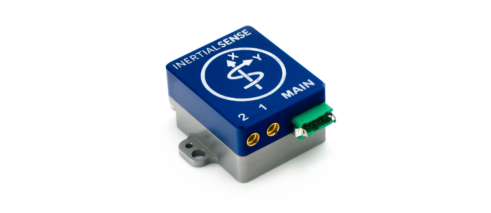
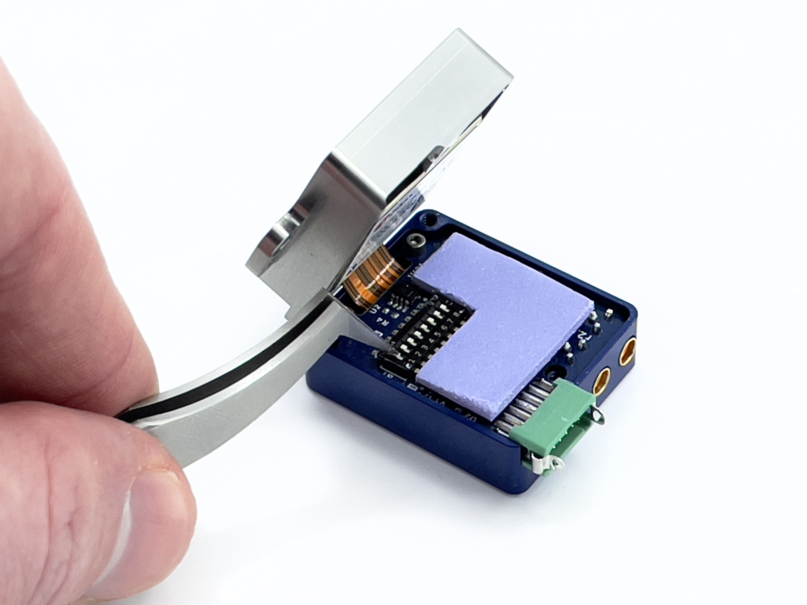

# Hardware Integration: Rugged-2

The Inertial Sense Rugged-2 is a ruggedized carrier board and case for the Inertial Sense µINS, µAHRS, or µIMU module. The Rugged-2 has similar functions compared to the EVB-1, but in a more compact form factor with the following added features:

- Onboard multi-band GNSS receiver(s) 
- Dual antenna ports for GPS compassing
- Integrated CAN transceiver

## Connecting Your Unit

For the purposes of basic evaluation, the easiest interface available on the rugged is the included USB to Gecko connector cable, included in the evaluation kit. The cable provides power and communications with the installed module via the on-board FTDI chip.

### GPS Antenna Ports

If using GPS with the module, connect an appropriate antenna to MMCX port ***1***. If the module is used for RTK compassing, connect a second antenna to MMCX port ***2***.  MMCX port ***1*** is for ***GPS1*** and MMXC port ***2*** is ***GPS2***.  

## Pinout

| Pin  | Name                                       | I/O  | Description                                                  |
| ---- | :----------------------------------------- | ---- | ------------------------------------------------------------ |
| 1    | GND                                        | PWR  | -                                                            |
| 2    | G5/STROBE                                  | I/O  | Strobe time sync input.  (Includes 390 ohm series resistor)  |
| 3    | VIN                                        | PWR  | 4V-20V supply voltage input                                  |
| 4    | USB.D+                                     | I/O  | USB Data Positive Line (Serial 0)                            |
| 5    | GPS_PPS                                    | O    | GPS PPS time synchronization output pulse (1Hz, 10% duty cycle) |
| 6    | USB.D-                                     | I/O  | USB Data Negative Line (Serial 0)                            |
| 7    | G3/Tx0/485Tx2-                             | I/O  | Serial 0 output (TTL or RS232) Serial 2 output- (RS485/RS422) |
| 8    | G2/Tx2/485Tx2+                             | I/O  | Serial 2 output (TTL or RS232) Serial 2 output+ (RS485/RS422) |
| 9    | G4/Rx0/485Rx2-                             | I/O  | Serial 0 input (TTL or RS232) Serial 2 input- (RS485/RS422) |
| 10   | G1/Rx2/485Rx2+                             | I/O  | Serial 2 input (TTL/RS232) Serial 2 input+ (RS485 or RS422) |
| 11   | G1/CANL1/Rx21        | I/O  | High level (CAN bus). Serial 2 input (TTL).                  |
| 12   | G2/CANH1/Tx21/STROBE | I/O  | Low level (CAN bus). Serial 2 output (TTL). Strobe time sync input. |

1Only available with uINS-3.2 and later.

## I/O Configuration

The "MAIN" connector pinout on the Rugged product line can be configured for USB, TTL, RS232, CAN, and RS485 by setting the dipswitches.

## Dipswitch Config

The Rugged-2 dip switches are used for setting the following I/O configurations. 

| Pins                 | Mode                                                         | Switches               |
| -------------------- | :----------------------------------------------------------- | ---------------------- |
| -                    | Tx0, Rx0: onboard GPS2                                       | * 8 - ON               |
| 7 9              | Tx0 (RS232) Rx0 (RS232)                                  | 5,6 - ON 8 - OFF   |
| 7 9              | Tx0 (TTL) Rx0 (TTL)                                      | 6,8 - OFF              |
| 8 10             | Tx2 (RS232) Rx2 (RS232)                                  | 5,6 - ON 7 - OFF   |
| 8 10             | Tx2 (TTL) Rx2 (TTL)                                      | 6,7 - OFF              |
| 7 8 9 10 | Tx2- (RS485) Tx2+ (RS485) Rx2- (RS485) Rx2+ (RS485) | 6 - ON 5,7 - OFF |
| 11 12            | CAN-H CAN-L                                              | \* 1,2,3,7 - ON        |
| 11 12            | G1-Rx2, CAN-Rx\*\* G2-Tx2, CAN-Tx\*\*, STROBE            | 7 - ON 1,2,3 - OFF |

\* Factory default settings:  

- Dual GPS units: All dip switches ON by default (Serial 0 used for onboard GPS2, CAN on pins 11 and 12) 
- Single GPS units: Dip switch 8 OFF by default (Serial 0 used for RS232 on pins 7 and 9, CAN on pins 11 and 12)

\*\* CAN transceiver bypassed. 

See the [Multi-Band GNSS page](../../gnss/multi_band_gnss/) for configuration information.

## **To open the Rugged-2:**

*Caution! Use of a grounding strap or other ESD protection device is advised.*

1. Completely remove power from the unit.

2. Remove the 3 5/16" screws from the bottom of the Rugged-2.

3. Gently separate the top and bottom halves from each other pealing them apart opening from the side with the green connector. 

   - The two halves maybe somewhat adhered due to the thermal pad used in the device. Consistent gentle pressure will separate them.
   - As the device starts to open, do not open the unit past 90 degrees. *If flexed to often and beyond 90 degrees the ribbon will break causing the unit to be damaged beyond repair.* 

4. Remove Kapton tape from the DIP Switch. (Save the tape!)

5. Make your adjustment for the desired configuration. (see table above for switch configurations)

   - Use of a small screwdriver or tweezers work well.
   - It should not take much of force to move the desired switch. 

6. Replace the Kapton tape.

7. Closed the two halves and install the 3 5/16" screws back in the bottom.

   

   **Done!**

## Related Parts

| Part                    | Manufacturer        | Manufacturer #       | Description                                   |
| ----------------------- | ------------------- | -------------------- | --------------------------------------------- |
| Main Connector          | Harwin              | G125-FC11205L0-0150F | 1.25MM F/F 12POS 26AWG 150MM                  |
| GPS antenna SMA adapter | Crystek Corporation | CCSMX-FBM-RG178-6    | 6" MMCX to SMA GPS antenna adaptor cable.     |
| GPS antenna SMA adapter | Crystek Corporation | CCSMX1-FBM-RG178-6   | 6" R/A MMCX to SMA GPS antenna adaptor cable. |

See the [Multi-Band GNSS page](../../gnss/multi_band_gnss/#multi-band-gnss-components) for GNSS antenna options.

## Using with Inertial Sense Software

Please return to the [getting started](../../getting-started/getting-started.md) page to get started programming, updating firmware, viewing data, and logging. 
