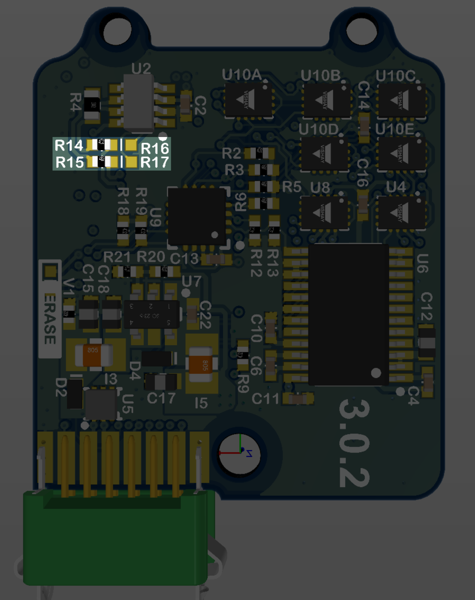

# Hardware Integration: RUG-3-IMX-5 (Rugged-3)

The **RUG-3-IMX-5** series adds a rugged aluminum enclosure and RS232, RS485, and CAN bus to the IMX-5. 

The **RUG-3-IMX-5-RTK** includes a multi-frequency GNSS receiver with RTK precision position enabling INS sensor fusion for roll, pitch, heading, velocity, and position. 

The **RUG-3-IMX-5-Dual** includes two multi-frequency GNSS receivers with RTK precision position and dual GNSS heading/compass. 

- Integrated CAN transceiver, RS232, RS485, TTL serial, USB, and SPI interfaces.
- Dual onboard multi-band GNSS receiver(s).
- Dual antenna ports for GPS compassing.

## Features

- **Tactical Grade IMU**
  - **Gyro: 1.5 °/hr Bias Instability, 0.16 °/√hr ARW**
  - **Accel: 19 µg Bias Instability, 0.02 m/s/√hr VRW**
* **INS, AHRS**
  - **Dynamic: 0.04° Roll/Pitch, 0.13° Heading**
  - **Static: 0.1° Roll/Pitch, 0.5° Heading**
- Up to 1KHz IMU Output Data Rate
- Dual onboard multi-band (L1/L2/E5) GNSS receivers
- Dual MMCX antenna ports for GPS compassing
- Size: 25.4 x 25.4 x 20.0 mm
- Light weight: 14g
- Low power consumption: <1500mW
- UART x3, RS232, RS485, CAN, and SPI interfaces
- Integrated CAN and RS232 / RS485 transceivers
- Voltage regulation for 3.3V - 17V input

## Applications

- Drone Navigation
- Unmanned Vehicle Payloads
- Ground and Aerial Survey
- Automotive Navigation
- Stabilized Platforms
- Antenna and Camera Pointing
- First Responder and Trackers
- Health, Fitness, and Sport Monitors
- Robotics and Ground Vehicles
- Maritime

## Connecting Your Unit

For the purposes of basic evaluation, the easiest interface available on the rugged is the included USB to Gecko connector cable, included in the evaluation kit. The cable provides power and communications with the installed module via USB virtual communications port.

### GPS Antenna Ports

If using GPS with the module, connect an appropriate antenna to MMCX port ***1*** (***GPS1***).  If the module is used for RTK compassing, connect a second antenna to MMCX port ***2***, (***GPS2***).  

## Pinout

The following table shows the Rugged-3 pinout.  Note that pin function can change based on changing  `DID_FLASH_CONFIG.platformConfig` (see [I/O Configuration](#I/O Configuration) below).

| Rugged Pin | IMX Pin      | Name                                            | I/O           | Description                                                  |
| -------------- | ---------------- | :---------------------------------------------- | ------------- | ------------------------------------------------------------ |
| 1              |                  | GND                                             | PWR           | -                                                            |
| 2              | G9               | G9_STROBE                                       | I/O           | G9-Strobe time sync input.  (Includes 3K ohm series resistor) |
| 3              |                  | VIN                                             | PWR           | 4V-20V supply voltage input                                  |
| 4              |                  | USB.D+                                          | I/O           | USB Data Positive Line                                       |
| 5              |                  | GPS_PPS                                         | O             | GPS PPS time synchronization output pulse (1Hz, 10% duty cycle) |
| 6              |                  | USB.D-                                          | I/O           | USB Data Negative Line                                       |
| 7              | G3 G2 G5 | Tx0 485Tx1+ SCLK                        | O O I | Serial 0 output (TTL or RS232) Serial 1 output- (RS485/RS422) SPI clock |
| 8              | G2 G2 G7 | Tx2 485Tx1- Tx1, MISO                   | O O O | Serial 2 output (TTL) Serial 1 output+ (RS485/RS422) Serial 1 output (TTL or RS232), SPI MISO |
| 9              | G4 G1 G8 | Rx0 485Rx1- CS, G8_STROBE               | I I I | Serial 0 input (TTL or RS232) Serial 1 input- (RS485/RS422) SPI chip select, G8-Strobe time sync input |
| 10             | G1 G1 G6 | Rx2 485Rx1+ Rx1, MOSI                   | I I I | Serial 2 input (TTL) Serial 1 input+ (RS485/RS422) Serial 1 input (TTL or RS232), SPI MOSI |
| 11             | G1 G1        | CANL\* Rx2\*\*        | I/O I     | High level (CAN bus) Serial 2 input (TTL)\*\*              |
| 12             | G2 G2        | CANH\* Tx2, G2_STROBE\*\* | I/O I/O   | Low level (CAN bus)\*.  Serial 2 output (TTL)\*\*, G2-Strobe time sync input\*\* |

\* (Default) To enable CAN bus on pins 11,12 remove R16,R17 and add 0402 zero ohm jumpers to R14,R15. \** To enable Serial2 TTL or STROBE on pins 11,12 remove R14,R15 and add 0402 zero ohm jumpers to R16,R17.

## I/O Configuration

The Rugged 3 "MAIN" connector pinout can be configured for USB, TTL, RS232, RS485, and CAN by setting the  `DID_FLASH_CONFIG.platformConfig`.

| RUG-3 Pin IMX Pin | 7,9 G3,G4 (G5,G8) | 8,10 G1,G2          | 11,12 G1,G2 | GPS1 | GPS2 |
| --------------------- | ------------------------- | ----------------------- | --------------- | ---- | ---- |
| **I/O Preset**        |                           |                         |                 |      |      |
| 1 *                   | S0-RS232                  |                         | CAN             | S1   |      |
| 2                     | S0-TTL                    |                         | CAN             | S1   |      |
| 3                     | S0-TTL                    | S2-TTL or G2-STROBE |                 | S1   |      |
| 4                     | S0-RS232                  | S1-RS232                |                 | S2   |      |
| 5                     | S1-RS485                  | S1-RS485                |                 | S2   | S0   |
| 6                     | SPI or G8-STROBE      | SPI                     |                 | S2   | S0   |
| 7 **                  |                           | S1-RS232                |                 | S2   | S0   |
| 8                     |                           |                         | CAN             | S1   | S0   |
| 9                     |                           | S2-TTL                  |                 | S1   | S0   |

\* RUG-3-G0 default \** RUG-3-G2 default

## Hardware Versions

The following outlines differences in the RUG-3 hardware versions.

**RUG-3.1**

Use platform config RUG-3 with this hardware version.

- GPS1 PPS line connected to IMX G15 (pin 20).

**RUG-2.1** (RUG-3.0)

Use platform config RUG-2.1 with this hardware version.

- GPS1 PPS line connected to IMX G9 (pin 10).
- MAIN pin 5 is connected to IMX G15 (pin 20).
- MAIN pin 5 is not connected to GPS1 PPS. 

## Related Parts

| Part                    | Manufacturer        | Manufacturer #       | Description                                   |
| ----------------------- | ------------------- | -------------------- | --------------------------------------------- |
| Main Connector          | Harwin              | G125-FC11205L0-0150L | 1.25MM F/F 12POS 26AWG 150MM                  |
| GPS antenna SMA adapter | Crystek Corporation | CCSMX-FBM-RG178-6    | 6" MMCX to SMA GPS antenna adaptor cable.     |
| GPS antenna SMA adapter | Crystek Corporation | CCSMX1-FBM-RG178-6   | 6" R/A MMCX to SMA GPS antenna adaptor cable. |

See the [Multi-Band GNSS page](../../gnss/multi_band_gnss/#multi-band-gnss-components) for GNSS antenna options.

## Using with Inertial Sense Software

Please return to the [getting started](../../getting-started/getting-started.md) page to get started programming, updating firmware, viewing data, and logging. 
