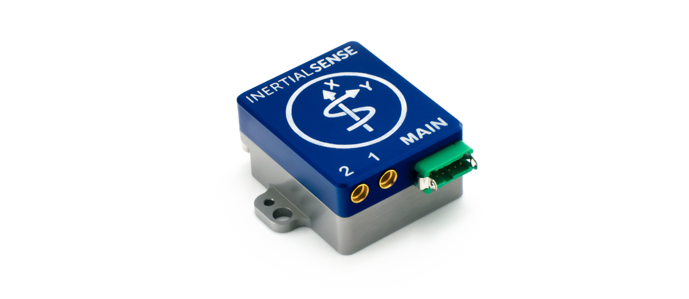

# Hardware Integration: RUG-3-IMX-5 (Rugged-3)

The **RUG-3-IMX-5** series adds a rugged aluminum enclosure and RS232, RS485, and CAN bus to the IMX-5. 

The **RUG-3-IMX-5-RTK** includes a multi-frequency GNSS receiver with RTK precision position enabling INS sensor fusion for roll, pitch, heading, velocity, and position. 

The **RUG-3-IMX-5-Dual** includes two multi-frequency GNSS receivers with RTK precision position and dual GNSS heading/compass. 

- Integrated CAN transceiver, RS232, RS485, TTL serial, USB, and SPI interfaces.
- Dual onboard multi-band GNSS receiver(s).
- Dual antenna ports for GPS compassing.

## Features

- Tactical Grade IMU (w/ IMU-5)
  - **Gyro: 1.5 °/hr Bias Instability, 0.16 °/√hr ARW**
  - **Accel: 19 µg Bias Instability, 0.02 m/s/√hr VRW**
- **High Accuracy INS (w/ IMU-5): 0.03° Roll/Pitch, 0.1° Dynamic Heading**
- Up to 1KHz IMU and INS Output Data Rate
- Dual onboard multi-band (L1/L2/E5) GNSS receivers
- Dual MMCX antenna ports for GPS compassing
- Size: 25.4 x 25.4 x 20.0 mm
- Light weight: 14g
- Low power consumption: <1500mW
- UART x3, RS232, RS485, CAN, and SPI interfaces
- Integrated CAN and RS232 / RS485 transceivers
- Voltage regulation for 3.3V - 17V input

## Applications

- Drone Navigation
- Unmanned Vehicle Payloads
- Ground and Aerial Survey
- Automotive Navigation
- Stabilized Platforms
- Antenna and Camera Pointing
- First Responder and Trackers
- Health, Fitness, and Sport Monitors
- Robotics and Ground Vehicles
- Maritime

## Connecting Your Unit

For the purposes of basic evaluation, the easiest interface available on the rugged is the included USB to Gecko connector cable, included in the evaluation kit. The cable provides power and communications with the installed module via USB virtual communications port.

### GPS Antenna Ports

If using GPS with the module, connect an appropriate antenna to MMCX port ***1*** (***GPS1***).  If the module is used for RTK compassing, connect a second antenna to MMCX port ***2***, (***GPS2***).  

## Pinout

| Pin  | Name                                       | I/O  | Description                                                  |
| ---- | :----------------------------------------- | ---- | ------------------------------------------------------------ |
| 1    | GND                                        | PWR  | -                                                            |
| 2    | G9/STROBE                                  | I/O  | Strobe time sync input.  (Includes 3K ohm series resistor)   |
| 3    | VIN                                        | PWR  | 4V-20V supply voltage input                                  |
| 4    | USB.D+                                     | I/O  | USB Data Positive Line                                       |
| 5    | GPS_PPS                                    | O    | GPS PPS time synchronization output pulse (1Hz, 10% duty cycle) |
| 6    | USB.D-                                     | I/O  | USB Data Negative Line                                       |
| 7    | G3/Tx0/485Tx2-/SCLK                        | I/O  | Serial 0 output (TTL or RS232) Serial 2 output- (RS485/RS422) SPI clock |
| 8    | G2/Tx2/485Tx2+/Tx1/MISO                    | I/O  | Serial 2 output (TTL or RS232) Serial 2 output+ (RS485/RS422) Serial 1 output (TTL or RS232) SPI MISO |
| 9    | G4/Rx0/485Rx2-/CS                          | I/O  | Serial 0 input (TTL or RS232) Serial 2 input- (RS485/RS422) SPI chip select |
| 10   | G1/Rx2/485Rx2+/Rx1/MOSI                    | I/O  | Serial 2 input (TTL/RS232) Serial 2 input+ (RS485 or RS422) Serial 1 input (TTL or RS232) SPI MOSI |
| 11   | G1/CANL/Rx2        | I/O  | High level (CAN bus). Serial 2 input (TTL).                  |
| 12   | G2/CANH/Tx2/STROBE | I/O  | Low level (CAN bus). Serial 2 output (TTL). Strobe time sync input. |

## I/O Configuration

The Rugged 2.1 "MAIN" connector pinout can be configured for USB, TTL, RS232, RS485, and CAN by setting the DID_FLASH_CONFIG.cBrdConfig.

|              |              | MAIN-P8P10 | MAIN-P7P9         | MAIN-P11P12 | 1        | 2        |
| ------------ | ------------ | ---------- | ----------------- | ----------- | -------- | -------- |
| **Config #** | **RUG Type** | **G1:G2**  | **G3:G4 (G5,G8)** | **G1:G2**   | **GPS1** | **GPS2** |
| 0 *          | G0 + G2      | S1-RS232   | S0-RS232          | CAN (S2)    | -        | -        |
| 1            | G0 + G2      | S1-TTL     | G5G8-STROBE       | CAN (S2)    | -        | S0       |
| 2            | G0 + G2      | S2-RS485   | S2-RS485          | -           | S1       | S0       |
| 3            | G0 + G2      | S1-TTL     | S0-TTL            | CAN (S2)    | -        | -        |
| 4            | G0 + G2      | SPI (S1)   | SPI (S1)          | -           | S2       | S0       |
| 5 **         | G2           | S2-RS232   | -                 | -           | S1       | S0       |
| 6            | G2           | S2-TTL     | G5G8-STROBE       | -           | S1       | S0       |
| 7            | G2           | S2-RS232   | S0-RS232          | -           | S1       | -        |
| 8            | G2           | S2-TTL     | S0-TTL            | -           | S1       | -        |
| 9            | G2           | -          | G5G8-STROBE       | CAN (S2)    | S1       | S0       |
| 10           | G2           | -          | S0-RS232          | CAN (S2)    | S1       | -        |
| 11           | G2           | -          | S0-TTL            | CAN (S2)    | S1       | -        |
| 12           | G2           | S1-RS232   | -                 | CAN (S2)    | -        | S0       |

\* RUG-3.0-G0 default

\** RUG-3.0-G2 default

## Related Parts

| Part                    | Manufacturer        | Manufacturer #       | Description                                   |
| ----------------------- | ------------------- | -------------------- | --------------------------------------------- |
| Main Connector          | Harwin              | G125-FC11205L0-0150F | 1.25MM F/F 12POS 26AWG 150MM                  |
| GPS antenna SMA adapter | Crystek Corporation | CCSMX-FBM-RG178-6    | 6" MMCX to SMA GPS antenna adaptor cable.     |
| GPS antenna SMA adapter | Crystek Corporation | CCSMX1-FBM-RG178-6   | 6" R/A MMCX to SMA GPS antenna adaptor cable. |

See the [Multi-Band GNSS page](../../gnss/multi_band_gnss/#multi-band-gnss-components) for GNSS antenna options.

## Using with Inertial Sense Software

Please return to the [getting started](../../getting-started/getting-started.md) page to get started programming, updating firmware, viewing data, and logging. 
