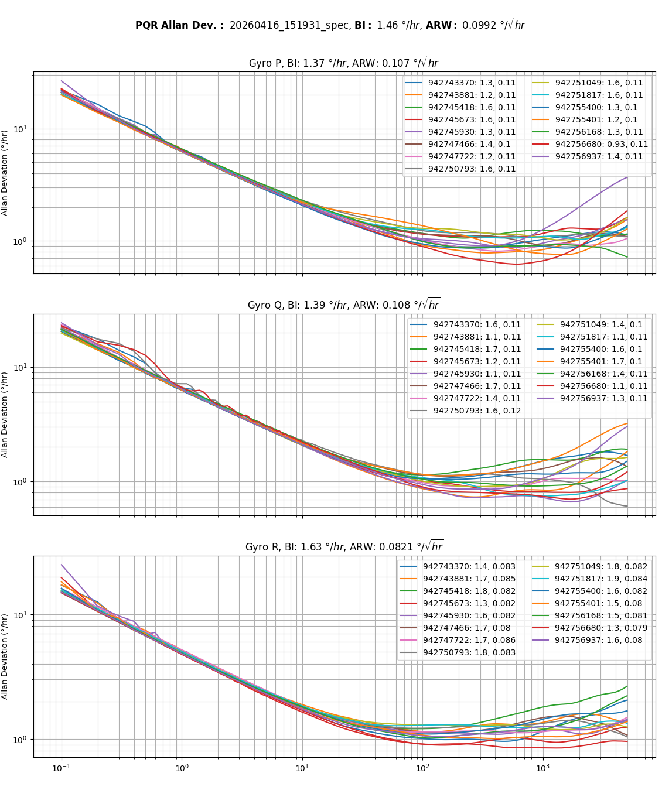
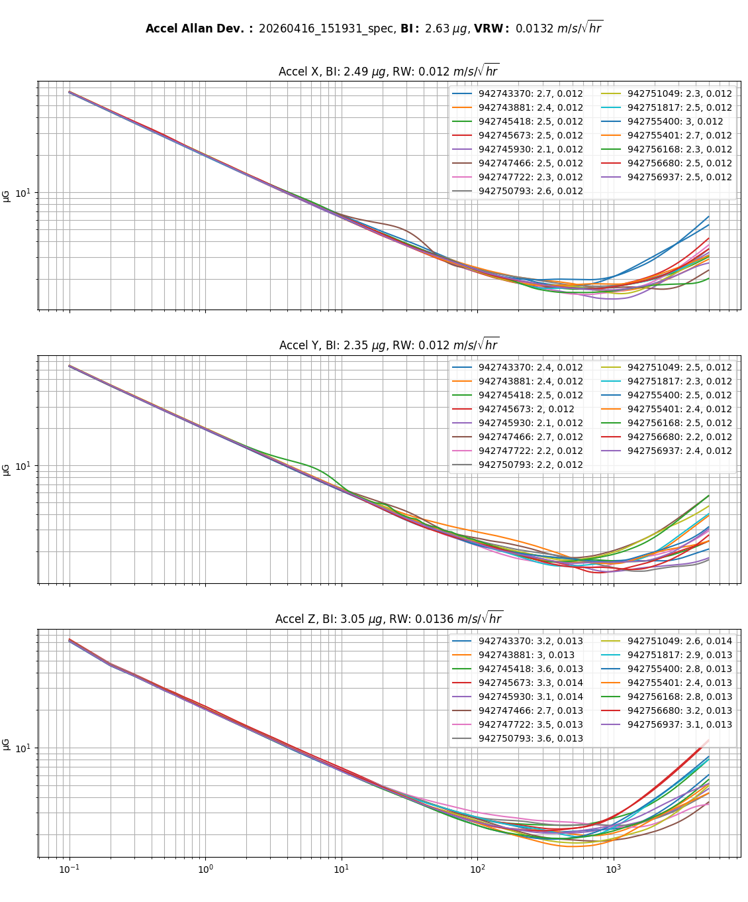

# Allan Variance / Allan Deviation (AVAR/ADEV)

Allan Deviation (ADEV), the square root of Allan Variance (AVAR), is the industry-standard statistical method for characterizing inertial sensor noise as a function of averaging time. Unlike a single RMS noise specification, Allan Deviation separates the various stochastic error processes present in MEMS gyroscopes and accelerometers, allowing white noise, bias instability, random walk, and long-term drift to be independently quantified.

The Allan Deviation plots below were generated from static IMU data collected under controlled laboratory conditions. Each point represents the expected sensor uncertainty after averaging measurements over the corresponding integration time.

## Test Conditions

* Sample Rate: **1000 Hz**
* Test Duration: **24 hours**
* Environment: **Static, vibration-free**
* Ambient Temperature: **25 °C**

## IMX-6 IMU Performance

| Parameter                                |             Value |
| ---------------------------------------- | ----------------: |
| Gyro Bias Instability                    |      **1.5 °/hr** |
| Gyro Angle Random Walk (ARW)             |    **0.10 °/√hr** |
| Accelerometer Bias Instability           |        **2.8 µg** |
| Accelerometer Velocity Random Walk (VRW) | **0.013 m/s/√hr** |

Bias Instability values are reported using the IEEE Std 952-1997 convention and are computed as the minimum Allan Deviation divided by **0.664**, yielding the bias instability coefficient attributable to flicker (1/f) noise. This value is sometimes loosely referred to as the 1σ bias instability, though strictly speaking it is a power-spectral-density-derived coefficient rather than a standard deviation of a Gaussian process.

## Interpreting Allan Deviation

Different stochastic error sources appear as characteristic slopes on the log-log Allan Deviation plot.

|    Slope | Dominant Noise Process  | Typical Effect                      |
| -------: | ----------------------- | ----------------------------------- |
| **−1/2** | White Noise (ARW / VRW) | Short-term measurement noise        |
|    **0** | Bias Instability        | Minimum achievable bias uncertainty |
| **+1/2** | Rate Random Walk        | Slowly varying bias drift           |
|   **+1** | Rate Ramp               | Very low-frequency systematic drift |

At short averaging times, white sensor noise dominates, producing the characteristic **−1/2** slope. As averaging time increases, random noise is reduced through averaging until the Allan Deviation reaches its minimum, corresponding to the sensor's bias instability. For longer averaging times, low-frequency drift mechanisms become dominant, causing the Allan Deviation to increase.

## Gyroscope

The gyroscope Allan Deviation plot is used to characterize both short-term angular rate noise and long-term bias stability.

* **Angle Random Walk (ARW)** quantifies the white angular-rate noise present at short averaging times and determines the rate at which attitude error accumulates during inertial integration.
* **Bias Instability** represents the minimum achievable bias uncertainty resulting primarily from flicker (1/f) noise.
* Positive-slope regions identify lower-frequency stochastic processes such as rate random walk and rate ramp.

The IMX-6 gyroscope exhibits an Angle Random Walk of **0.10 °/√hr** and a Bias Instability of **1.5 °/hr**, providing excellent short-term stability while maintaining exceptionally low long-term drift.

## Accelerometer

The accelerometer Allan Deviation plot characterizes both short-term acceleration noise and long-term bias stability.

* **Velocity Random Walk (VRW)** quantifies the white acceleration noise and determines velocity error accumulation during inertial integration.
* **Bias Instability** represents the minimum achievable accelerometer bias uncertainty.
* Positive-slope regions indicate long-term stochastic drift mechanisms that become significant over extended averaging periods.

The IMX-6 accelerometer exhibits a Velocity Random Walk of **0.013 m/s/√hr** and a Bias Instability of **2.8 µg**, providing excellent performance for precision inertial navigation and long-duration dead reckoning.

