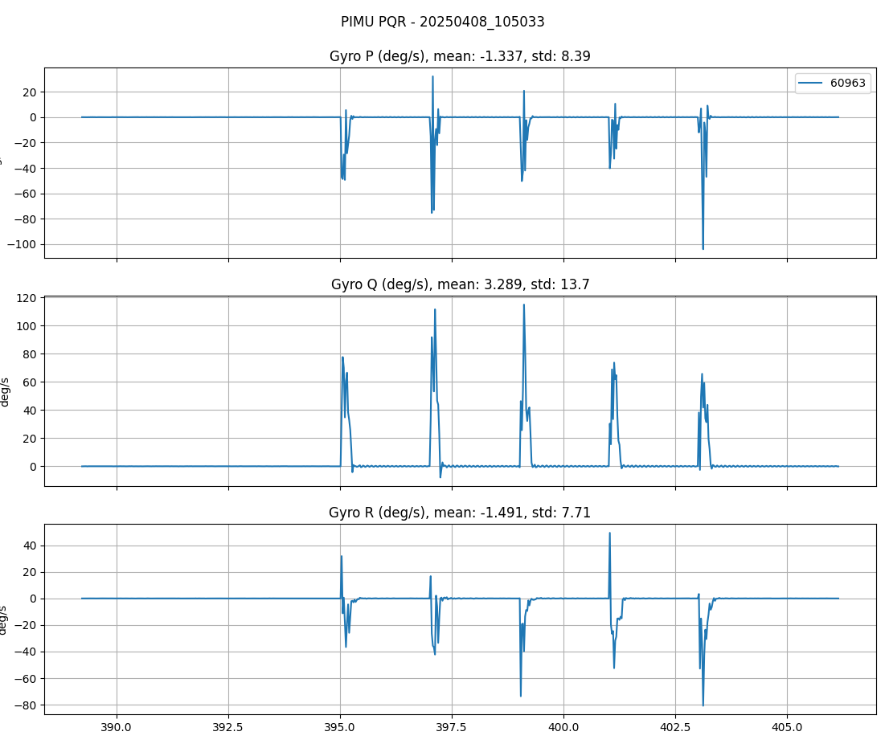
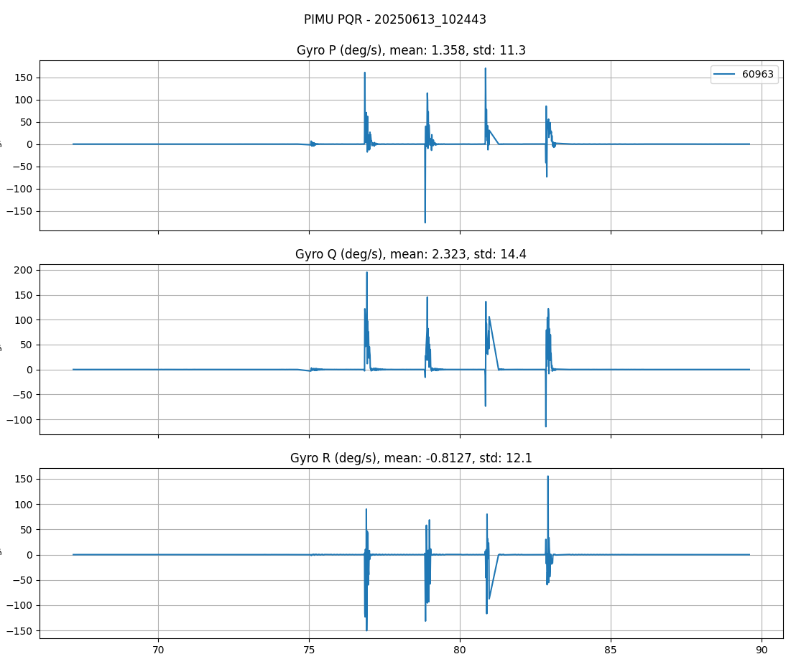

# IMU Shock Rejection

## Overview

The IMU Shock Detection feature enables the system to identify and mitigate mechanical shock events that adversely affect Inertial Measurement Unit (IMU) measurements. Because impulse shocks can saturate sensors and exceed their effective bandwidth---producing invalid data that would otherwise corrupt Attitude and Heading Reference System (AHRS) and Inertial Navigation System (INS) estimates---the system employs specialized algorithms to detect, isolate, and reject shock-induced disturbances.  When a shock is detected, the Extended Kalman Filter (EKF) is rewound to remove corrupted measurements and maintain navigation solution integrity.

------------------------------------------------------------------------

## Without Shock Rejection

In the absence of a shock rejection mechanism on platforms such as the IMX-5, the attitude solution (comprising roll, pitch, and heading) can exhibit significant degradation, manifesting as attitude offset deviations of up to **+10 degrees** from the true value.  This degradation underscores the critical need for a robust mitigation strategy.




------------------------------------------------------------------------

## Performance With Shock Rejection

### Shock Rejection Enabled

When the shock rejection feature is active, a substantial impulse can be observed on the IMU accelerometer's X-axis. The true peak magnitude of this shock is often unidentifiable due to the large impulse force exceeding the sensor's bandwidth limitations.




During the event, the IMU status flags provide crucial diagnostic information, recording both sensor saturation and successful shock detection.  Critically, because the shock event is accurately identified and mitigated, the attitude estimate (roll, pitch, and yaw) remains largely impervious to the shock input, preserving the accuracy and reliability of the navigation solution.


Because the shock is properly identified, the attitude estimate (roll, pitch, yaw) is relatively unaffected by the shock input.


------------------------------------------------------------------------

## How to Enable Shock Rejection

The shock rejection feature is configured through specific bit settings within the Software Development Kit (SDK) and must be applied to the **DID_FLASH_CONFIG.imuShockOptions** register:

**IMU_SHOCK_OPTIONS_ENABLE (0x01):** Activates the IMU shock rejection functionality.

**IMU_SHOCK_OPTIONS_FAST_RECOVERY (0x02):** This option is particularly beneficial when impulse shocks occur concurrent with platform rotation. It minimizes the post-shock integration error and substantially reduces the time required for attitude convergence. However, it is important to note that this setting can marginally increase the attitude error induced directly by the shock event itself. Therefore, its use is generally discouraged for applications where the platform is stationary and not undergoing rotation during shock occurrences.

## Configuration

The shock rejection can be tuned if needed using the following parameters. 

| **Parameter**                      | **Type** | **Units** | **Purpose**                                          | **Typical Range** | **Notes / Impact**                                           |
| ---------------------------------- | -------- | --------- | ---------------------------------------------------- | ----------------- | ------------------------------------------------------------ |
| **imuShockDetectLatencyMs**        | uint8_t  | ms        | EKF rewind window after shock detection              | 10–100 ms         | Larger values protect more history but add navigation latency |
| **imuShockRejectLatchMs**          | uint8_t  | ms        | Time shock rejection remains active after shock ends | 100–500 ms        | Prevents rapid on/off oscillation; ensures stabilization     |
| **imuShockOptions**                | uint8_t  | —         | Bitfield controlling shock detection behavior        | —                 | Enables detection, algorithm selection, EKF rewind behavior  |
| **imuShockDeltaAccHighThreshold**  | uint8_t  | m/s²      | Acceleration difference to trigger shock start       | 2–10 m/s²         | Lower = more sensitive; higher = fewer false positives       |
| **imuShockDeltaAccLowThreshold**   | uint8_t  | m/s²      | Acceleration difference to confirm shock end         | 0.5–5 m/s²        | Must be lower than high threshold for hysteresis             |
| **imuShockDeltaGyroHighThreshold** | uint8_t  | deg/s     | Angular rate difference to trigger shock start       | 5–20 deg/s        | Detects rotational shocks                                    |
| **imuShockDeltaGyroLowThreshold**  | uint8_t  | deg/s     | Angular rate difference to confirm shock end         | 1–10 deg/s        | Lower than high threshold to avoid oscillation               |

## Usage Example

### Configuration for Vehicle Dynamics

``` cpp
config.imuShockDetectLatencyMs = 50;           // 50ms EKF rewind window
config.imuShockRejectLatchMs = 200;            // 200ms latch time after shock end
config.imuShockOptions = 0x01;                 // Enable shock detection
config.imuShockDeltaAccHighThreshold = 5;      // 5 m/s² to trigger
config.imuShockDeltaAccLowThreshold = 2;       // 2 m/s² to confirm end
config.imuShockDeltaGyroHighThreshold = 10;    // 10 deg/s to trigger
config.imuShockDeltaGyroLowThreshold = 4;      // 4 deg/s to confirm end
```

------------------------------------------------------------------------

## Tuning Guidelines

### For Sensitive Applications (e.g., precision navigation)

- Increase `imuShockDetectLatencyMs` to provide better protection
- Lower acceleration/gyroscope thresholds to catch subtle shocks
- Longer latch time to ensure full stabilization

### For Rugged Environments (e.g., off-road vehicles)

- Consider reducing thresholds further to detect frequent impacts
- Balance latch time against desired responsiveness
- Monitor EKF rewind performance in field testing

### For Minimal Interference

- Increase thresholds to only catch significant shocks
- Shorter latch times for faster recovery
- Reduce `imuShockDetectLatencyMs` if rewind latency is unacceptable

------------------------------------------------------------------------

## Shock Detection Algorithm

The system detects shocks by monitoring **inter-IMU differences**:

1.  **Shock Start:** When differences exceed either the acceleration OR gyroscope high thresholds
2.  **Active Shock:** Shock rejection remains active for the duration of the shock event
3.  **Shock End:** When ALL differences drop below their respective low thresholds AND the latch timer expires
4.  **EKF Rewind:** The navigation state is rewound by `imuShockDetectLatencyMs` to remove shock-corrupted estimates

------------------------------------------------------------------------

## Performance Considerations

-   **Latency Impact:** EKF rewind introduces latency proportional to `imuShockDetectLatencyMs`
-   **Computational Load:** Shock detection adds minimal overhead (difference calculations and comparisons)
-   **IMU Health:** Requires all 3 IMUs to be operational for reliable shock detection
