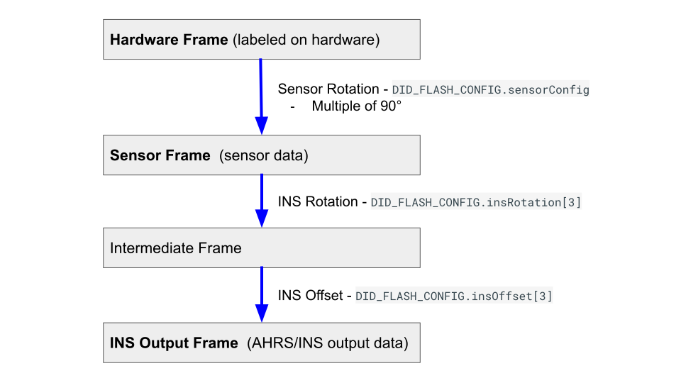
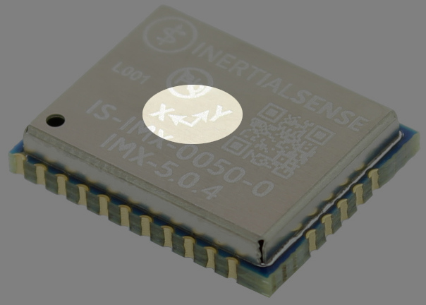
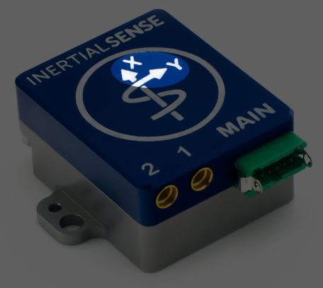
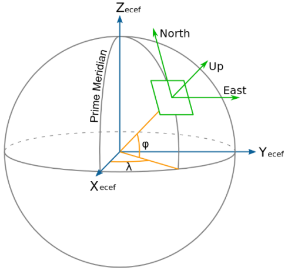

# Coordinate Frames
In this manual, coordinate frame systems are simply referred to as frames. This page is to assist the developer in choosing and implementing the appropriate coordinate frames for their respective application. It should be noted that the following frames are in relation to the IMX itself.

## Coordinate Frame Relationship

The relationship between the Hardware Frame, Sensor Frame, and INS Output Frame are as follows.  



NOTE: The ***Hardware Frame*** and ***Sensor Frame*** are equivalent when the sensor rotation in `DID_FLASH_CONFIG.sensorConfig` is zero.  The ***Sensor Frame*** and ***INS output Frame*** are equivalent when the `DID_FLASH_CONFIG.insRotation` and `DID_FLASH_CONFIG.insOffset` are zero.  

## Hardware Frame

The Hardware Frame is labeled "X" and "Y" on the hardware indicating the direction of the sensing elements in the IMX.  





The IMX follows the right right rule for XYZ axis relative direction and angular rotation.


## Sensor Frame

The IMU and magnetometer data (i.e. messages DID_IMU and DID_MAGNETOMETER) are in the Sensor Frame.  The ***Hardware Frame*** is rotated into the ***Sensor Frame*** in multiples of 90° using the `SENSOR_CFG_SENSOR_ROTATION_MASK` bits of the `DID_FLASH_CONFIG.sensorConfig` as defined in `enum eSensorConfig`.   

## INS Output Frame

The INS output data (DID_INS_1, DID_INS_2, DID_INS_3) is in the INS Output Frame. Translation from Sensor
Frame to INS Output Frame is defined as:

 1. Sensor Frame → Intermediate Output Frame by rotation of `DID_FLASH_CONFIG.insRotation` euler angles (in order of heading, pitch, roll angle) In radians.
 2. Intermediate Output Frame → INS Output Frame: Offset by `DID_FLASH_CONFIG.insOffset` in meters.

If `DID_FLASH_CONFIG.insRotation` and `DID_FLASH_CONFIG.insOffset` are zero, the Sensor Frame and the INS Output Frame are the same.

## North-East-Down (NED) Frame
Position estimates can be output in the North-East-Down (NED) coordinate frame defined as follows:

  * Right-handed, Cartesian, non-inertial, geodetic frame with origin located at the surface of Earth (WGS84 ellipsoid).
  * Positive X-axis points towards North, tangent to WGS84 ellipsoid.
  * Positive Y-axis points towards East, tangent to WGS84 ellipsoid.
  * Positive Z-axis points down into the ground completing the right-handed system.

## Earth-Centered Earth-Fixed (ECEF) Frame
The Earth-Centered Earth-Fixed (ECEF) frame is defined as follows:

  *  Right-handed, Cartesian, non-inertial frame with origin located at the center of Earth.
  *  Fixed to and rotates with Earth.
  *  Positive X-axis aligns with the WGS84 X-axis, which aligns with the International Earth Rotation and Reference Systems Service (IERS) Prime Meridian.
  *  Positive Z-axis aligns with the WGS84 Z-axis, which aligns with the IERS Reference Pole (IRP) that points towards the North Pole.
  *  Positive Y-axis aligns with the WGS84 Y-axis, completing the right-handed system.



## Coordinate Frames Transformation Functions
This section is intended to be an example of how to rotate between frames using utility functions defined in the [InertialSenseSDK](https://github.com/inertialsense/InertialSenseSDK).

### Body frame to NED frame

The following example converts body velocity `DID_INS_2.uvw` to NED velocity `vel_ned`.

``` C++
#include "SDK/src/ISPose.h"
quatRot( vel_ned, DID_INS_2.qn2b, DID_INS_2.uvw );
```

This following example removes gravity from the IMU measured acceleration.  

``` C++
#include "SDK/src/ISPose.h"
Vector gravityNED = { 0, 0, -9.80665 };	// m/s^2
Vector gravityBody;
Vector accMinusGravity;
// Rotate gravity into body frame
quatConjRot( gravityBody, DID_INS_2.qn2b, gravityNED );
// Subtract gravity from IMU acceleration output
sub_Vec3_Vec3( accMinusGravity, DID_DUAL_IMU.I[0].acc, gravityBody );
```

### ECEF frame to NED frame

This example converts ECEF velocity `vel_ecef` to NED velocity `vel_ned`.

```c++
#include "SDC/src/ISPose.h"
quat_ecef2ned( lla[0], lla[1], qe2n );
quatConj( qn2e, qe2n );
quatRot( vel_ned, qn2e, vel_ecef );
```

