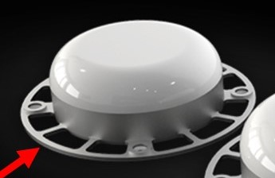

# Interference Considerations

Electrical interference or noise can be coupled into the Inertial Sense module in the form of electromagnetic interference (EMI) through the air or electrically conducted through wiring.  Sources for interference include:

- EMI at the GPS antenna.
- EMI at the IMX module.
- EMI conducted through the power supply or I/O lines.

Common sources for noise and interference are digital lines, USB 3.x, noisy power supplies, etc.  

## Detecting Interference

To detect if interference is being coupled into the Inertial Sense sensor module, it can be compared with a stock EVB demo unit to compare noise figures. This is done by using the following steps. If both steps pass, there is no noise being coupled into the module. Optionally connect multiple sensor modules can be connected to the EvalTool in parallel to compare noise.

1. **Evaluate the IMU sensor** - Make sure the unit is stationary (on a table or non-moving surface) and not seeing any vibrations. Watch the standard deviation columns labeled "σ" in the Sensors tab of the EvalTool. This shows the noise level over the past 5 seconds, which means the device needs to be completely stable for 5 seconds to be accurate. Compare this figure between the integrated sensor module and EVB demo unit.
2. **Evaluate GPS sensitivity** – In clear view of the sky, monitor the satellite signal strength through the `DID_GPS_NAV.cnoMax` and `DID_GPS_NAV.cnoMean` fields in the EvalTool "Data Sets" tab or in the EvalTool "GPS" tab. See that the strongest (largest) CNO values are roughly the same between the integrated sensor module and the EVB demo unit.

## Interference Mitigation

The best solution is to stop the EMI (emitted) or conducted noise at its source.  If it is not possible to completely eliminate the source, the following methods should be considered depending on the cause of interference:

- **GPS antenna location** - Position the GPS antenna at the top of the vehicle, clear of obstructions and away from noise sources such as motors, processors, USB cables, digital devices, etc. USB 3.x typically generates quite a bit of EMI and interferes with the GPS.  Added shielding and/or signal [inline USB filters](https://www.amazon.com/AudioQuest-Jitterbug-USB-Filter/dp/B00YTA78FW/ref=sr_1_5?ie=UTF8&qid=1525737258&sr=8-5&keywords=usb+filter) can be added USB 3.x to reduce EMI and mitigate GPS interference. Symptoms of GPS interference are poor GPS CNO signal strength, long times to lock, slip out of lock, etc.
- **GPS antenna ground plane** - Adding a 2"-3" diameter metallic ground plane below the GPS antenna will improve CNO noise ratio and improve sensitivity. This can help in noisy environments. You can use any scrap metal or PCB to test the concept by simply placing it below the GPS antenna (no electrical grounding required). The ground plane can have holes to reduce the weight and aerodynamic effects.

- **Shielding around the Inertial Sense module** - This can further prevent EMI from being absorbed by potentially GPS sensitive circuitry on the module.
- **Digital signals** - Making sure best practices for electrical current return paths for both common mode and differential mode signals can be key for this.  Customers have seen GPS interference caused by USB 3.x and have have resolved the issues using shielding and [inline USB filters](https://www.amazon.com/AudioQuest-Jitterbug-USB-Filter/dp/B00YTA78FW/ref=sr_1_5?ie=UTF8&qid=1525737258&sr=8-5&keywords=usb+filter).
- **Power supply filtering** - This may be necessary on systems with significant digital noise.  LC filters or similar filters can be added inline between the power supply and the IMX supply input (Vcc).  Common switching mode/buck voltage regulators should be fine for use with the IMX module and not require additional filtering.  

Please contact us at [support@inertialsense.com](mailto:support@inertialsense.com) if further support is needed.

## Magnetic Interference

Magnetic interference may impact IMX magnetometer performance if surrounded by steel or ferrous material or near motors, motor drivers, or other electronics that cause EMI.  This interference can be observed in the magnetometer output, magnetometer status, and INS heading.  Make sure all components are fixed in location during this test.  While powering and actuating the various interference sources, observe the following:

- **Magnetometer Output** should remain constant and not deviate.  (EvalTool Sensors tab)
- **Magnetometer Status** should remain good and not indicate interference.  (EvalTool INS tab, "Mag used" green = good, yellow = interference)
- **INS Heading** (yaw) estimate should not drift or change direction.   (EvalTool INS tab, "Yaw")

If any of these items are affected during the test, the system may result in incorrect magnetometer and heading values.    

## Mechanical Vibration

The system accuracy may degrade in the presence of mechanical vibrations that exceed 3 g of acceleration. Empirical data shows degradation at approximately 100 - 150 Hz. Adding **vibration isolation** to the mount may be necessary to reduce the vibrations seen by the product and to improve accuracy.

## Temperature Sensitivity

The system is designed to compensate for the effects of temperature drift, which can be found in typical
operation. However, rapid hardware temperature changes can result in degraded accuracy of the IMU calibration, GPS position, and INS estimate. Rapid temperature change can be caused by direct exposure to wind, sun, and other elements.