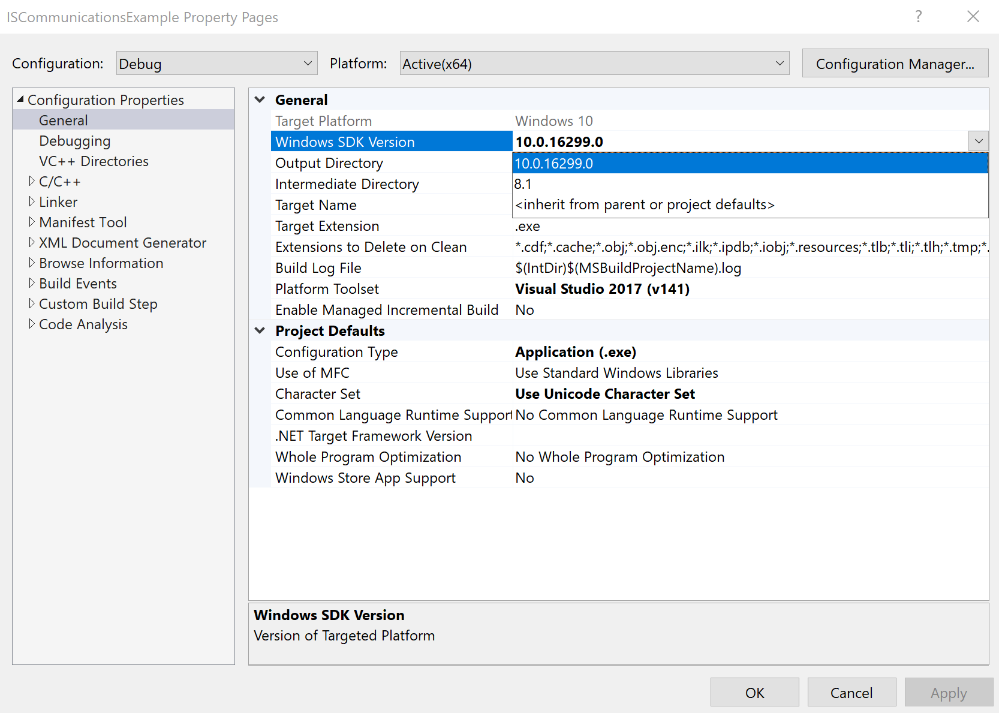

# SDK

### Overview

The Inertial Sense open source software development kit (SDK) provides quick integration for communication with the Inertial Sense product line, including the µIMU, µAHRS, and µINS. It includes data logger, math libraries, and serial port interface for Linux and Windows environments.

## C vs. C++ Implementation

The Inertial Sense SDK provides both C and C++ programming language implementation.  The following compares differences between these implementations.

### C

- Easier implementation
- Light weight
- Smaller code size
- Minimal subset of SDK files
- Recommended for smaller projects that require lower memory usage.
- SDK files: ISComm.c

### C++

- Object oriented device representation
- Fully integrated support for:
  - Commutations: single or multiple data type callback functions.
  - Serial port handling included
  - Datalogging
  - Firmware update (bootloader)
- Recommended for typical to advanced C++ applications and production level integration.
- SDK files: InertialSense.cpp

## Installing and Configuring Visual Studio

The SDK example projects can be conveniently compiled using gcc with cmake or Visual Studio.  The following sections outline how to setup Visual Studio for use with the SDK example projects.

### Installing

The SDK example projects can be compiled using the Community (free) version of Visual Studio.  Windows SDK should be installed in addition to Visual Studio, as an added option in the Visual Studio installer or using the separate Windows SDK installer.

- [Visual Studio](https://visualstudio.microsoft.com/downloads/)
- Windows SDK - Can be installed using option in Visual Studio Installer or using [separate Windows SDK installer](https://developer.microsoft.com/en-us/windows/downloads/windows-10-sdk).

### Configuring

When compiling an Inertial Sense SDK example project in Visual Studio, the currently installed version of Windows SDK must be selected in the project properties, as illustrated below:

`Project properties > General > Windows SDK Version > [Currently Installed Version]`

## SDK Example Projects Overview

| Example Project                                         | Language | Description                                                  |
| ------------------------------------------------------- | -------- | ------------------------------------------------------------ |
| [ASCII Communications](../SDK/CommunicationsAscii.md)   | C        | How to use SDK for ASCII NMEA communications.                |
| [Binary Communications](../SDK/CommunicationsBinary.md) | C        | How to use SDK for binary communications.                    |
| [Fimrware Update](../SDK/FirmwareUpdate.md)             | C        | How to use bootloader for embedded firmware update.          |
| [Data Logger](../SDK/DataLogger.md)                     | C++      | How to use SDK data logging.                                 |
| [CLTool](../SDK/InertialSenseClassCLTool.md)            | C++      | Open source project illustrating how to use the InertialSense C++ class.  It combines all SDK capabilities including serial communications, data logging to file, and embedded firmware update. |

## 