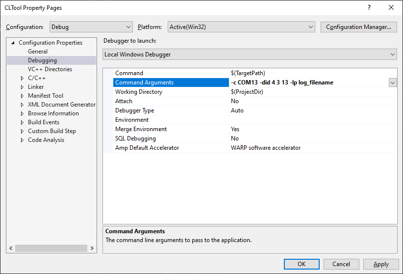

# CLTool

## Overview
The Inertial Sense CLTool is a command line utility that can be used to read and display data, update firmware, and log data from Inertial Sense products. Additionally, CLTool serves as example source code that demonstrates integration of the Inertial Sense SDK into your own source code. The CLTool can be compiled in Linux, Mac, Windows and embedded platforms.

## Help Menu

```
Command line utility for communicating, logging, and updating firmware with Inertial Sense product line.

EXAMPLES
    cltool -c /dev/ttyS2 -did DID_INS_1 DID_GPS1_POS DID_PIMU      # stream DID messages
    cltool -c /dev/ttyS2 -did 4 13 3                # stream same as line above
    cltool -c /dev/ttyS2 -did 3=5                   # stream DID_PIMU at startupNavDtMs x 5
    cltool -c /dev/ttyS2 -presetPPD                 # stream post processing data (PPD) with INS2
    cltool -c /dev/ttyS2 -presetPPD -lon -lts=1     # stream PPD + INS2 data, logging, dir timestamp
    cltool -c /dev/ttyS2 -edit DID_FLASH_CFG        # edit DID_FLASH_CONFIG message
    cltool -c /dev/ttyS2 -baud=115200 -did 5 13=10  # stream at 115200 bps, GPS streamed at 10x startupGPSDtMs
    cltool -c /dev/ttyS2 -rover=RTCM3:192.168.1.100:7777:mount:user:password    # Connect to RTK NTRIP base
    cltool -rp logs/20170117_222549                 # replay log files from a folder
    cltool -c /dev/ttyS2 -uf fw/IS_IMX-5.hex -ub fw/IS_bootloader-STM32L4.hex -uv
                                                    # update application firmware and bootloader
    cltool -c * -baud=921600                        # 921600 bps baudrate on all serial ports

OPTIONS (General)
    -h --help       Display this help menu.
    -c COM_PORT     Select the serial port. Set COM_PORT to "*" for all ports and "*4" to use
                    only the first four ports. 
    -baud=BAUDRATE  Set serial port baudrate.  Options: 115200, 230400, 460800, 921600 (default)
    -magRecal[n]    Recalibrate magnetometers: 0=multi-axis, 1=single-axis
    -q              Quiet mode, no display.
    -reset          Issue software reset.
    -s              Scroll displayed messages to show history.
    -stats          Display statistics of data received.
    -survey=[s],[d] Survey-in and store base position to refLla: s=[2=3D, 3=float, 4=fix], d=durationSec
    -uf FILEPATH    Update application firmware using .hex file FILEPATH.  Add -baud=115200 for systems w/ baud rate limits.
    -ub FILEPATH    Update bootloader using .bin file FILEPATH if version is old. Must be used along with option -uf.
    -fb             Force bootloader update regardless of the version.
    -uv             Run verification after application firmware update.
    -uf-cmd CMDSET  Update one or more V2-protocol devices using V2 command sets.
    -sysCmd=[c]     Send DID_SYS_CMD c (see eSystemCommand) preceeded by unlock command then exit the program.
    -factoryReset   Reset IMX flash config to factory defaults.
    -romBootloader  Reboot into ROM bootloader mode.  Requires power cycle and reloading bootloader and firmware.
    -v              Print version information.

OPTIONS (Message Streaming)
    -did [DID#<=PERIODMULT> DID#<=PERIODMULT> ...]  Stream 1 or more datasets and display w/ compact view.
    -edit [DID#<=PERIODMULT>]                       Stream and edit 1 dataset.
          Each DID# can be the DID number or name and appended with <=PERIODMULT> to decrease message frequency. 
          Message period = source period x PERIODMULT. PERIODMULT is 1 if not specified.
          Common DIDs: DID_INS_1, DID_INS_2, DID_INS_4, DID_PIMU, DID_IMU, DID_GPS1_POS,
          DID_GPS2_RTK_CMP_REL, DID_BAROMETER, DID_MAGNETOMETER, DID_FLASH_CONFIG (see data_sets.h for complete list)
    -dids           Print list of all DID datasets
    -persistent     Save current streams as persistent messages enabled on startup
    -presetPPD      Stream preset post processing datasets (PPD)
    -presetINS2     Stream preset INS2 datasets

OPTIONS (Logging to file, disabled by default)
    -lon            Enable logging
    -lt=TYPE        Log type: dat (default), raw, sdat, kml or csv
    -lp PATH        Log data to path (default: ./IS_logs)
    -lms=PERCENT    Log max space in percent of free space (default: 0.5)
    -lmf=BYTES      Log max file size in bytes (default: 5242880)
    -lts=0          Log sub folder, 0 or blank for none, 1 for timestamp, else use as is
    -r              Replay data log from default path
    -rp PATH        Replay data log from PATH
    -rs=SPEED       Replay data log at x SPEED. SPEED=0 runs as fast as possible.

OPTIONS (Read or write flash configuration from command line)
    -flashCfg       List all IMX "keys" and "values"
   "-flashCfg=[key]=[value]|[key]=[value]" 
                    Set key / value pairs in flash config. Surround with "quotes" when using pipe operator.
EXAMPLES
    cltool -c /dev/ttyS2 -flashCfg  # Read from device and print all keys and values
    cltool -c /dev/ttyS2 -flashCfg=insRotation[0]=1.5708|insOffset[1]=1.2  
                                  # Set multiple flashCfg values
OPTIONS (RTK Rover / Base)
    -rover=[type]:[IP or URL]:[port]:[mountpoint]:[username]:[password]
        As a rover (client), receive RTK corrections.  Examples:
            -rover=TCP:RTCM3:192.168.1.100:7777:mountpoint:username:password   (NTRIP)
            -rover=TCP:RTCM3:192.168.1.100:7777
            -rover=TCP:UBLOX:192.168.1.100:7777
            -rover=SERIAL:RTCM3:/dev/ttyS2:57600             (port, baud rate)
    -base=[IP]:[port]   As a Base (sever), send RTK corrections.  Examples:
            -base=TCP::7777                            (IP is optional)
            -base=TCP:192.168.1.43:7777
            -base=SERIAL:/dev/ttyS2:921600
```

## Compile & Run (Linux/Mac)

1. You must have cmake installed on your machine. To do this, download the cmake application at https://cmake.org/download/. Then, using the command line, you will need to install cmake with either of the following commands depending on your platform:
    ```bash
    Mac:
    sudo "/Applications/CMake.app/Contents.bin/cmake-gui" --install
    
    Linux:
    sudo apt-get install cmake
    ```
2. Create build directory
   ```bash
   cd cltool
   mkdir build
   ```

3. Run cmake from within build directory
   ```bash
   cd build
   cmake ..
   ```

4. Compile using make
   ```bash
   make
   ```

5. If necessary, add current user to the "dialout" group in order to read and write to the USB serial communication ports:
   ```bash
   sudo usermod -a -G dialout $USER
   sudo usermod -a -G plugdev $USER
   (reboot computer)
   ```

6. Run executable
   ``` bash
   cd build
   ./cltool
   ```

## Compile & Run (Windows CMake CL)
1. Install CMake for Windows

2. Create build directory
    ```bash
    cd cltool
    mkdir build
    
3. Run cmake from within build directory
   ```bash
   cd build
   cmake ..
   ```

4. Compile
   ```bash
   cmake --build .
   ```
5. Run executable
   ``` bash
   cd Release (or Debug depending on CMake configuration you selected)
   cltool.exe
   ```
## Compile & Run (Windows CMake Visual Studio)
Windows Visual Studio supports CMake projects. Follow the instructions provided by Microsoft:
https://learn.microsoft.com/en-us/cpp/build/cmake-projects-in-visual-studio?view=msvc-170

## Updating Firmware with CLTool
### Updating using Firmware Package

Updating firmware using a firmware package file provides a simple method to update multiple devices in one process.  This include the ability to update an IMX-GPX module pair in one step.  The cltool only needs know the file path of the firmware package file and the serial port of the device to be updated.  The file extension for a firmware package is `.fpkg`.

```bash
cltool -c [serial port] -uf-cmd "package=[.fpkg file path]"
```

The following is a specific example using a firmware package file:

```bash
cltool -c /dev/ttyACM0 -uf-cmd "package=IS-firmware_2.0.3_2024-03-18_213925.fpkg"
```

### Updating using Single Firmware File

The CLTool can be used to update device firmware with the following options:  

```bash
cltool -c [serial port] -uf [firmware file path] -ub [bootloader file path] -uv
```

| Options           | Description                                                  |
| ----------------- | ------------------------------------------------------------ |
| `-c [serialport]` | Specifies the device serial port.                            |
| `-uf [filepath]`  | Specifies the application firmware file path.                |
| `-ub [filepath]`  | (Optional) Specified the bootloader firmware file.  The bootloader is only updated if the version of the file provided is newer than the bootloader version currently on the device. |
| `-uv`             | (Optional) Run verification after application firmware update. |

The following is a specific example:

```bash
cltool -c /dev/ttyS2 -uf fw/IS_IMX-5.hex -ub fw/IS_bootloader-STM32L4.hex -uv	
```

Note: The firmware can only be updated at the following baud rates: 300000, 921600, 460800, 230400, 115200

## Logging with CLTool

The CLTool can be used to log data to file with the following options: 

```	bash
cltool -c [serial port] -lon -lt=[log type] -lp [directory]
```

| Options           | Description                                                  |
| ----------------- | ------------------------------------------------------------ |
| `-lon`            | Enable logging.                                              |
| `-lt=[logtype]`   | Specifies the  [log file type](#log-type) to be written.  Log types include: `dat`, `raw`, `sdat`, and `csv`. |
| `-lp [directory]` | (Optional) Specifies the path where log files will be written.  When not specified, the default location will be the current working directory. |

### Log File Types

| Log Type | Description                                                  |
| -------- | ------------------------------------------------------------ |
| `dat`    | Binary file containing InertialSense binary (ISB) DID data sets in "chunk" groups containing data in serial order as they appear over the serial port.  Default file format.  ***Recommended for post processing.*** |
| `raw`    | Binary file containing byte for byte data received over the serial ports.  All packets remain in their native form.  Used for logging InertialSense binary (ISB), NMEA, RTCM3, uBlox UBX binary and SPARTN, and any other packet formats.  ***Recommended for logging all data formats and post processing***. |
| `sdat`   | Binary file containing InertialSense binary (ISB) DID data sets in "chunk" groups organized by DID.  Each chunk contains only one DID type, and at least one chunk allocated for each DID data set type.  Not recommended for future use. |
| `csv`    | Comma-Separated Values - Plain text file that uses specific structuring to arrange tabular data. Its basic format involves separating each data field (or cell in a table) with a comma and each record (or row) is on a new line. This simple format allows for ease in data import and export between programs that handle tabular data, such as databases and spreadsheets. |

The following is an example of enabling the logger with type raw and specifying the output directory:
```bash
./cltool -c /dev/ttyACM0 -lon -lt=raw -lp /media/usbdrive/data
```

## Command Line Options

Navigate to the directory `/cpp/SDK/cltool/build` and run the CLTool with the help option, "`-h`"

``` bash
./cltool -h
```

to display the command line options

## Command Line Options in MS Visual Studio
When using MS Visual Studio IDE, command line arguments can be supplied by right clicking the project in the solution explorer and then selecting **Configuration Properties -> Debugging -> Command Arguments** (see image below).


